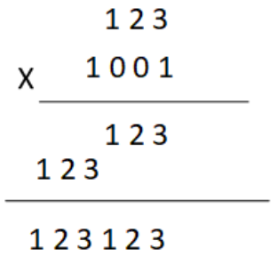
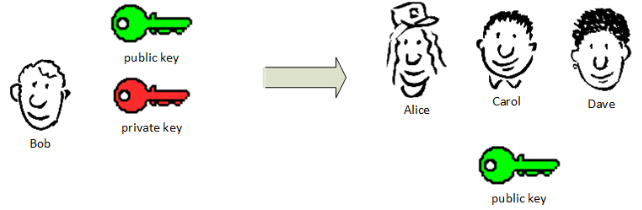
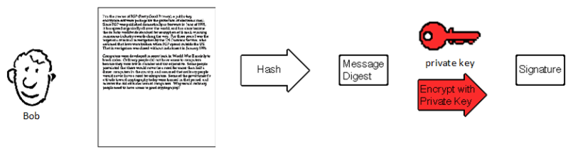
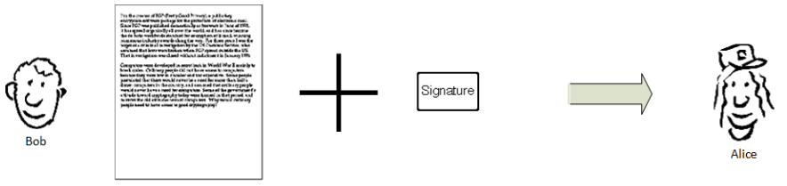
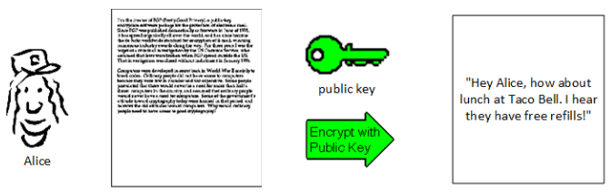
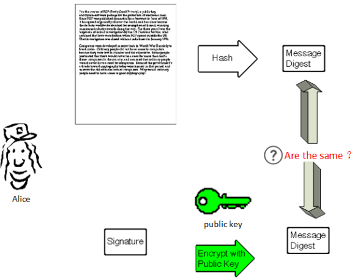
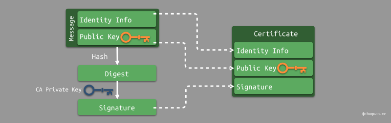
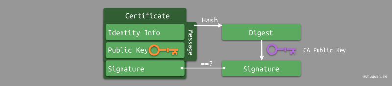

# RSA 算法

转载于 阮一峰 [博客](http://www.ruanyifeng.com/blog/2013/06/rsa_algorithm_part_one.html)

选取2个质数p(61)和q(53)

q与p相乘得到n

```math
n = pq = 61 \times 53 = 3233  \\
\varphi(n) = (p-1)(q-1) = (61- 1)(53 - 1) = 3120  \\
1 < e < \varphi(n)   \\
e = 17 \\
ed \equiv 1 \mod(\varphi(n))  \\
d = 2753
```

公钥(n, e) 即(3233, 17)  
私钥(n, d) 即(3233, 2753)


加密:
```math
m^e \equiv c \mod(n)  \\
65^{17} \equiv 2790 \mod(3233)
```

解密:
```math
c^d \equiv m \mod(n)  \\
2790^{2753} \equiv 65 \mod(3233)
```

另一种理解从[B站视频](https://www.bilibili.com/video/BV14y4y1272w)中提取
加密：对原始数据m取e(encrypt)次幂, 将结果除以N再取余数，最后得到密文c(cipher)
正向计算出密文c很简单，反向推出原始数据很难。

$$
m^e \mod N = c
$$

解密：
$$
c^d \mod N = m
$$

推导过程：
令：$m^{ed} \mod N = m$
根据欧拉定理: $m^{\varphi(n)} \equiv 1 \mod(n)$
其中：$\varphi(n)$ 表示在不大于n的正整数中，有多少个**与n互质**的数

```math
m^{\varphi(n)} \equiv 1 \mod(n)  \\
(m^{\varphi(n)})^k \equiv 1^k \mod(n)  \\
m^{k\varphi(n)} \equiv 1 \mod(n)  \\
m^{k\varphi(n)} \times m \equiv 1 \times m \mod(n)  \\
m^{k\varphi(n) + 1} \equiv m \mod(n)  \\
m^{k\varphi(n) + 1} \mod n = m
```

观察：
```math
m^{k\varphi(n) + 1} \mod n = m \\
m^{ed} \mod n = m
```

令 $ed = k\varphi(n) + 1$ 则：$d = \frac{k\varphi(n) + 1}{e}$

对于任何的质数p 都有 $\varphi(p) = p -1$
对于任何2个互质的整数p，q 都有 $\varphi(p \times q) = \varphi(p) \times \varphi(q) $
例如：令 p = 17, q = 23， n = $17 \times 23 = 391$
```math
\varphi(n) = \\
\varphi(17 \times 23) = \varphi(391) \\
= \varphi(17) \times \varphi(23) \\
=(17-1) \times (23 -1) \\
= 352
```

选取k = 5, e = 3， e要与$\varphi(n)$ 互质
带入公式:：
```math
d = \frac{k\varphi(n) + 1}{e} = \frac{5 \times 352 + 1}{3} = 587
```

求出私钥d之后，我们就不用p和q了。 将 (e, n) 作为公钥public key， (d, n)作为私钥 private key

e = 3,  d = 587, n = 391
m = 97
加密：$97^{3} \mod 391 = 79$
解密：$79^{587} \mod 391 = 97$

## 对称加密
1. 甲方选择某一种加密规则，对信息进行加密；
2. 乙方使用同一种规则，对信息进行解密。

举个例子：
1. 选择任意一个3位数的数字，比如 `123` (原文)
2. 用 123 * 91 = 11193，告诉我 `11193` (密文)
3. 解密时用 11193 / 91 = 123,  `123`就是解码后的原文。

## 非对称加密
1. 乙方生成两把密钥（公钥和私钥）。公钥是公开的，任何人都可以获得，私钥则是保密的。
2. 甲方获取乙方的公钥，然后用它对信息加密。
3. 乙方得到加密后的信息，用私钥解密。

所以非对称加密**公钥就像一把打开的锁，私钥就像那把锁的钥匙**。

举个例子：
1. 选择任意一个3位数的数字，比如 `123` (原文)
2. 用 123 * 91 = 11193，告诉我最后3位数 `193` (密文)
3. 解密时用 193 * 11 = 2123，最后3位数`123`就是解码后的原文。

此原理是 `1001 乘以 任意一个3位数 得到的数字 它的末尾3位数与原数字末尾3位数相同`



## 数字签名
参考于这里[1](http://www.youdzone.com/signature.html) [2](http://chuquan.me/2020/03/22/ios-certificate-principle/)

### 生成签名


Bob 产生一个公钥(public key)和一个私钥(private key)，把公钥发出去，私钥自己保存。


Bob给Alice写了一封信(Message)，他用私钥加密


对信进行Hash算法，生成信的摘要(Digest) 并用私钥加密生成签名(Signature)


Bob 把信和签名 发给了Alice


### 签名验证


Alice得到信和签名 之后用公钥对信解密得到信的原文


Alice用Hash算法得到信的摘要1，对签名用公钥解密得到摘要2。
比较摘要1和摘要2，如果一致则信的内容没有被他人修改。


## 数字证书
参考于[这里](http://chuquan.me/2020/03/22/ios-certificate-principle/)

**数字证书（Digital Certificate）** 是一种相当于现实世界中身份证的功能在数字信息领域中的实现。数字证书包含了个人或机构的 **身份信息** 及其 **公钥**，因此也称为 **公钥证书（Public-Key Certificate，PKC）**

类似于身份证是由权威的公安局颁发，公钥证书也是由权威的 **认证机构（Certificate Authority，CA）** 颁发。认证机构向接收方提供发送方的证书，证书中包含了发送方的身份信息和公钥。为了防止证书在颁发过程中被篡改，认证机构会将身份信息和公钥作为消息，用 **CA 私钥** 进行签名，进而将 **身份信息**、**公钥**、**签名** 一起放入证书，如下图所示。


接收方得到发送方证书时，通过 CA 公钥对证书进行签名验证。


