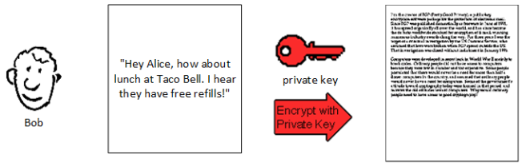

# RSA 算法

转载于 阮一峰 [博客](http://www.ruanyifeng.com/blog/2013/06/rsa_algorithm_part_one.html)

选取2个质数p(61)和q(53)

q与p相乘得到n

```math
n = pq = 61 \times 53 = 3233  \\
\varphi(n) = (p-1)(q-1) = (61- 1)(53 - 1) = 3120  \\
1 < e < \varphi(n)   \\
e = 17 \\
ed \equiv 1 \mod(\varphi(n))  \\
d = 2753
```

公钥(n, e) 即(3233, 17)  
私钥(n, d) 即(3233, 2753)


加密:
```math
m^e \equiv c \mod(n)  \\
65^{17} \equiv 2790 \mod(3233)
```

解密:
```math
c^d \equiv m \mod(n)  \\
2790^{2753} \equiv 65 \mod(3233)
```

## 对称加密
1. 甲方选择某一种加密规则，对信息进行加密；
2. 乙方使用同一种规则，对信息进行解密。

举个例子：
1. 选择任意一个3位数的数字，比如 `123` (原文)
2. 用 123 * 91 = 11193，告诉我 `11193` (密文)
3. 解密时用 11193 / 91 = 123,  `123`就是解码后的原文。

## 非对称加密
1. 乙方生成两把密钥（公钥和私钥）。公钥是公开的，任何人都可以获得，私钥则是保密的。
2. 甲方获取乙方的公钥，然后用它对信息加密。
3. 乙方得到加密后的信息，用私钥解密。

所以非对称加密**公钥就像一把打开的锁，私钥就像那把锁的钥匙**。

举个例子：
1. 选择任意一个3位数的数字，比如 `123` (原文)
2. 用 123 * 91 = 11193，告诉我最后3位数 `193` (密文)
3. 解密时用 193 * 11 = 2123，最后3位数`123`就是解码后的原文。

此原理是 `1001 乘以 任意一个3位数 得到的数字 它的末尾3位数与原数字末尾3位数相同`


## 数字签名
参考于[这里](http://www.youdzone.com/signature.html)

Bob 产生一个公钥(public key)和一个私钥(private key)，把公钥发出去，私钥自己保存。


Bob给Alice写了一封信(Message)，他用私钥加密


对信进行Hash算法，生成信的摘要(Digest) 并用私钥加密生成签名(Signature)


Bob 把信和签名 发给了Alice


Alice得到信和签名 之后用公钥对信解密得到信的原文


Alice用Hash算法得到信的摘要1，对签名用公钥解密得到摘要2。
比较摘要1和摘要2，如果一致则信的内容没有被他人修改。


