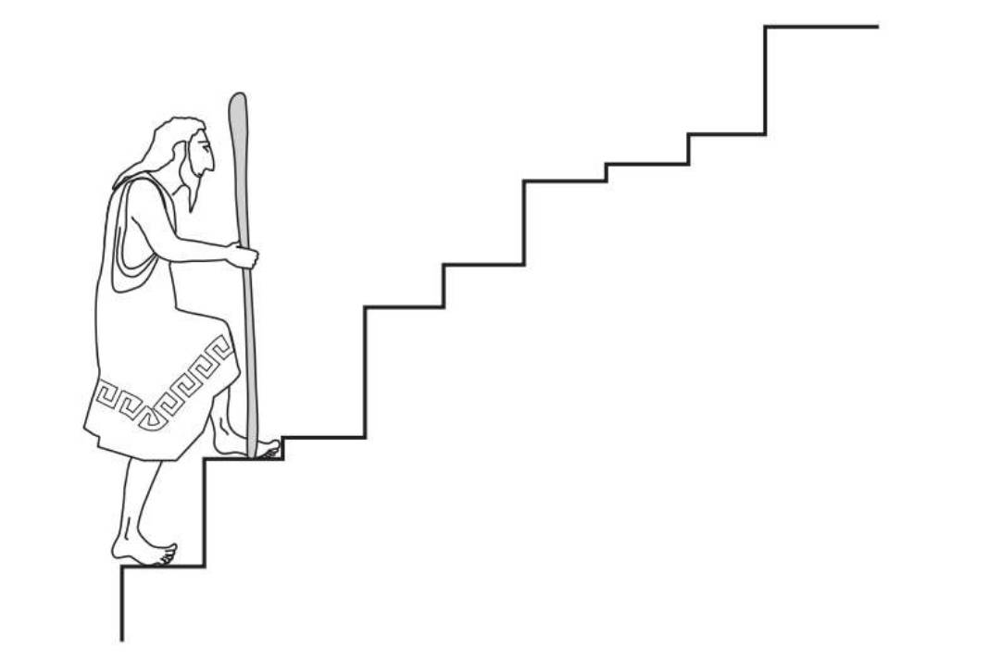
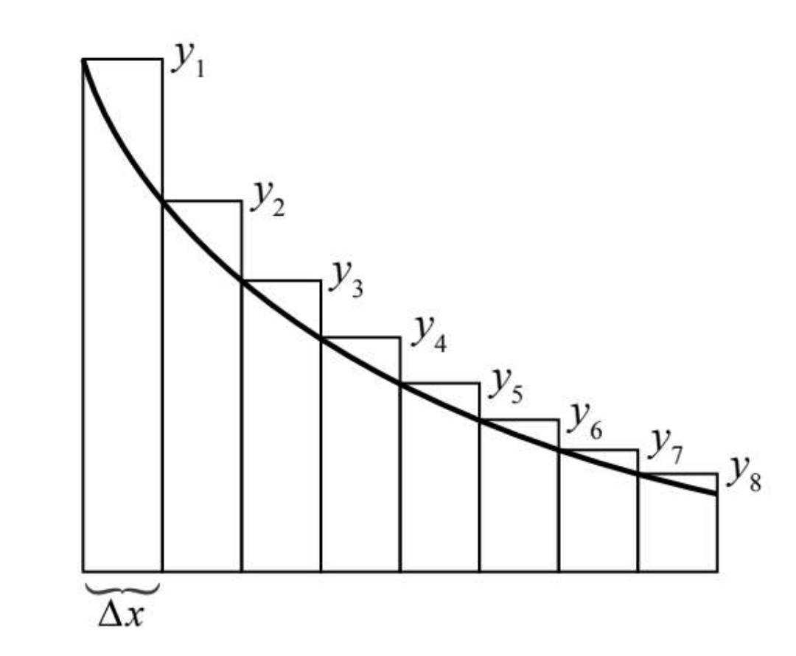

# 微积分

## 计算下面的级数之和
$$
\begin{aligned}
S &= \frac{1}{1 \times 2} + \frac{1}{2 \times 3} + \dots + \frac{1}{n(n+1)} \\ &=
\frac{2-1}{1 \times 2} + \frac{3-2}{2 \times 3} + \dots + \frac{(n+1)-1}{n(n+1)} \\&=
(\frac{2}{1 \times 2} - \frac{1}{1 \times 2}) + (\frac{3}{2 \times 3} - \frac{2}{2 \times 3}) + \dots + (\frac{n+1}{n \times (n+1)} - \frac{n}{n \times (n+1)}) \\&=
(\frac{1}{1} - \frac{1}{2}) + (\frac{1}{2} - \frac{1}{3}) + \dots + (\frac{1}{n} - \frac{1}{n+1}) \\&=
\frac{1}{1} - \frac{1}{2} + \frac{1}{2} - \frac{1}{3} + \dots + \frac{1}{n} - \frac{1}{n+1} \\&=
1 - \frac{1}{n+1}
\end{aligned}
$$

上面用到了裂项相消

所有台阶的垂直高度之和顶部数值减去底部数值[^high]

为简单起见，假设这8个矩形的底均为$\Delta{x}$, 它们的高分别为$y_1, y_2, y_3 \dots y_8$
则，这些矩形的面积为：
$$
y_1\Delta{x} + y_2\Delta{x} + \dots + y_8\Delta{x}
$$

如果我们能找到某些神奇的数字$A_0, A_2, A_3 \dots A_8$, 并使它们的差分别等于这8个矩形的面积:
$$
y_1\Delta{x} = A_1 - A_0 \\
y_2\Delta{x} = A_2 - A_1 \\
y_3\Delta{x} = A_3 - A_2 \\
\dots \\
y_8\Delta{x} = A_8 - A_7 \\
$$

于是，8个矩形的总面积就会伸缩为：
$$
\begin{aligned}
&\quad
y_1\Delta{x} + y_2\Delta{x} + \dots + y_8\Delta{x} \\
&= (A_1 - A_0) + (A_2 - A_1) + (A_3 - A_2) + \dots + (A_8 -A_7) \\
&= A_8 - A_0
\end{aligned}
$$

精确面积为:
$$
\int_a^b y(x)\mathrm{d}x = A(b) - A(a)
$$

怎么找到这个神奇的函数A(x)呢？ 像 $y_1\Delta{x}=A_1 - A_0$ 这样的方程，
随着矩形变得无限细，它们就会变成：
$$
y(x)dx = dA
$$

用导数的形式来表示：
$$
\frac{dA}{dx} = y(x)
$$

所以 A(x) 的导数就是已知的 y(x)

$$
S = \int_a^b f(x)\mathrm{d}x = 
$$

当 a = 0， b = 1 时, 求
$$
\begin{aligned}
\int_a^b {x^2} \mathrm{d}x &= \left. \frac{x^3}{3} \right|_{a}^{b} \\&=
\frac{b^3}{3} - \frac{a^3}{3} \\&=
\frac{1^3}{3} - \frac{0^3}{3} \\&=
\frac{1}{3}
\end{aligned}
$$

$$
\begin{equation}
数学公式
\end{equation}
$$

$$
\begin{equation}
\begin{aligned}
aa
\end{aligned}
\end{equation}
$$

[^high]: 微积分的力量 作者: [美] 史蒂夫·斯托加茨

