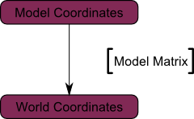
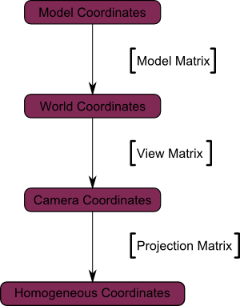
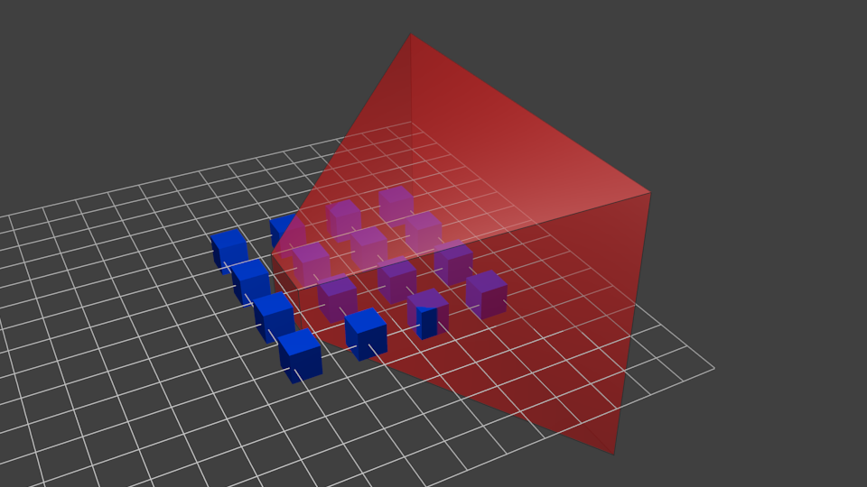

# OpenGL教程笔记
[TOC]

以这个教程做的笔记
http://www.opengl-tutorial.org/cn/beginners-tutorials/tutorial-1-opening-a-window/


```sh
git clone https://github.com/opengl-tutorials/ogl

cd ogl
mkdir build
cmake ..

# 316cccc - (HEAD) Updated GLFW include path
```

用cmake执行后 用 Visual studio打开 Tutorials.sln

## 第一个程序
头文件
```cpp
// Include standard headers
#include <stdio.h>
#include <stdlib.h>

// Include GLEW
#include <GL/glew.h>

// Include GLFW
#include <GLFW/glfw3.h>
GLFWwindow* window;

// Include GLM
#include <glm/glm.hpp>
using namespace glm;
```

glm是数学库

## 绘制第一个三角形
### 顶点数组对象(VAO)

```cpp
GLuint VertexArrayID;
glGenVertexArrays(1, &VertexArrayID);
glBindVertexArray(VertexArrayID);
```

窗口创建成功后（即OpenGL上下文创建后）紧接着完成上述动作；这一步必须在其他OpenGL调用前完成。

### 屏幕坐标系
三点确定一个三角形。我们常常用“顶点”（Vertex，复数vertices）来指代3D图形学中的点。一个顶点有三个坐标：X，Y和Z。您可以这样想象这三根坐标轴：
- X轴朝右
- Y轴朝上
- Z轴指向您后面（没错，是后面，不是前面）

还有更形象的方法：使用右手定则
- 拇指代表X轴
- 食指代表Y轴
- 中指代表Z轴。如果您的拇指指向右边，食指指向天空，那么中指将指向您的后面。


三个三维点来组成一个三角形；下面来定义一个三角形：
```cpp
// An array of 3 vectors which represents 3 vertices
static const GLfloat g_vertex_buffer_data[] = { 
    -1.0f, -1.0f, 0.0f,
    1.0f, -1.0f, 0.0f,
    0.0f,  1.0f, 0.0f,
};
```

第一个顶点是(-1, -1, 0)。 这意味着如果不变换该顶点，它就将显示在屏幕的(-1, -1)位置。这是什么意思呢？屏幕的原点在中间，X轴朝右，Y轴朝上。屏幕坐标如下图：


这是显卡内置的坐标系，无法改变。(-1, -1)是屏幕的左下角，(1, -1)是右下角，(0, 1)位于中上部。这个三角形占据了大部分屏幕。

### 绘制三角形
下一步，通过缓冲把三角形传给OpenGL：
```cpp
// This will identify our vertex buffer
GLuint vertexbuffer;

// Generate 1 buffer, put the resulting identifier in vertexbuffer
glGenBuffers(1, &vertexbuffer);

// The following commands will talk about our 'vertexbuffer' buffer
glBindBuffer(GL_ARRAY_BUFFER, vertexbuffer);

// Give our vertices to OpenGL.
glBufferData(GL_ARRAY_BUFFER, sizeof(g_vertex_buffer_data), g_vertex_buffer_data, GL_STATIC_DRAW);
```

现在终于可以绘制三角形了：
```cpp
// 1rst attribute buffer : vertices
glEnableVertexAttribArray(0);
glBindBuffer(GL_ARRAY_BUFFER, vertexbuffer);
glVertexAttribPointer(
   0,                  // attribute 0. No particular reason for 0, but must match the layout in the shader.
   3,                  // size
   GL_FLOAT,           // type
   GL_FALSE,           // normalized?
   0,                  // stride
   (void*)0            // array buffer offset
);
// Draw the triangle !
glDrawArrays(GL_TRIANGLES, 0, 3); // Starting from vertex 0; 3 vertices total -> 1 triangle
glDisableVertexAttribArray(0);
```

### 着色器（Shader）
编译着色器
在最简配置下，您得有两个着色器：一个叫顶点着色器（vertex shader），它将作用于每个顶点上；
另一个叫片段着色器（fragment shader），它将作用于每一个采样点。我们采用4倍抗锯齿，因此每个像素有四个采样点。

**着色器编程使用GLSL(GL Shading Language)，属于OpenGL的一部分。与C、Java不同，GLSL必须在运行时编译，这意味着每次启动程序时，所有的着色器将重新编译**。

这两个着色器通常单独存放在文件里。本例中有SimpleFragmentShader.fragmentshader和SimpleVertexShader.vertexshader两个着色器。扩展名无关紧要，也可以是.txt或者.glsl。

注意，着色器和缓冲对象一样不能直接访问：我们仅拥有其ID，其真正的实现隐藏在驱动程序中。

顶点着色器
```glsl
#version 330 core

// Input vertex data, different for all executions of this shader.
layout(location = 0) in vec3 vertexPosition_modelspace;

void main(){

    gl_Position.xyz = vertexPosition_modelspace;
    gl_Position.w = 1.0;

}
```

第一行告诉编译器我们将用OpenGL 3语法。
第二行声明输入数据:
- 在GLSL中 `vec3` 代表一个三维向量。类似但不等同于之前声明三角形的 `glm::vec3`。最重要的是，如果我们在C++中使用三维向量，那么在GLSL中也要相应地使用三维向量。
- `layout(location = 0)` 指向存储 `vertexPosition_modelspace` 属性（attribute）的缓冲。每个顶点有多种属性：位置，一种或多种颜色，一个或多个纹理坐标等等。OpenGL并不清楚什么是颜色，它只能识别vec3这样的数据类型。因此我们必须将 `glvertexAttribPointer` 函数的第一个参数值赋给`layout`，以此告知OpenGL每个缓冲对应的是哪种属性数据。第二个参数“0”并不重要，也可以换成12（但是不能超过`glGetIntegerv(GL_MAX_VERTEX_ATTRIBS, &v)`），关键是C++和GLSL两边数值必须保持一致。
- `vertexPosition_modelspace` 这个变量名可以任取，其中保存的是顶点位置，顶点着色器每次运行时都会用到。
- `in` 表明是这是输入数据。不久我们将会看到“out”关键字。


每个顶点都会调用main函数(和C语言一样)

这里的 `main` 函数只是简单地将缓冲里的值作为顶点位置。因此如果位置是(1,1)，那么三角形有一个顶点位于屏幕的右上角。

`gl_Position` 是仅有的几个内置变量之一：您必须对其赋值。其他操作都是可选的，


片段着色器
```glsl
#version 330 core

// Ouput data
out vec3 color;

void main()
{
	// Output color = red 
	color = vec3(1,0,0);
}
```

它仅仅简单将每个片段的颜色设为红色。（记住，我们采用了4倍抗锯齿，因此每个像素有4个片段）。
vec3(1,0,0)代表红色。因为在计算机屏幕上，颜色由红、绿、蓝三元组表示。因此(1,0,0)代表纯红色，无绿、蓝分量。

汇总
在主循环之前调用`LoadShaders`函数：

```cpp
// Create and compile our GLSL program from the shaders
GLuint programID = LoadShaders( "SimpleVertexShader.vertexshader", "SimpleFragmentShader.fragmentshader" );
```

首先在主循环中清屏。在进入主循环之前调用了`glClearColor(0.0f, 0.0f, 0.4f, 0.0f)` ，把背景色设为深蓝色。

然后让OpenGL使用您的着色器
```cpp
// Clear the screen
glClear( GL_COLOR_BUFFER_BIT );

// Use our shader
glUseProgram(programID);
```

然后，哒哒，就看到您亲手绘制的红色三角形啦！


## 矩阵
### 齐次坐标（Homogeneous coordinates）
目前为止，我们仍然把三维顶点视为三元组(x,y,z)。现在引入一个新的分量w，得到向量(x,y,z,w)。请先记住以下两点（稍后我们会给出解释）：

- 若w==1，则向量(x, y, z, 1)为空间中的点。
- 若w==0，则向量(x, y, z, 0)为方向。

### 变换矩阵（Transformation matrices）
矩阵简介
矩阵就是一个行列数固定的、纵横排列的数表。比如，一个2x3矩阵看起来像这样:

$$
\begin{bmatrix}
2 & 5 & 7 \\
9 & 8 & 1
\end{bmatrix}
$$

三维图形学中我们只用到4x4矩阵，它能对顶点(x,y,z,w)作变换。这一变换是用矩阵左乘顶点来实现的：

**矩阵x顶点（记住顺序！！矩阵左乘顶点，顶点用列向量表示）= 变换后的顶点**

用C++，GLM表示：
```cpp
glm::mat4 myMatrix;
glm::vec4 myVector;
// fill myMatrix and myVector somehow
glm::vec4 transformedVector = myMatrix * myVector; // Again, in this order ! this is important.
```

用GLSL表示：
```glsl
mat4 myMatrix;
vec4 myVector;
// fill myMatrix and myVector somehow
vec4 transformedVector = myMatrix * myVector; // Yeah, it's pretty much the same than GLM
```

### 平移矩阵（Translation matrices）
平移矩阵是最简单的变换矩阵。平移矩阵是这样的：
$$
\begin{bmatrix}
1 & 0 & 0 & X \\
0 & 1 & 0 & Y \\
0 & 0 & 1 & Z \\
0 & 0 & 0 & 1 \\
\end{bmatrix}
$$
其中，X、Y、Z是点的位移增量。

例如，若想把向量(10, 10, 10, 1)沿X轴方向平移10个单位，可得：
$$
\begin{bmatrix}
1 & 0 & 0 & 10\\
0 & 1 & 0 & 0 \\
0 & 0 & 1 & 0 \\
0 & 0 & 0 & 1 \\
\end{bmatrix}
\times
\begin{bmatrix}
10 \\
10 \\
10 \\
1
\end{bmatrix} =
\begin{bmatrix}
20 \\
10 \\
10 \\
1
\end{bmatrix} 
$$

这样就得到了齐次向量(20,10,10,1)！记住，末尾的1表示这是一个点，而不是方向。经过变换计算后，点仍然是点，这倒是挺合情合理的。

用代码表示平移变换
用C++，GLM表示：
```cpp
#include <glm/gtx/transform.hpp> // after <glm/glm.hpp>

glm::mat4 myMatrix = glm::translate(glm::mat4(), glm::vec3(10.0f, 0.0f, 0.0f));
glm::vec4 myVector(10.0f, 10.0f, 10.0f, 0.0f);
glm::vec4 transformedVector = myMatrix * myVector; // guess the result
```

1. `glm::mat4 myMatrix = glm::translate(glm::mat4(), glm::vec3(10.0f, 0.0f, 0.0f));` 
这行代码创建了一个变换矩阵`myMatrix`。这个变换是一个平移变换，将物体在 x 轴方向上移动 10 个单位。`glm::translate`函数接收两个参数，第一个参数是一个单位矩阵，第二个参数是一个三维向量，表示在 x、y 和 z 方向上的移动量。
2. `glm::vec4 myVector(10.0f, 10.0f, 10.0f, 0.0f);` 
这行代码创建了一个四维向量`myVector`，其中的四个参数分别是 x、y、z 坐标和齐次坐标w。这个向量可能表示一个位置或者方向。

3. `glm::vec4 transformedVector = myMatrix * myVector;` 
这行代码将变换矩阵`myMatrix`应用到向量`myVector`上，得到一个新的向量`transformedVector`。这个新向量是原向量经过平移变换后的结果。

其中 myMatrix 由单位矩阵，通过变换生成出来的
$$
\begin{bmatrix}
1 & 0 & 0 & t_x \\
0 & 1 & 0 & t_y \\
0 & 0 & 1 & t_z \\
0 & 0 & 0 & 1
\end{bmatrix}
\Rightarrow 
\begin{bmatrix}
1 & 0 & 0 & 10 \\
0 & 1 & 0 & 0 \\
0 & 0 & 1 & 0 \\
0 & 0 & 0 & 1
\end{bmatrix} 
$$


用GLSL表示：
呃，实际中我们几乎不用GLSL计算变换矩阵。大多数情况下在C++代码中用glm::translate()算出矩阵，然后把它传给GLSL。在GLSL中只做一次乘法
```glsl
vec4 transformedVector = myMatrix * myVector;
```

### 单位矩阵（Identity matrix）
单位矩阵很特殊，它什么也不做。单位矩阵的身份和自然数”1”一样基础而重要，因此在这里要特别提及一下。
$$
\begin{bmatrix}
1 & 0 & 0 & 0\\
0 & 1 & 0 & 0 \\
0 & 0 & 1 & 0 \\
0 & 0 & 0 & 1 \\
\end{bmatrix}
\times
\begin{bmatrix}
x \\
y \\
z \\
w
\end{bmatrix} =
\begin{bmatrix}
x \\
y \\
z \\
w
\end{bmatrix}
$$

用C++表示：
```cpp
glm::mat4 myIdentityMatrix = glm::mat4(1.0);
```

### 缩放矩阵（Scaling matrices）
缩放矩阵也很简单：

把一个向量（点或方向皆可）沿各方向放大2倍
$$
\begin{bmatrix}
2 & 0 & 0 & 0\\
0 & 2 & 0 & 0 \\
0 & 0 & 2 & 0 \\
0 & 0 & 0 & 1 \\
\end{bmatrix}
\times
\begin{bmatrix}
x \\
y \\
z \\
w
\end{bmatrix} =
\begin{bmatrix}
2x \\
2y \\
2z \\
w
\end{bmatrix}
$$

w还是没变。您也许会问：”缩放一个向量”有什么用？嗯，大多数情况下是没什么用，所以一般不会去缩放向量；但在某些特殊情况下它就派上用场了。（顺便说一下，单位矩阵只是缩放矩阵的一个特例，其(X, Y, Z) = (1, 1, 1)。单位矩阵同时也是旋转矩阵的一个特例，其(X, Y, Z)=(0, 0, 0)）。

用C++表示：
```cpp
// Use #include <glm/gtc/matrix_transform.hpp> and #include <glm/gtx/transform.hpp>
glm::mat4 myScalingMatrix = glm::scale(2.0f, 2.0f ,2.0f);
```

### 旋转矩阵（Rotation matrices）
旋转矩阵比较复杂。这里略过细节
用C++表示：
```cpp
// Use #include <glm/gtc/matrix_transform.hpp> and #include <glm/gtx/transform.hpp>
glm::vec3 myRotationAxis( ??, ??, ??);
glm::rotate( angle_in_degrees, myRotationAxis );
```

### 累积变换
前面已经学习了如何旋转、平移和缩放向量。把这些矩阵相乘就能将它们组合起来，例如：
```cpp
TransformedVector = TranslationMatrix * RotationMatrix * ScaleMatrix * OriginalVector;
```
**注意**：这行代码首先执行缩放，接着旋转，最后才是平移。这就是矩阵乘法的工作方式。

你在变换游戏角色或者其他物体时所需的：先缩放；再调整方向；最后平移。例如，假设有个船的模型（为简化，略去旋转）：

- 错误做法：
    + 按(10, 0, 0)平移船体。船体中心目前距离原点10个单位。
    + 将船体放大2倍。以原点为参照，每个坐标都变成原来的2倍，就出问题了。最后您得到的是一艘放大的船，但其中心位于2*10=20。这并非您预期的结果。
- 正确做法：
    + 将船体放大2倍，得到一艘中心位于原点的大船。
    + 平移船体。船大小不变，移动距离也正确。

矩阵-矩阵乘法和矩阵-向量乘法类似，所以这里也会省略一些细节，不清楚的读者请移步[矩阵和四元组常见问题](http://www.opengl-tutorial.org/assets/faq_quaternions/index.html#Q11)。

用C++，GLM表示：
```cpp
glm::mat4 myModelMatrix = myTranslationMatrix * myRotationMatrix * myScaleMatrix;
glm::vec4 myTransformedVector = myModelMatrix * myOriginalVector;
```

用GLSL表示：
```glsl
mat4 transform = mat2 * mat1;
vec4 out_vec = transform * in_vec;
```

### 模型（Model）、观察（View）和投影（Projection）矩阵

### 模型矩阵
这个三维模型和可爱的红色三角形一样，由一组顶点定义。顶点的XYZ坐标是相对于物体中心定义的：也就是说，若某顶点位于(0,0,0)，则其位于物体的中心。


我们希望能够移动它，玩家也需要用键鼠控制这个模型。这很简单，只需记住：缩放旋转平移就够了。在每一帧中，用算出的这个矩阵去乘（在GLSL中乘，不是在C++中！）所有的顶点，物体就会移动。唯一不动的是世界空间（World Space）的中心。


现在，物体所有顶点都位于世界空间。下图中黑色箭头的意思是：从模型空间（Model Space）（顶点都相对于模型的中心定义）变换到世界空间（顶点都相对于世界空间中心定义）。


下图概括了这一过程：


### 观察矩阵
这里再引用一下《飞出个未来》：
> The engines don’t move the ship at all. The ship stays where it is and the engines move the universe around it. -- Futurama
> 引擎推动的不是飞船而是宇宙。飞船压根就没动过。


仔细想想，摄像机的原理也是相通的。如果想换个角度观察一座山，您可以移动摄像机也可以……移动山。后者在实际中不可行，在计算机图形学中却十分方便。

起初，摄像机位于世界坐标系的原点。移动世界只需乘一个矩阵。假如你想把摄像机向**右**（X轴正方向）移动3个单位，这和把整个世界（包括网格）向**左**（X轴负方向）移3个单位是等效的！脑子有点乱？来写代码吧：
```cpp
// Use #include <glm/gtc/matrix_transform.hpp> and #include <glm/gtx/transform.hpp>
glm::mat4 ViewMatrix = glm::translate(glm::mat4(), glm::vec3(-3.0f, 0.0f, 0.0f));
```

下图展示了：从世界空间（顶点都相对于世界空间中心定义）到摄像机空间（Camera Space，顶点都相对于摄像机定义）的变换。


趁脑袋还没爆炸，来欣赏一下GLM强大的glm::LookAt函数吧：
```cpp
glm::mat4 CameraMatrix = glm::LookAt(
    cameraPosition, // the position of your camera, in world space
    cameraTarget,   // where you want to look at, in world space
    upVector        // probably glm::vec3(0,1,0), but (0,-1,0) would make you looking upside-down, which can be great too
);
```

下图解释了上述变换过程：


### 投影矩阵
现在，我们处于摄像机空间中。这意味着，经历了这么多变换后，现在一个坐标 `X=0` 且 `Y=0` 的顶点，应该被画在屏幕的中心。但仅有x、y坐标还不足以确定物体是否应该画在屏幕上：它到摄像机的距离（z）也很重要！两个x、y坐标相同的顶点，z值较大的一个将会最终显示在屏幕上。

这就是所谓的透视投影（perspective projection）：


好在用一个4x4矩阵就能表示这个投影[^4x4]:
```cpp
// Generates a really hard-to-read matrix, but a normal, standard 4x4 matrix nonetheless
glm::mat4 projectionMatrix = glm::perspective(
    glm::radians(FoV), // The vertical Field of View, in radians: the amount of "zoom". Think "camera lens". Usually between 90&deg; (extra wide) and 30&deg; (quite zoomed in)
    4.0f / 3.0f,       // Aspect Ratio. Depends on the size of your window. Notice that 4/3 == 800/600 == 1280/960, sounds familiar ?
    0.1f,              // Near clipping plane. Keep as big as possible, or you'll get precision issues.
    100.0f             // Far clipping plane. Keep as little as possible.
);
```
这行代码创建了一个透视投影矩阵。投影矩阵用于将3D坐标转换到2D屏幕上，同时考虑到视点的深度。
- `glm::perspective`函数接收四个参数：视野（FOV）、宽高比（AspectRatio）、近裁剪面（Near clipping plane）和远裁剪面（Far clipping plane）。
- `glm::radians(45.0f)`表示视野是45度，但GLM库需要的是弧度制，所以这里用`glm::radians`函数转换一下。
- `4.0f / 3.0f`是宽高比。这通常与你的窗口的宽高比是一致的。在这个例子中，宽度是4，高度是3。
- `0.1f`是近裁剪面，`100.0f`是远裁剪面。这两个值定义了可视深度范围，也就是说，只有在0.1到100.0的范围内的物体才会被渲染。

当我们说视野是45度，通常是指从观察者的视线中心点，向上和向下各偏离22.5度，加起来就构成了垂直方向的45度视野范围。
至于水平方向（即左右方向）的视野范围，它通常是通过垂直方向的视野和屏幕的宽高比来计算得出的。


最后一个变换：
从摄像机空间（顶点都相对于摄像机定义）到齐次坐空间（Homogeneous Space）（顶点都在一个小立方体中定义。立方体内的物体都会在屏幕上显示）的变换。


再添几张图，以便大家更好地理解投影变换。投影前，蓝色物体都位于摄像机空间中，红色的东西是摄像机的平截头体（frustum）：这是摄像机实际能看见的区域。


用投影矩阵去乘前面的结果，得到如下效果：


此图中，平截头体变成了一个正方体（每条棱的范围都是-1到1，图不太明显），所有的蓝色物体都经过了相同的变形。因此，离摄像机近的物体就显得大一些，远的显得小一些。这和现实生活一样！

让我们从平截头体的”后面”看看它们的模样：


这就是您得到的图像！看上去太方方正正了，因此，还需要做一次数学变换使之适合实际的窗口大小。


这就是实际渲染的图像啦！

### 复合变换：模型观察投影矩阵（MVP）
再来一连串深爱已久的标准矩阵乘法：
```cpp
// C++ : compute the matrix
glm::mat4 MVPmatrix = projection * view * model; // Remember : inverted !
```

```glsl
// GLSL : apply it
transformed_vertex = MVP * in_vertex;
```

总结
第一步：创建模型观察投影（MVP）矩阵。任何要渲染的模型都要做这一步。
```cpp
// Projection matrix : 45° Field of View, 4:3 ratio, display range : 0.1 unit <-> 100 units
glm::mat4 Projection = glm::perspective(glm::radians(45.0f), (float) width / (float)height, 0.1f, 100.0f);

// Or, for an ortho camera :
//glm::mat4 Projection = glm::ortho(-10.0f,10.0f,-10.0f,10.0f,0.0f,100.0f); // In world coordinates

// Camera matrix
glm::mat4 View = glm::lookAt(
    glm::vec3(4,3,3), // Camera is at (4,3,3), in World Space
    glm::vec3(0,0,0), // and looks at the origin
    glm::vec3(0,1,0)  // Head is up (set to 0,-1,0 to look upside-down)
    );

// Model matrix : an identity matrix (model will be at the origin)
glm::mat4 Model = glm::mat4(1.0f);
// Our ModelViewProjection : multiplication of our 3 matrices
glm::mat4 mvp = Projection * View * Model; // Remember, matrix multiplication is the other way around
```

`glm::ortho`函数接收六个参数，分别是左、右、底、顶、近和远裁剪面。

在这个例子中，左和右裁剪面分别是-10.0f和10.0f，底和顶裁剪面分别是-10.0f和10.0f，近和远裁剪面分别是0.0f和100.0f。这些参数定义了一个裁剪空间，只有在这个空间内的物体才会被渲染。

这个正交投影矩阵会被用于之后的顶点着色器中，将3D世界坐标转换到2D屏幕坐标。由于是正交投影，所以远离或靠近观察者的物体大小不会改变。


第二步：把MVP传给GLSL
```cpp
// Get a handle for our "MVP" uniform
// Only during the initialisation
GLuint MatrixID = glGetUniformLocation(programID, "MVP");

// Send our transformation to the currently bound shader, in the "MVP" uniform
// This is done in the main loop since each model will have a different MVP matrix (At least for the M part)
glUniformMatrix4fv(MatrixID, 1, GL_FALSE, &mvp[0][0]);
```

第三步：在GLSL中用MVP变换顶点
```cpp
// Input vertex data, different for all executions of this shader.
layout(location = 0) in vec3 vertexPosition_modelspace;

// Values that stay constant for the whole mesh.
uniform mat4 MVP;

void main(){
  // Output position of the vertex, in clip space : MVP * position
  gl_Position =  MVP * vec4(vertexPosition_modelspace,1);
}
```

搞定！三角形和第二课的一样，仍然在原点(0,0,0)，然而是从点(4,3,3)透视观察的；摄像机的朝上方向为(0,1,0)，视野（field of view）45°。


## 彩色立方体
### 绘制立方体
立方体有六个方形表面，而OpenGL只支持画三角形，因此需要画12个三角形，每个面两个。我们用定义三角形顶点的方式来定义这些顶点。
```cpp
// Our vertices. Three consecutive floats give a 3D vertex; Three consecutive vertices give a triangle.
// A cube has 6 faces with 2 triangles each, so this makes 6*2=12 triangles, and 12*3 vertices
static const GLfloat g_vertex_buffer_data[] = {
    -1.0f,-1.0f,-1.0f, // triangle 1 : begin
    -1.0f,-1.0f, 1.0f,
    -1.0f, 1.0f, 1.0f, // triangle 1 : end
    1.0f, 1.0f,-1.0f, // triangle 2 : begin
    -1.0f,-1.0f,-1.0f,
    -1.0f, 1.0f,-1.0f, // triangle 2 : end
    1.0f,-1.0f, 1.0f,
    -1.0f,-1.0f,-1.0f,
    1.0f,-1.0f,-1.0f,
    1.0f, 1.0f,-1.0f,
    1.0f,-1.0f,-1.0f,
    -1.0f,-1.0f,-1.0f,
    -1.0f,-1.0f,-1.0f,
    -1.0f, 1.0f, 1.0f,
    -1.0f, 1.0f,-1.0f,
    1.0f,-1.0f, 1.0f,
    -1.0f,-1.0f, 1.0f,
    -1.0f,-1.0f,-1.0f,
    -1.0f, 1.0f, 1.0f,
    -1.0f,-1.0f, 1.0f,
    1.0f,-1.0f, 1.0f,
    1.0f, 1.0f, 1.0f,
    1.0f,-1.0f,-1.0f,
    1.0f, 1.0f,-1.0f,
    1.0f,-1.0f,-1.0f,
    1.0f, 1.0f, 1.0f,
    1.0f,-1.0f, 1.0f,
    1.0f, 1.0f, 1.0f,
    1.0f, 1.0f,-1.0f,
    -1.0f, 1.0f,-1.0f,
    1.0f, 1.0f, 1.0f,
    -1.0f, 1.0f,-1.0f,
    -1.0f, 1.0f, 1.0f,
    1.0f, 1.0f, 1.0f,
    -1.0f, 1.0f, 1.0f,
    1.0f,-1.0f, 1.0f
};
```

OpenGL的缓冲由一些标准的函数（glGenBuffers, glBindBuffer, glBufferData, glVertexAttribPointer）来创建、绑定、填充和配置；这些可参阅第二课。若有遗忘，可参见第二课。绘制的调用也没变，只需改变绘制的点的个数：
```cpp
// Draw the triangle !
glDrawArrays(GL_TRIANGLES, 0, 12*3); // 12*3 indices starting at 0 -> 12 triangles -> 6 squares
```

关于这段代码，有几点要说明一下：
- 截至目前我们使用的三维模型都是固定的：只能在源码中修改模型，重新编译，然后祈祷不要出什么差错。我们将在第七课中学习如何动态地加载模型。
- 实际上，每个顶点至少出现了三次（在以上代码中搜索”-1.0f,-1.0f,-1.0f”看看）。这严重浪费了内存空间。我们将在第九课中学习怎样对此进行优化。

现在您已具备绘制一个白色立方体的所有条件。试着让着色器运行起来吧:)

### 增色添彩
从概念上讲，颜色与位置是一回事：就是数据嘛。OpenGL术语中称之为”属性（attribute）”。其实我们之前已用glEnableVertexAttribArray()和glVertexAttribPointer()设置过属性了。现在加上颜色属性，代码很相似。

首先声明颜色：每个顶点一个RGB三元组。这里随机生成一些颜色，所以效果看起来可能不太好；您可以调整得更好些，例如把顶点的位置作为颜色值。

```cpp
// One color for each vertex. They were generated randomly.
static const GLfloat g_color_buffer_data[] = {
    0.583f,  0.771f,  0.014f,
    0.609f,  0.115f,  0.436f,
    0.327f,  0.483f,  0.844f,
    0.822f,  0.569f,  0.201f,
    0.435f,  0.602f,  0.223f,
    0.310f,  0.747f,  0.185f,
    0.597f,  0.770f,  0.761f,
    0.559f,  0.436f,  0.730f,
    0.359f,  0.583f,  0.152f,
    0.483f,  0.596f,  0.789f,
    0.559f,  0.861f,  0.639f,
    0.195f,  0.548f,  0.859f,
    0.014f,  0.184f,  0.576f,
    0.771f,  0.328f,  0.970f,
    0.406f,  0.615f,  0.116f,
    0.676f,  0.977f,  0.133f,
    0.971f,  0.572f,  0.833f,
    0.140f,  0.616f,  0.489f,
    0.997f,  0.513f,  0.064f,
    0.945f,  0.719f,  0.592f,
    0.543f,  0.021f,  0.978f,
    0.279f,  0.317f,  0.505f,
    0.167f,  0.620f,  0.077f,
    0.347f,  0.857f,  0.137f,
    0.055f,  0.953f,  0.042f,
    0.714f,  0.505f,  0.345f,
    0.783f,  0.290f,  0.734f,
    0.722f,  0.645f,  0.174f,
    0.302f,  0.455f,  0.848f,
    0.225f,  0.587f,  0.040f,
    0.517f,  0.713f,  0.338f,
    0.053f,  0.959f,  0.120f,
    0.393f,  0.621f,  0.362f,
    0.673f,  0.211f,  0.457f,
    0.820f,  0.883f,  0.371f,
    0.982f,  0.099f,  0.879f
};
```

缓冲的创建、绑定和填充方法与之前一样：
```cpp
GLuint colorbuffer;
glGenBuffers(1, &colorbuffer);
glBindBuffer(GL_ARRAY_BUFFER, colorbuffer);
glBufferData(GL_ARRAY_BUFFER, sizeof(g_color_buffer_data), g_color_buffer_data, GL_STATIC_DRAW);
```

配置也一样：
```cpp
// 2nd attribute buffer : colors
glEnableVertexAttribArray(1);
glBindBuffer(GL_ARRAY_BUFFER, colorbuffer);
glVertexAttribPointer(
    1,                                // attribute. No particular reason for 1, but must match the layout in the shader.
    3,                                // size
    GL_FLOAT,                         // type
    GL_FALSE,                         // normalized?
    0,                                // stride
    (void*)0                          // array buffer offset
);
```

现在在顶点着色器中已经能访问这个新增的缓冲了：
```glsl
// Notice that the "1" here equals the "1" in glVertexAttribPointer
layout(location = 1) in vec3 vertexColor;
```

这一课的顶点着色器没有什么复杂的效果，仅仅是简单地把颜色传递到片段着色器：
```glsl
// Output data ; will be interpolated for each fragment.
out vec3 fragmentColor;

void main(){

    [...]

    // The color of each vertex will be interpolated
    // to produce the color of each fragment
    fragmentColor = vertexColor;
}
```

在片段着色器中要再次声明片段颜色：
```glsl
// Interpolated values from the vertex shaders
in vec3 fragmentColor;
```

然后将其拷贝到输出颜色：
```glsl
// Ouput data
out vec3 color;

void main(){
    // Output color = color specified in the vertex shader,
    // interpolated between all 3 surrounding vertices
    color = fragmentColor;
}
```

于是得到：


呃，太难看了。为了搞清楚出现这种情况原因，我们先看看画一个”远”和”近”的三角形会发生什么：


似乎挺好。现在画”远”三角形：


它遮住了”近”三角形！它本应该在”近”三角形后面的！我们的立方体问题就在这里：一些理应被遮挡的面，因为绘制次序靠后，竟然变成可见的了。我们将用深度缓冲（Z-Buffer）算法解决它。

便签1
如果您没发现问题，把摄像机放到(4,3,-3)试试
便签2
如果”颜色和位置同为属性”，那为什么颜色要声明 out vec3 fragmentColor，而位置不需要？实际上，位置有点特殊：它是唯一必须赋初值的（否则OpenGL不知道在哪画三角形）。所以在顶点着色器里， gl_Position是内置变量。

### 深度缓冲（Z-Buffer）The Z-Buffer
该问题的解决方案是：在缓冲中存储每个片段的深度（即”Z”值）；并且每次绘制片段之前要比较当前与先前片段的深度值，看谁离摄像机更近。

您可以自己实现深度缓冲，但让硬件自动完成更简单：
```glsl
// Enable depth test
glEnable(GL_DEPTH_TEST);
// Accept fragment if it closer to the camera than the former one
glDepthFunc(GL_LESS);
```

你还需要清除除了颜色以外每一帧（frame）的深度。
```glsl
// Clear the screen
glClear(GL_COLOR_BUFFER_BIT | GL_DEPTH_BUFFER_BIT);
```

问题解决了。


练习
- 在不同的位置画立方体和三角形。您得构造两个MVP矩阵，在主循环中进行两次绘制调用，但只需一个着色器。
- 自己生成颜色值。一些点子：随机生成颜色，这样每次运行时颜色都不同；根据顶点位置生成颜色；把前面两种思路结合起来；或其他创意:)。若您不了解C，参考以下语法：

```cpp
static GLfloat g_color_buffer_data[12*3*3];
for (int v = 0; v < 12*3 ; v++){
    g_color_buffer_data[3*v+0] = your red color here;
    g_color_buffer_data[3*v+1] = your green color here;
    g_color_buffer_data[3*v+2] = your blue color here;
}
```

完成上面习题后，尝试每帧都改变颜色。您得在每帧都调用glBufferData。请确保已绑定（glBindBuffer）了合适的缓冲

## 带纹理的立方体
### 关于UV坐标
给模型贴纹理时，我们需要通过UV坐标来告诉OpenGL用哪块图像填充三角形。

每个顶点除了位置坐标外还有两个浮点数坐标：U和V。这两个坐标用于访问纹理，如下图所示：


注意观察纹理是怎样在三角形上扭曲的。

### 自行加载.BMP图片
不用花太多心思了解BMP文件格式：很多库可以帮你加载BMP文件。但BMP格式极为简单，可以帮助你理解那些库的工作原理。所以，我们从头开始写一个BMP文件加载器，不过千万别在实际工程中使用这个实验品。

如下是加载函数的声明：
```cpp
GLuint loadBMP_custom(const char * imagepath);
```

使用方式如下：
```cpp
GLuint image = loadBMP_custom("./my_texture.bmp");
```

接下来看看如何读取BMP文件。

首先需要一些数据。读取文件时将设置这些变量。
```cpp
// Data read from the header of the BMP file
unsigned char header[54]; // Each BMP file begins by a 54-bytes header
unsigned int dataPos;     // Position in the file where the actual data begins
unsigned int width, height;
unsigned int imageSize;   // = width*height*3
// Actual RGB data
unsigned char * data;
```

现在正式开始打开文件。
```cpp
// Open the file
FILE * file = fopen(imagepath,"rb");
if (!file)
{
    printf("Image could not be openedn");
    return 0;
}
```

文件一开始是54字节长的文件头，用于标识”这是不是一个BMP文件”、图像大小、像素位等等。来读取文件头吧：
```cpp
if ( fread(header, 1, 54, file)!=54 ){ // If not 54 bytes read : problem
    printf("Not a correct BMP filen");
    return false;
}
```

文件头总是以”BM”开头。实际上，如果用十六进制编辑器打开BMP文件，您会看到如下情形：


因此得检查一下头两个字节是否确为‘B’和‘M’：
```cpp
if ( header[0]!='B' || header[1]!='M' ){
    printf("Not a correct BMP filen");
    return 0;
}
```

现在可以读取文件中图像大小、数据位置等信息了：
```cpp
// Read ints from the byte array
dataPos    = *(int*)&(header[0x0A]);
imageSize  = *(int*)&(header[0x22]);
width      = *(int*)&(header[0x12]);
height     = *(int*)&(header[0x16]);
```

如果这些信息缺失，您得手动补齐：
```cpp
// Some BMP files are misformatted, guess missing information
if (imageSize==0)    imageSize=width*height*3; // 3 : one byte for each Red, Green and Blue component
if (dataPos==0)      dataPos=54; // The BMP header is done that way
```

现在我们知道了图像的大小，可以为之分配一些内存，把图像读进去：
```cpp
// Create a buffer
data = new unsigned char [imageSize];

// Read the actual data from the file into the buffer
fread(data,1,imageSize,file);

//Everything is in memory now, the file can be closed
fclose(file);
```

到了真正的OpenGL部分了。创建纹理和创建顶点缓冲差不多：创建一个纹理、绑定、填充、配置。

在glTexImage2D函数中，GL_RGB表示颜色由三个分量构成，GL_BGR则说明了颜色在内存中的存储格式。实际上，BMP存储的并不是RGB，而是BGR，因此得把这个告诉OpenGL。
```cpp
// Create one OpenGL texture
GLuint textureID;
glGenTextures(1, &textureID);

// "Bind" the newly created texture : all future texture functions will modify this texture
glBindTexture(GL_TEXTURE_2D, textureID);

// Give the image to OpenGL
glTexImage2D(GL_TEXTURE_2D, 0,GL_RGB, width, height, 0, GL_BGR, GL_UNSIGNED_BYTE, data);

glTexParameteri(GL_TEXTURE_2D, GL_TEXTURE_MAG_FILTER, GL_NEAREST);
glTexParameteri(GL_TEXTURE_2D, GL_TEXTURE_MIN_FILTER, GL_NEAREST);
```

稍后再解释最后两行代码。同时，得在C++代码中使用刚写好的函数加载一个纹理：
```cpp
GLuint Texture = loadBMP_custom("uvtemplate.bmp");
```

另外十分重要的一点：**使用2次幂（power-of-two）的纹理**
- 优质纹理： 128x128, 256*256, 1024x1024, 2x2, …
- 劣质纹理： 127x128, 3x5, …
- 勉强可以但很怪异的纹理： 128x256

### 在OpenGL中使用纹理
先来看看片段着色器。大部分代码一目了然：
```glsl
#version 330 core

// Interpolated values from the vertex shaders
in vec2 UV;

// Ouput data
out vec3 color;

// Values that stay constant for the whole mesh.
uniform sampler2D myTextureSampler;

void main(){

    // Output color = color of the texture at the specified UV
    color = texture( myTextureSampler, UV ).rgb;
}
```

注意三点：
- 片段着色器需要UV坐标。看似合情合理。
- 同时也需要一个”Sampler2D”来获知要加载哪一个纹理（同一个着色器中可以访问多个纹理）
- 最后一点，用texture()访问纹理，该方法返回一个(R,G,B,A)的vec4变量。马上就会了解到分量A。

顶点着色器也很简单，只需把UV坐标传给片段着色器：
```glsl
#version 330 core

// Input vertex data, different for all executions of this shader.
layout(location = 0) in vec3 vertexPosition_modelspace;
layout(location = 1) in vec2 vertexUV;

// Output data ; will be interpolated for each fragment.
out vec2 UV;

// Values that stay constant for the whole mesh.
uniform mat4 MVP;

void main(){

    // Output position of the vertex, in clip space : MVP * position
    gl_Position =  MVP * vec4(vertexPosition_modelspace,1);

    // UV of the vertex. No special space for this one.
    UV = vertexUV;
}
```
还记得第四课中的”layout(location = 1) in vec2 vertexUV”吗？我们得在这儿把相同的事情再做一遍，但这次的缓冲中放的不是(R,G,B)三元组，而是(U,V)数对。

```cpp
// Two UV coordinatesfor each vertex. They were created with Blender. You'll learn shortly how to do this yourself.
static const GLfloat g_uv_buffer_data[] = {
    0.000059f, 1.0f-0.000004f,
    0.000103f, 1.0f-0.336048f,
    0.335973f, 1.0f-0.335903f,
    1.000023f, 1.0f-0.000013f,
    0.667979f, 1.0f-0.335851f,
    0.999958f, 1.0f-0.336064f,
    0.667979f, 1.0f-0.335851f,
    0.336024f, 1.0f-0.671877f,
    0.667969f, 1.0f-0.671889f,
    1.000023f, 1.0f-0.000013f,
    0.668104f, 1.0f-0.000013f,
    0.667979f, 1.0f-0.335851f,
    0.000059f, 1.0f-0.000004f,
    0.335973f, 1.0f-0.335903f,
    0.336098f, 1.0f-0.000071f,
    0.667979f, 1.0f-0.335851f,
    0.335973f, 1.0f-0.335903f,
    0.336024f, 1.0f-0.671877f,
    1.000004f, 1.0f-0.671847f,
    0.999958f, 1.0f-0.336064f,
    0.667979f, 1.0f-0.335851f,
    0.668104f, 1.0f-0.000013f,
    0.335973f, 1.0f-0.335903f,
    0.667979f, 1.0f-0.335851f,
    0.335973f, 1.0f-0.335903f,
    0.668104f, 1.0f-0.000013f,
    0.336098f, 1.0f-0.000071f,
    0.000103f, 1.0f-0.336048f,
    0.000004f, 1.0f-0.671870f,
    0.336024f, 1.0f-0.671877f,
    0.000103f, 1.0f-0.336048f,
    0.336024f, 1.0f-0.671877f,
    0.335973f, 1.0f-0.335903f,
    0.667969f, 1.0f-0.671889f,
    1.000004f, 1.0f-0.671847f,
    0.667979f, 1.0f-0.335851f
};
```

上述UV坐标对应于下面的模型：


其余的就很清楚了。创建一个缓冲、绑定、填充、配置，像往常一样绘制顶点缓冲对象。要注意把glVertexAttribPointer的第二个参数（大小）3改成2。

结果如下：


放大后：


### 什么是过滤和mipmap？怎样使用？
正如在上面截图中看到的，纹理质量不是很好。这是因为在loadBMP_custom函数中，有如下两行代码：
```cpp
glTexParameteri(GL_TEXTURE_2D, GL_TEXTURE_MAG_FILTER, GL_NEAREST);
glTexParameteri(GL_TEXTURE_2D, GL_TEXTURE_MIN_FILTER, GL_NEAREST);
```

这意味着在片段着色器中，texture()将直接提取位于(U,V)坐标的纹素（texel）。


有几种方法可以改善这一状况。
### 线性过滤（Linear filtering）
若采用线性过滤。texture()会查看周围的纹素，然后根据UV坐标距离各纹素中心的距离来混合颜色。这就避免了前面看到的锯齿状边缘。


线性过滤可以显著改善纹理质量，应用的也很多。但若想获得更高质量的纹理，可以采用各向异性过滤，不过速度有些慢。

### 各向异性过滤（Anisotropic filtering）
这种方法逼近了真正片断中的纹素区块。例如下图中稍稍旋转了的纹理，各向异性过滤将沿蓝色矩形框的主方向，作一定数量的采样（即所谓的”各向异性层级”），计算出其内的颜色。


### Mipmaps
线性过滤和各向异性过滤都存在一个共同的问题。那就是如果从远处观察纹理，只对4个纹素作混合显得不够。实际上，如果3D模型位于很远的地方，屏幕上只看得见一个片断（像素），那计算平均值得出最终颜色值时，图像所有的纹素都应该考虑在内。很显然，这种做法没有考虑性能问题。撇开两种过滤方法不谈，这里要介绍的是mipmap技术：


- 一开始，把图像缩小到原来的1/2，然后依次缩小，直到图像只有1x1大小（应该是图像所有纹素的平均值）
- 绘制模型时，根据纹素大小选择合适的mipmap。
- 可以选用nearest、linear、anisotropic等任意一种滤波方式来对mipmap采样。
- 要想效果更好，可以对两个mipmap采样然后混合，得出结果。

好在这个比较简单，OpenGL都帮我们做好了，只需一个简单的调用：
```cpp
// When MAGnifying the image (no bigger mipmap available), use LINEAR filtering
glTexParameteri(GL_TEXTURE_2D, GL_TEXTURE_MAG_FILTER, GL_LINEAR);
// When MINifying the image, use a LINEAR blend of two mipmaps, each filtered LINEARLY too
glTexParameteri(GL_TEXTURE_2D, GL_TEXTURE_MIN_FILTER, GL_LINEAR_MIPMAP_LINEAR);
// Generate mipmaps, by the way.
glGenerateMipmap(GL_TEXTURE_2D);
```

### 怎样利用GLFW加载纹理？
我们的loadBMP_custom函数很棒，因为这是我们自己写的！不过用专门的库更好。GLFW就可以加载纹理（仅限TGA文件）：
```cpp
GLuint loadTGA_glfw(const char * imagepath){

    // Create one OpenGL texture
    GLuint textureID;
    glGenTextures(1, &textureID);

    // "Bind" the newly created texture : all future texture functions will modify this texture
    glBindTexture(GL_TEXTURE_2D, textureID);

    // Read the file, call glTexImage2D with the right parameters
    glfwLoadTexture2D(imagepath, 0);

    // Nice trilinear filtering.
    glTexParameteri(GL_TEXTURE_2D, GL_TEXTURE_WRAP_S, GL_REPEAT);
    glTexParameteri(GL_TEXTURE_2D, GL_TEXTURE_WRAP_T, GL_REPEAT);
    glTexParameteri(GL_TEXTURE_2D, GL_TEXTURE_MAG_FILTER, GL_LINEAR);
    glTexParameteri(GL_TEXTURE_2D, GL_TEXTURE_MIN_FILTER, GL_LINEAR_MIPMAP_LINEAR);
    glGenerateMipmap(GL_TEXTURE_2D);

    // Return the ID of the texture we just created
    return textureID;
}
```


### 压缩纹理
学到这儿，您可能会问：那JPEG格式的纹理又该怎样加载呢？

简答：用不着考虑这些文件格式，您还有更好的选择。

### 创建压缩纹理
下载The [Compressonator](http://gpuopen.com/gaming-product/compressonator/),一款ATI工具
用它加载一个二次幂纹理
将其压缩成DXT1、DXT3或DXT5格式（这些格式之间的差别请参考[Wikipedia](http://en.wikipedia.org/wiki/S3_Texture_Compression）：


- 生成mipmap，这样就不用在运行时生成mipmap了。
- 导出为.DDS文件。

至此，图像已压缩为可被GPU直接使用的格式。在着色中随时调用texture()均可以实时解压。这一过程看似很慢，但由于它节省了很多内存空间，传输的数据量就少了。传输内存数据开销很大；纹理解压缩却几乎不耗时（有专门的硬件负责此事）。一般情况下，采用压缩纹理可使性能提升20%。

### 使用压缩纹理
来看看怎样加载压缩纹理[^texture_compression]。这和加载BMP的代码很相似，只不过文件头的结构不一样：
```cpp
GLuint loadDDS(const char * imagepath){

    unsigned char header[124];

    FILE *fp;

    /* try to open the file */
    fp = fopen(imagepath, "rb");
    if (fp == NULL)
        return 0;

    /* verify the type of file */
    char filecode[4];
    fread(filecode, 1, 4, fp);
    if (strncmp(filecode, "DDS ", 4) != 0) {
        fclose(fp);
        return 0;
    }

    /* get the surface desc */
    fread(&header, 124, 1, fp);

    unsigned int height      = *(unsigned int*)&(header[8 ]);
    unsigned int width         = *(unsigned int*)&(header[12]);
    unsigned int linearSize     = *(unsigned int*)&(header[16]);
    unsigned int mipMapCount = *(unsigned int*)&(header[24]);
    unsigned int fourCC      = *(unsigned int*)&(header[80]);
```

文件头之后是真正的数据：紧接着是mipmap层级。可以一次性批量地读取：
```cpp
    unsigned char * buffer;
    unsigned int bufsize;
    /* how big is it going to be including all mipmaps? */
    bufsize = mipMapCount > 1 ? linearSize * 2 : linearSize;
    buffer = (unsigned char*)malloc(bufsize * sizeof(unsigned char));
    fread(buffer, 1, bufsize, fp);
    /* close the file pointer */
    fclose(fp);
```

这里要处理三种格式：DXT1、DXT3和DXT5。我们得把”fourCC”标识转换成OpenGL能识别的值。
```cpp
    unsigned int components  = (fourCC == FOURCC_DXT1) ? 3 : 4;
    unsigned int format;
    switch(fourCC)
    {
    case FOURCC_DXT1:
        format = GL_COMPRESSED_RGBA_S3TC_DXT1_EXT;
        break;
    case FOURCC_DXT3:
        format = GL_COMPRESSED_RGBA_S3TC_DXT3_EXT;
        break;
    case FOURCC_DXT5:
        format = GL_COMPRESSED_RGBA_S3TC_DXT5_EXT;
        break;
    default:
        free(buffer);
        return 0;
    }
```

像往常一样创建纹理：
```cpp
    // Create one OpenGL texture
    GLuint textureID;
    glGenTextures(1, &textureID);

    // "Bind" the newly created texture : all future texture functions will modify this texture
    glBindTexture(GL_TEXTURE_2D, textureID);
```

现在只需逐个填充mipmap：
```cpp
    unsigned int blockSize = (format == GL_COMPRESSED_RGBA_S3TC_DXT1_EXT) ? 8 : 16;
    unsigned int offset = 0;

    /* load the mipmaps */
    for (unsigned int level = 0; level < mipMapCount && (width || height); ++level)
    {
        unsigned int size = ((width+3)/4)*((height+3)/4)*blockSize;
        glCompressedTexImage2D(GL_TEXTURE_2D, level, format, width, height,
            0, size, buffer + offset);

        offset += size;
        width  /= 2;
        height /= 2;
    }
    free(buffer);

    return textureID;
```

### 反转UV坐标
DXT压缩源自DirectX。和OpenGL相比，DirectX中的V纹理坐标是反过来的。所以使用压缩纹理时，得用(coord.v, 1.0-coord.v)来获取正确的纹素。可以在导出脚本、加载器、着色器等环节中执行这步操作

总结
刚才我们学习了创建、加载以及在OpenGL中使用纹理。

总的来说，压缩纹理体积小、加载迅速、使用便捷，应该只用压缩纹理；主要的缺点是得用The Compressonator来转换图像格式。

练习
源代码中实现了DDS加载器，但没有做纹理坐标的改动（译者注：指文中讲述的反转 UV坐标）。在适当的位置添加该功能，以使正方体正确显示。
试试各种DDS格式。所得结果有何不同？压缩率呢？
试试在The Compressonator不生成mipmap。结果如何？请给出3种方案解决这一问题。


[^4x4]: 好在用一个4x4矩阵就能表示这个投影：实际上，这句话并不正确。透视变换不是仿射（affine）的，因此，透视投影无法完全由一个矩阵表示。向量与投影矩阵相乘之后，齐次坐标的每个分量都要除以自身的W（透视除法）。W分量恰好是-Z（投影矩阵会保证这一点）。这样，离原点更远的点，除以了较大的Z值；其X、Y坐标变小，点与点之间变紧密，物体看起来就小了，这才产生了透视效果。
[^texture_compression]: http://www.oldunreal.com/editing/s3tc/ARB_texture_compression.pdf


