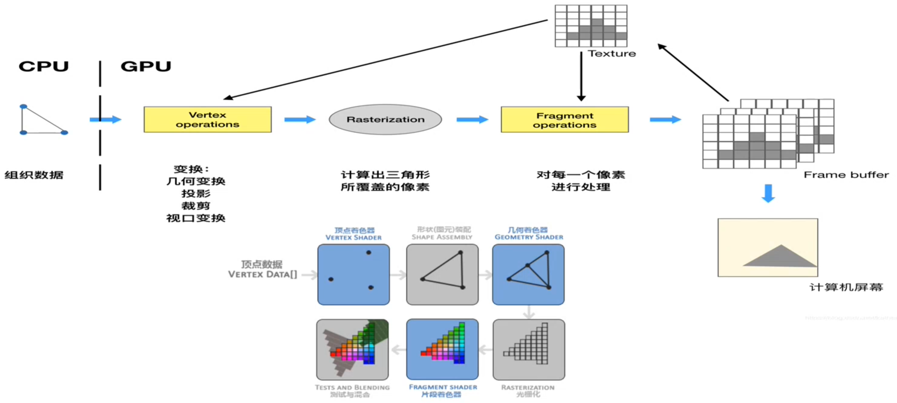
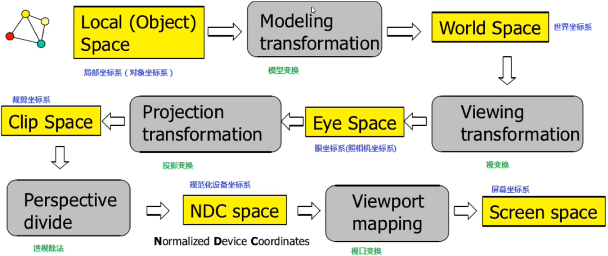
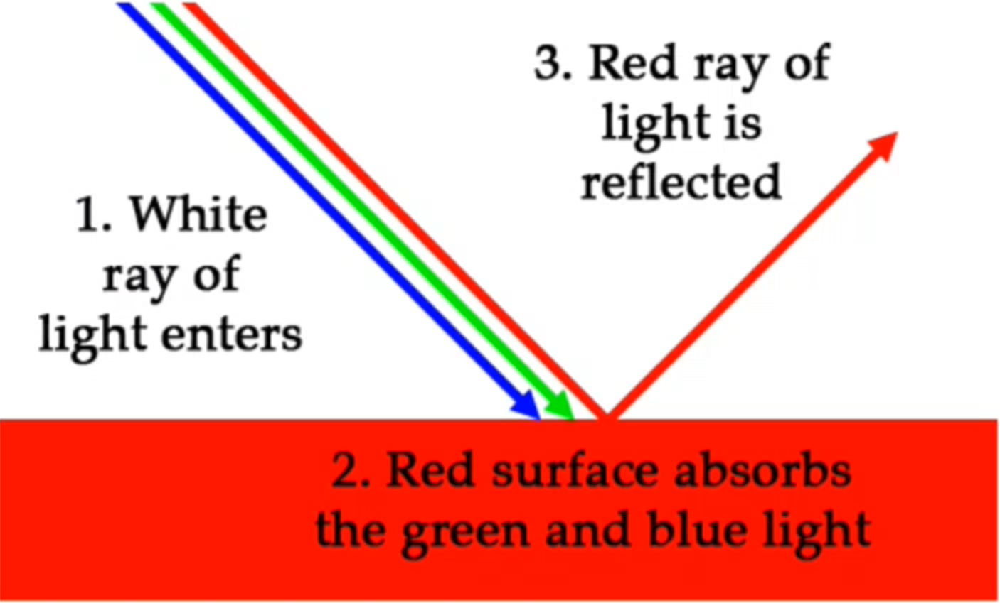
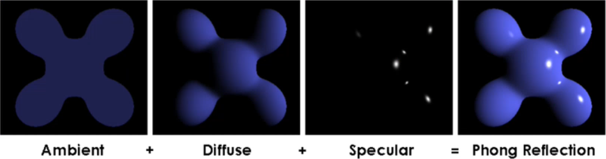

# OpenGL
[TOC]

## 历史简介
OpenGL 是图像API， 提供了2D, 3D画图的接口。一套协议 规定了输入与输出，实现由各个GPU厂商来实现？
需要符合 OpenGL 的 conformence 测试。

1992年 OpenGL1.0 ~ 2009 OpenGL3.2 ~ 2017 OpenGL4.6 -- Vulkan
Immediate Mode ------------------------  Core-profile Mode

OpenGL: 单线程，单context
Vulkan: 多线程，多context

Vulkan不会取代OpenGL，以后 OpenGL 与 Vulkan 并存。

Immediate Mode:
Core-profile mode: 

Shader 在2004年OpenGL2.0的时候诞生的。之后GPU才有EU的概念。之前是fixed function。

## OpenGL pipeline

## 多边形 polygon
OpenGL 规定 valid 多边形，要满足任意2个顶点的连线在要在多边形内(也叫凸多边形)

## 坐标体系 coordinate systems

## 颜色

图中 红色的表面吸收了蓝色和绿色成分，将红色反射出来。颜色吸收和反射的过程可以表示为：
LightIntensity * ObjectColor = Reflectcolor

$$
\begin{bmatrix}
R && G && B
\end{bmatrix}
\begin{bmatrix}
X \\
Y \\
Z
\end{bmatrix} =
\begin{bmatrix}
XR && YG && ZB
\end{bmatrix}
$$

上面的过程表示为：
(1, 1, 1) * (1, 0, 0) = (1, 0, 0)

## 光照
Phong Reflection Model

