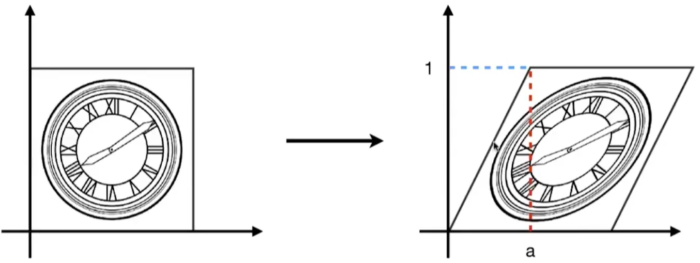
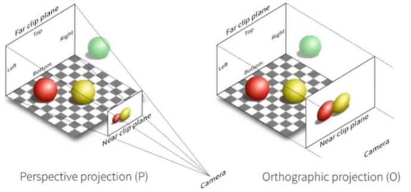

# 计算机图形学入门
[TOC]

以 闫令琪 GAMES101-现代计算机图形学入门 https://www.bilibili.com/video/BV1X7411F744 的视频做的笔记

这段话把英文26个字母都包含进去了
> the quick brown fox jumps over the lazy dog

## 向量
在图形学中 默认是列向量

$\vec{A} = \begin{pmatrix} x \\ y \end{pmatrix}$

$A^T = (x, y)$

$|\vec{A}| = \sqrt{x^2 + y^2}$

$\overrightarrow{AB} = (x_{b}-x_{a}, y_{b}-y_{a})$

单位向量 
$$ \hat{n} = \frac{\vec{u}}{|\vec{u}|} $$

### 向量的点乘
向量的点乘[^dot-product]是一个数

$$ \vec{A} \cdot \vec{B} = |\vec{A}| |\vec{B}| \cos\theta $$

$$\vec{A} = (x_{a}, y_{a})$$ 

$$\vec{B} = (x_{b}, y_{b})$$

$$ \vec{A} \cdot \vec{B} = x_{a}x_{b} + y_{a}y_{b} $$

其中 $0 \le \theta \le \pi$

这个公式能快速知道2个向量之间的夹角
$$ \cos\theta = \frac{\vec{A} \cdot \vec{B}}{|\vec{A}| |\vec{B}|}  $$

### 点乘的运算法则
交换律
$\vec{A} \cdot \vec{B} = \vec{B} \cdot \vec{A}$

结合律
$\vec{A} \cdot (\vec{B} + \vec{C}) = \vec{A} \cdot \vec{B} + \vec{A} \cdot \vec{C}$

分配律
$(k\vec{A}) \cdot \vec{B} = \vec{A} \cdot (k\vec{B}) = k(\vec{A} \cdot \vec{B})$

### 向量的叉乘

向量叉乘[^cross-product]的结果为一个向量，有大小有方向.
方向: 用右手螺旋定则判断. 先四指方向指向 $\vec{a}$ 的方向, 再以不超过180°转向 $\vec{b}$. 大拇指方向就是  $ \vec{a} \times \vec{b} $ 的方向

$$ \vec{a} \times \vec{b} = |\vec{a}| |\vec{b}| \sin\theta $$

$$ \vec{a} \times \vec{b} = 
\begin{vmatrix} y_{a}z_{b} - y_{b}z_{a} \\
z_{a}x_{b} - x_{z}z_{b} \\
x_{a}y_{b} - y_{a}x_{b}
\end{vmatrix}
$$

$$
\vec{a} \cdot \vec{b} =
A*b =
\begin{pmatrix}
0 & -z_{a} & y_a \\
z_{a} & 0 & -x_a \\
-y_{a} & x_{a} & 0
\end{pmatrix}
\begin{pmatrix}
x_b \\
y_b \\
z_b
\end{pmatrix}
$$

### 叉乘的运算法则
没有交换律
$\vec{x} \times \vec{y} = \vec{z}$

$\vec{A} \times \vec{B} = -\vec{B} \times \vec{A}$

$\vec{A} \times \vec{A} = \vec{0}$

$\vec{A} \times ( \vec{B} + \vec{C} )= \vec{A} \times \vec{B} + \vec{A} \times \vec{C} $

$\vec{A} \times (k\vec{B}) = k(\vec{A} \times \vec{B})$

### 分解
$|\vec{u}| = |\vec{v}| = |\vec{w}| = 1$

$\vec{u} \cdot \vec{v} = \vec{u} \cdot \vec{w} = \vec{v} \cdot \vec{w} = 0$

$\vec{w} = \vec{u} \cdot \vec{v}$ (右手定则)

$\vec{p} = (\vec{p} \cdot \vec{u}) \vec{u} + (\vec{p} \cdot \vec{v}) \vec{v} +(\vec{p} \cdot \vec{w}) \vec{w}$

## 矩阵
### 矩阵乘法
矩阵乘法 **第1个矩阵的列数 = 第2个矩阵的行数** 才有意义
(M x N) (N x P) = (M x P)

$$
\begin{bmatrix} 1 & 3 \\
5 & 2 \\
0 & 4
\end{bmatrix}
\begin{bmatrix} 3 & 6 & 9 & 4 \\ 
2 & 7 & 8 & 3
\end{bmatrix} =
\begin{bmatrix} 9 & ? & 33 & 13 \\
19 & 44 & 61 & 26 \\
8 & 26 & 32 & 12
\end{bmatrix}
$$

这里的 ？是 第1行第2列， 
然后去第1个矩阵里面找第1行 $\begin{bmatrix} 1 & 3\end{bmatrix}$

以及第2个矩阵里面找第2列  $\begin{bmatrix} 6 \\ 7\end{bmatrix}$

然后运算 1 * 6 + 3 * 7 = 27

### 矩阵的运算法则
没有结合律 通常情况下 $AB \neq BA $

有分配律
1. (AB)C = A(BC)
2. A(B+C) = AB + AC
3. (A+B)C = AC + BC

### 矩阵转置
矩阵转置就是把行列互换
$$
\begin{bmatrix}
1 & 2 \\
3 & 4 \\
5 & 6
\end{bmatrix}^T =
\begin{bmatrix}
1 & 3 & 5 \\
2 & 4 & 6
\end{bmatrix}
$$

$$(AB)^T = B^TA^T$$

### 单位矩阵
单位矩阵: 左上到右下这条对角线上面都是1，其余都是0
$$
I_{3\times3} =
\begin{pmatrix}
1 & 0 & 0 \\
0 & 1 & 0 \\
0 & 0 & 1
\end{pmatrix}
$$

矩阵的逆
$ AA^{-1} = A^{-1}A = I $
$ (AB)^{-1} = B^{-1}A^{-1} $

### 矩阵中向量的点乘
$$
\vec{A} \cdot \vec{B} =
\vec{A}^{T} \vec{B} =
\begin{pmatrix}
x_a & y_a & z_a
\end{pmatrix}
\begin{pmatrix}
x_b \\
y_b \\
z_b
\end{pmatrix} =
(x_ax_b + y_ay_b + z_az_b)
$$

### 矩阵中向量的叉乘
$$
\vec{A} \cdot \vec{B} =
A*b =
\begin{pmatrix}
0 & -z_{a} & y_a \\
z_{a} & 0 & -x_a \\
-y_{a} & x_{a} & 0
\end{pmatrix}
\begin{pmatrix}
x_b \\
y_b \\
z_b
\end{pmatrix}
$$

## 变换
### 缩放变换
同比例缩放

$$
\begin{bmatrix}
x^\prime \\
y^\prime
\end{bmatrix} =
\begin{bmatrix}
s && 0 \\
0 && s
\end{bmatrix}
\begin{bmatrix}
x \\
y
\end{bmatrix}
$$

x,y 不同比例缩放

$$
\begin{bmatrix}
x^\prime \\
y^\prime
\end{bmatrix} =
\begin{bmatrix}
s_x && 0 \\
0 && s_y
\end{bmatrix}
\begin{bmatrix}
x \\
y
\end{bmatrix}
$$

### 对称操作

$$
\begin{bmatrix}
x^\prime \\
y^\prime
\end{bmatrix} =
\begin{bmatrix}
-1 && 0 \\
0 && 1
\end{bmatrix}
\begin{bmatrix}
x \\
y
\end{bmatrix}
$$

### 切变
提示：
1. y=0时，水平方向的移动都为0
2. y=1时，水平方向偏移为a
3. 纵坐标没有变化

$$
\begin{bmatrix}
x^\prime \\
y^\prime
\end{bmatrix} =
\begin{bmatrix}
1 && a \\
0 && 1
\end{bmatrix}
\begin{bmatrix}
x \\
y
\end{bmatrix}
$$

### 旋转变换
默认按原点为中心逆时针方向旋转

以上是边长为单位1的正方形
可以取2个特殊点 (1, 0), 和 (0, 1)
以原点逆时针旋转后$\theta$角度后 ($\cos\theta$, $\sin\theta$), ($-\sin\theta$, $\cos\theta$)

可以设 $\begin{bmatrix}A && B \\ C && D\end{bmatrix}\begin{bmatrix}x \\ y\end{bmatrix}$ 把上面的特殊点代入就可以求出A、B、C、D的值

$$
\begin{bmatrix}
x^\prime \\
y^\prime
\end{bmatrix} =
\begin{bmatrix}
\cos\theta && -\sin\theta \\
\sin\theta && \cos\theta
\end{bmatrix}
\begin{bmatrix}
x \\
y
\end{bmatrix}
$$

### 2D线性变换
通过一个矩阵 乘以一个坐标 得到变换后的坐标. 这种变换成为线性变换[^linear-transform]。
$$
x^\prime = Ax + By \newline
y^\prime = Cx + Dy
$$

$$
\begin{bmatrix}
x^\prime \\
y^\prime
\end{bmatrix} =
\begin{bmatrix}
A && B \\
C && D
\end{bmatrix}
\begin{bmatrix}
x \\ y
\end{bmatrix} =
\begin{bmatrix}
Ax + By \\
Cx + Dy
\end{bmatrix}
$$

### 仿射变换
仿射变换 = **先**线性变换 + **再**平移
它是有顺序的, 调换顺序结果会不一致.

$$
\begin{bmatrix}
x^\prime \\
y^\prime
\end{bmatrix} =
\begin{bmatrix}
A && B \\
C && D
\end{bmatrix}
\begin{bmatrix}
x \\ y
\end{bmatrix} +
\begin{bmatrix}
t_{x} \\ t_{y}
\end{bmatrix}
$$

在平移的过程中 不是一个线性变换
$$
\begin{bmatrix}
x^\prime \\
y^\prime
\end{bmatrix} =
\begin{bmatrix}
A && B \\
C && D
\end{bmatrix}
\begin{bmatrix}
x \\ y
\end{bmatrix} +
\begin{bmatrix}
t_{x} \\
t_{y}
\end{bmatrix}=
\begin{bmatrix}
Ax + By + t_{x}\\
Cx + Dy + t_{y}
\end{bmatrix}
$$

## 齐次坐标 homogeneous coordinates
引入了齐次坐标, 就还能运用线性变换来处理
2D point = $(x, y, 1)^T$
2D vector = $(x, y, 0)^T$

> **Note:** 向量具有平移不变性 所以 (x, y, 0)

$$
\begin{bmatrix}
x^\prime \\
y^\prime \\
w^\prime
\end{bmatrix} =
\begin{bmatrix}
1 && 0 && t_{x}\\
0 && 1 && t_{y}\\
0 && 0 && 1
\end{bmatrix}
\begin{bmatrix}
x \\ y \\ 1
\end{bmatrix} =
\begin{bmatrix}
x + t_{x} \\
y + t_{y} \\
1
\end{bmatrix}
$$

### 用齐次坐标表示仿射变换

$$
\begin{bmatrix}
x^\prime \\
y^\prime \\
1
\end{bmatrix} =
\begin{bmatrix}
A && B && t_{x}\\
C && D && t_{y}\\
0 && 0 && 1
\end{bmatrix}
\begin{bmatrix}
x \\ y \\ 1
\end{bmatrix}
$$

### 用齐次坐标表示缩放、旋转、平移
缩放
$$
S(s_{x}, s_{y}) =
\begin{bmatrix}
s_{x} && 0 && 0 \\
0 && s_{y} && 0 \\
0 &&  0 && 1
\end{bmatrix}
$$

旋转
$$
R(\theta) =
\begin{bmatrix}
\cos\theta && -\sin\theta && 0 \\
\sin\theta && \cos\theta && 0 \\
0 &&  0 && 1
\end{bmatrix}
$$

平移
$$
T(t_{x}, t_{y}) =
\begin{bmatrix}
1 && 0 && t_{x} \\
0 && 1 && t_{y} \\
0 &&  0 && 1
\end{bmatrix}
$$

### 组合变换的顺序
先看下面这个例子从左边变换到右边

先平移， 再绕原点旋转 这种方式并不符合

先绕原点旋转，再平移

从这里可以看出顺序非常重要
$R(45) \cdot T(1, 0) \neq T(1, 0) \cdot R(45)$

注意: 矩阵乘法**从右往左**

$$
R(45) \cdot T(1, 0) \cdot
\begin{bmatrix}
x \\ y \\ 1
\end{bmatrix} =
\begin{bmatrix}
1 && 0 && 1 \\
0 && 1 && 0 \\
0 && 0 && 1
\end{bmatrix}
\begin{bmatrix}
\cos\theta && -\sin\theta && 0 \\
\sin\theta && \cos\theta && 0 \\
0 &&  0 && 1
\end{bmatrix}
\begin{bmatrix}
x \\ y \\ 1
\end{bmatrix}
$$

推广到一般就有
$$
A_{n}(\cdots A_{2}(A_{1}(x))) = \underbrace{A_{n} \cdots A_{2} \cdot A_{1}}_{N \ matrices} \cdot
\begin{bmatrix}
x \\
y \\
1
\end{bmatrix}
$$

预乘n个矩阵以获得表示组合变换的单个矩阵

### 如何分解图形

$$
T(c) \cdot R(\theta) \cdot T(-c)
$$

计算的方向**从右到左**

### 3维空间的齐次坐标
3D point = $(x, y, z, 1)^T$
3D vector = $(x, y, z, 0)^T$

### 3维空间齐次坐标表示仿射变换
$$
\begin{bmatrix}
x^\prime \\
y^\prime \\
z^\prime \\
1
\end{bmatrix} =
\begin{bmatrix}
A && B && C && t_{x}\\
D && E && F && t_{y}\\
G && H && I && t_{z}\\
0 && 0 && 0 && 1
\end{bmatrix}
\begin{bmatrix}
x \\ y \\ z \\ 1
\end{bmatrix}
$$

这个式子表示: **先线性变换,再平移**

### 3维空间齐次坐标表示缩放、旋转、平移
缩放
$$
S(s_{x}, s_{y}, s_{z}) =
\begin{bmatrix}
s_{x} && 0 && 0 && 0 \\
0 && s_{y} && 0 && 0 \\
0 && 0 && s_{z} && 0 \\
0 && 0 && 0 && 1 
\end{bmatrix}
$$

平移
$$
T(t_{x}, t_{y}, t_{z}) =
\begin{bmatrix}
1 && 0 && 0 && t_{x} \\
0 && 1 && 0 && t_{y} \\
0 && 0 && 1 && t_{z} \\
0 && 0 && 0 && 1 
\end{bmatrix}
$$

旋转
绕哪个轴旋转，哪个轴上的数字就不变 (**绕谁谁不变**)

$$
R_x(\theta) =
\begin{bmatrix}
1 && 0 && 0 && 0 \\
0 && \cos\theta && -\sin\theta && 0 \\
0 && \sin\theta && \cos\theta && 0 \\
0 && 0 && 0 && 1 
\end{bmatrix}
$$

$$
R_y(\theta) =
\begin{bmatrix}
\cos\theta && 0 && \sin\theta && 0 \\
0 && 1 && 0 && 0 \\
-\sin\theta && 0 && \cos\theta && 0 \\
0 && 0 && 0 && 1 
\end{bmatrix}
$$

$$
R_z(\theta) =
\begin{bmatrix}
\cos\theta && -\sin\theta && 0 && 0 \\
\sin\theta && \cos\theta && 0 && 0 \\
0 && 0 && 1 && 0 \\
0 && 0 && 0 && 1 
\end{bmatrix}
$$

### 3D 旋转
这一节没有明白

Roll: 滚转
Pitch: 俯仰 (上下)
Yaw: 偏航 (左右)

罗德里格旋转公式[^Rodrigues-rotation-formula]:
$$
\boldsymbol{R}(\boldsymbol{n}, \alpha) = \cos(\alpha)\boldsymbol{I} + (1-\cos(\alpha)\boldsymbol{n}\boldsymbol{n}^T) + \sin(\alpha) \begin{bmatrix}
0 && -n_z && n_y \\
n_z && 0 && -n_x \\
-n_y && -n_x && 0
\end{bmatrix}
$$

旋转轴: $\boldsymbol{n}$
旋转角度: $\alpha$, 
单位矩阵: $\boldsymbol{I}$

### 正交矩阵 Orthogonal Matrix
正交矩阵是指其转置等于其逆的矩阵[^orthogonal-matrix]
$A^T = A^{-1}$

$$
I = AA^{-1} = A^{-1}A = A^{T}A = AA^{T}
\newline
\Rightarrow A^T = A^{-1}
$$

正交矩阵的例子：
$$
A =
\begin{bmatrix}
1 && 0 \\
0 && 1
\end{bmatrix},
B =
\begin{bmatrix}
1 && 0 \\
0 && -1
\end{bmatrix},
C =
\begin{bmatrix}
0 && 1 && 0 \\
-1 && 0 && 0 \\
0 && 0 && -1
\end{bmatrix}
$$

对于旋转矩阵来说
$$
R(\theta) =
\begin{bmatrix}
\cos\theta && -\sin\theta \\
\sin\theta && \cos\theta
\end{bmatrix}
$$

$$
R(-\theta) =
\begin{bmatrix}
\cos\theta && \sin\theta \\
-\sin\theta && \cos\theta
\end{bmatrix} =
R(\theta)^T
$$

$$
R(\theta) = R(\theta)^{-1}
$$

旋转矩阵的逆 = 旋转矩阵的转置

## 视图变换 viewing transformation

如何拍一张照片？
1. 搭好场景，摆好模型 (model transformation)
2. 选取合适**角度**, 放好相机 (view transformation)
3. 茄子，拍照 (projection transformation)

上面的过程就是所谓的MVP变换了

如何定义相机？
- 位置 position: $\vec{e}$
- 往某个方向看 look-at/gaze direction: $\hat{g}$
- 向上看 Up dierction: $\hat{t}$

**在图形学中默认相机在原点，y轴为上方向，往-z方向看**

### 模型变换 modeling tranformation

把 $\vec{e}$ 移动到原点
旋转 $\hat{g}$ 到-Z轴
旋转 $\hat{t}$ 到Y轴

数学公式
$$
M_{view} = R_{view}T_{view}
$$

变换 $\vec{e}$ 到原点
$$
T_{view} = \begin{bmatrix}
1 && 0 && 0 && -x_{e} \\
0 && 1 && 0 && -y_{e} \\
0 && 0 && 1 && -z_{e} \\
0 && 0 && 0 && 1
\end{bmatrix}
$$

因为旋转矩阵, 所以 $R_{view}^{-1} = R_{view}^{T}$

$$
R_{view}^{-1} = \begin{bmatrix}
x_{\hat{g} \times \hat{t}} && x_{t} && x_{-g} && 0 \\
y_{\hat{g} \times \hat{t}} && y_{t} && y_{-g} && 0 \\
z_{\hat{g} \times \hat{t}} && z_{t} && z_{-g} && 0 \\
0 && 0 && 0 && 1
\end{bmatrix}  \Leftrightarrow
R_{view}^{T}
$$

$$
R_{view} = \begin{bmatrix}
x_{\hat{g} \times \hat{t}} && y_{\hat{g} \times \hat{t}} && z_{\hat{g} \times \hat{t}} && 0 \\
x_{t} && y_{t} && z_{t} && 0 \\
x_{-g} && y_{-g} && z_{-g} && 0\\
0 && 0 && 0 && 1
\end{bmatrix}
$$

## 投影变换 projection transformation
### 正交投影 orthographic transformation
正交投影是相对简单的一种[^orthographic-transformation]，坐标的相对位置都不会改变，所有光线都是平行传播，我们只需将物体（可视部分，即上图的那个长方体）全部转换到一个的空间之中即可（其中x，y坐标便是投影结果，保留z是为了之后的遮挡检测） 

### 透视投影 perspective transformation
透视投影就是最类似人眼所看东西的方式, 物体近大远小. 

一种简单的理解方式
1. 相机放在原点，看向-Z方向，Y轴为上方向
2. 扔掉Z坐标轴
3. 通过变换和缩放把结果放到 $\left[-1, 1\right]^2$ 的矩形上面

透视投影 VS 正交投影

## 参考文献
[^cross-product]: https://zh.wikipedia.org/wiki/%E5%8F%89%E7%A7%AF
[^dot-product]: https://baike.baidu.com/item/%E7%82%B9%E7%A7%AF
[^linear-transform]: https://zhuanlan.zhihu.com/p/144323332
[^orthogonal-matrix]: https://zhuanlan.zhihu.com/p/34897603
[^Rodrigues-rotation-formula]: https://baike.baidu.com/item/%E7%BD%97%E5%BE%B7%E9%87%8C%E6%A0%BC%E6%97%8B%E8%BD%AC%E5%85%AC%E5%BC%8F
[^orthographic-transformation]: https://zhuanlan.zhihu.com/p/144329075

