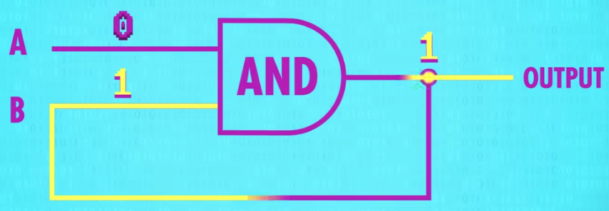
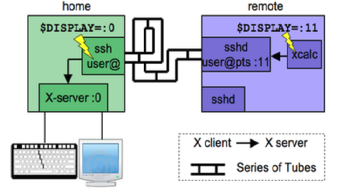

# Computer
[TOC]

## 图灵机
图灵思考的问题：
1. 数学问题是否都有明确的答案。
2. 如果有明确答案，是否可以通过有限步骤的计算得到答案。
3. 对于可能在有限步骤计算出来的数学问题，能否有一种机器，它不断地运动，最后停下来的时候，那个数学问题就解决了。


## 晶体管


> N型MOS管高电平导通  
> P型MOS管低电平导通

### 逻辑电路
### 非门


### 非门的工作过程


### 与门


> 与非门在实际中更容易实现，一般用 **与非门** 和 **非门** 实现 **与门**

### 与非门工作工程


### 或门


### 异或门


上面是用与或非三种门电路实现的一种异或门

### 寄存器

在或门的输出连接到一个输入端，一旦A或B有一个为1时，输出都是1。
之后无论A，B怎么变化，输出端都是1.


在这个与门中，先把A，B都设置为1，之后A为0，输出都为0。
跟上面的或门正好相反。


把之前的与门和或门组合在一起，可以组成一个AND-OR锁存器(AND-OR Latch)[^and-or-latch]
它有2个输入
“设置”输入1，它的输出为1
“复位”输入1，它的输出为0
**如果“设置”和“复位”都是0，整个电路的输出为最后放入的内容**。

| SET  | RESET | OUTPUT |
| :--- | :---- | :----- |
| 1    | 0     | 1      |
| 0    | 0     | 1      |

| SET  | RESET | OUTPUT |
| :--- | :---- | :----- |
| 0    | 1     | 0      |
| 0    | 0     | 0      |


为了易用性，我们希望只有一条输入线，还需要一条线来启用内存。 


## 加法器
### 半加器

除了1 + 1需要进位外，所有的末位可以用异或门来表示


对于 1 + 1，它的进位1，可以用与门来表示[^add-xor-and]

异或门 + 与门


### 全加器

用半加法器计算1 + 1时产生了进位，这个进位会参与下一个计算
所以不是2位，而是3位相加。


### 4bit的加法器


### 8bit的加法器


## 计算机结构的简化模型
图片来自： https://www.bilibili.com/video/BV1VE411o7nx?p=4

### 模型机


### 存储器


### CPU 控制器 


#### 控制器的基本组成


### CPU 运算器


#### 运算器的基本组成


### CPU的内部总线


## 执行指令的过程
举例说明：


假设模型机当前状态:


### 取指


### 译码


### 执行


### 回写


程序 = 指令 + 数据

内存中的指令告诉CPU 从哪去取数据


## 总线
总线再某一时刻只能由2个设备使用。 由控制器
CPU里有总的控制器， 各个设备有各个的控制器（像磁盘的SATA控制器）。 
CPU的控制器与各个设备的控制器相互通信
CPU能控制总线

## Linux
### API(application programing interface)
- syscall
- libcall

### ABI(application binary interface)
- ELF

## 终端
### 虚拟终端:
Teletype
Ctrl + ALT + F[1-6]
表示： /dev/tty#

[下图来自这里](https://segmentfault.com/a/1190000009082089)
```
                   +-----------------------------------------+
 | Kernel       |                       |                   |              |                    |              |                |
 | +--------+   | +----------------+    |                   |              |                    |              |                |
 | +----------+ | +-------------------+ | tty1              | <----------> | User processes     |              |                |
 | Keyboard     | --------->            |                   | +--------+   | +----------------+ |              |                |
 | +----------+ |                       | Terminal Emulator | <->          | tty2               | <----------> | User processes |
 | Monitor      | <---------            |                   | +--------+   | +----------------+ |              |                |
 | +----------+ | +-------------------+ | tty3              | <----------> | User processes     |              |                |
 | +--------+   | +----------------+    |                   |              |                    |              |                |
 |              |                       |                   |              |                    |              |                |
                   +-----------------------------------------+
```

键盘、显示器都和内核中的终端模拟器相连，由模拟器决定创建多少tty，比如你在键盘上输入ctrl+alt+F1时，模拟器首先捕获到该输入，然后激活tty1，这样键盘的输入会转发到tty1，而tty1的输出会转发到显示器，同理用输入ctrl+alt+F2，就会切换到tty2。

当模拟器激活tty时如果发现没有进程与之关联，意味着这是第一次打开该tty，于是会启动配置好的进程并和该tty绑定，一般该进程就是负责login的进程。

当切换到tty2后，tty1里面的输出会输出到哪里呢？tty1的输出还是会输出给模拟器，模拟器里会有每个tty的缓存，不过由于模拟器的缓存空间有限，所以下次切回tty1的时候，只能看到最新的输出，以前的输出已经不在了。

### 图形终端:
Ctrl + ALT + F7

### 伪终端(pseudoterminal slave):
使用ssh远程连接
在图形界面下打开命令提示符
表示： /dev/pts/#

### 物理终端（控制台console）:
表示： /dev/console

### 串行终端:
表示： /dev/ttyS#

### X window
```sh
startx &
startx -- :2 &
```

#### X server
X Server：这组程序主要负责的是屏幕画面的绘制与显示。X Server 可以接收来自 X client 的数据，将这些数据绘制呈现为图面在屏幕上。 此外，我们移动鼠标、点击数据、 由键盘输入数据等等，也会透过 X Server 来传达到 X Client 端，而由X Client 来加以运 算出应绘制的数据；

#### X Client
X Client： 这组程序主要负责的是数据的运算。 X Client 在接受到 X Server 传来的数据后 (例如移动鼠标、点击 icon 等动作)，会经由本身的运算而得到鼠标应该要如何移动、点击的结果应该要出现什么样的数据、键盘输入的结果应该要如何呈现等等，然后将这些结果告知 X Server ，让他自行去绘制到屏幕上。

> **Tips**: 鸟哥常常开玩笑的说， X server 就是画布，而 X client 就是手拿画笔的画家。你得要先有画布 (管理好所有可显示的硬件后) 之后画家的想法 (计算出来的绘图数据) 才能够绘制到画布上！  
> **Server是提供"资源"的一方，而Client是使用"资源"的一方。**

#### Window Manager
由于每一支 X client 都是独立存在的程序，因此在图形显示会发生一些迭图的问题 (想象一下每一个 X client 都是一个很自我的画家， 每个画家都不承认对方的存在，都自顾自的在画布上面作画，最后的结果会是如何？)。因此，后来就有一组特殊的 X client 在进行管理所有的其他 X client 程序，这个总管的咚咚就是 Window Manager！

Window Manager (WM)：是一组控制所有 X client 的管理程序，并同时提供例如任务栏、 背景桌面、虚拟桌面、窗口大小、窗口移动与重迭显示等任务。Window manager主要由一些大型的计划案所开发而来，常见的有 GNOME, KDE, XFCE 等

#### Display Manager
Display Manager (DM)：提供使用者登入的画面以让用户可以藉由图形接口登入。 在使用者登入后，可透过 display manager 的功能去呼叫其他的 Window manager ，让用户在图形接口的登入过程变得更简单。 由于 DM 也是启动一个等待输入账号密码的图形数据，因此 DM 会主动去唤醒一个 X Server 然后在上头加载等待输入的画面就是了。


通常启动图形接口让用户登入的方式中，都是先执行Display Manager 程序， 该程序会主动加载一个 X Server 程序，然后再提供一个等待输入账号密码的接口程序，之后再根据用户的选择去启动所需要的 Window Manager 程序，最后就由用户直接操作 WM 来玩图形接口。


#### 将图形显示到其他主机
将图像显示到 localhost 这台主机上
```sh
export DISPLAY=localhost:0.0
xeyes
```

- 第一个0: 在(6000+0)这个端口上
- 第二个0: 表示连接到unix socket的路径 `/tmp/.X11-unix/X0`。这个几乎总是0

允许别的用户启动的图形程序将图形显示在当前屏幕上
```sh
xhost +
```

#### 将远程主机上的图像界面显示在本机上


在 X client computer上远程连接到 X server computer上面。
```sh
## -Y: enable X11 forwarding
ssh user1@Xserver -Y

xeyes
```

参考 [here](https://www.cyut.edu.tw/~ckhung/b/mi/xintro.php)
```sh
$ xauth list $DISPLAY
media-mc2.example.com:10  MIT-MAGIC-COOKIE-1  0d9d1431e67591364bce868773b1d7c0
```

```sh
$ xauth add media-mc2.example.com:10  MIT-MAGIC-COOKIE-1  0d9d1431e67591364bce868773b1d7c0

$ export DISPLAY=media-mc2.example.com:10
````

VNC



[^and-or-latch]: https://www.bilibili.com/video/BV1EW411u7th/?p=6&vd_source=5483606993f558f6ec3fbc3230b66c5d
[^add-xor-and]: https://www.youtube.com/watch?v=1I5ZMmrOfnA&list=PL8dPuuaLjXtNlUrzyH5r6jN9ulIgZBpdo&index=6

