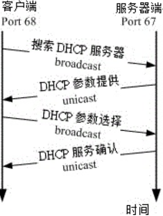

# dhcp

[TOC]

DHCP 通常是用于局域网络内的一个通讯协议，他主要藉由客户端传送广播封包给整个物理网段内的所有主机， 若局域网络内有 DHCP 服务器时，才会响应客户端的 IP 参数要求。所以啰，DHCP 服务器与客户端是应该要在同一个物理网段内的。 至于整个DHCP 封包在服务器与客户端的来来回回情况有点像底下这样：



## 客户端取得 IP 参数流程
### 1. 客户端：利用广播封包发送搜索 DHCP 服务器的封包
若客户端网络设定使用 DHCP 协议取得 IP (在 Windows 内为『自动取得 IP』 )，则当客户端开机或者是重新启动网络卡时，客户端主机会发送出搜寻 DHCP 服务器的 UDP 封包给所有物理网段内的计算机。
此封包的目标 IP 会是 255.255.255.255， 所以一般主机接收到这个封包后会直接予以丢弃，但若局域网络内有 DHCP 服务器时，则会开始进行后续行为。

### 2. 服务器端：提供客户端网络相关的租约以供选择
DHCP 服务器在接收到这个客户端的要求后，会针对这个客户端的硬件地址 (MAC) 与本身的设定数据来进行下列工作：

- 到服务器的登录文件中寻找该用户之前是否曾经用过某个 IP ，若有且该 IP 目前无人使用，则提供此 IP 给客户端；
- 若配置文件针对该 MAC 提供额外的固定 IP (static IP) 时，则提供该固定 IP 给客户端；
- 若不符合上述两个条件，则随机取用目前没有被使用的 IP 参数给客户端，并记录下
来。 总之，服务器端会针对客户端的要求提供一组网络参数租约给客户端选择，由
于此时客户端尚未有 IP ，因此服务器端响应的封包信息中， 主要是针对客户端的
MAC 来给予回应。此时服务器端会保留这个租约然后开始等待客户端的回应。

### 3. 客户端：决定选择的 DHCP 服务器提供的网络参数租约并回报服务器
由于局域网络内可能并非仅有一部 DHCP 服务器，但客户端仅能接受一组网络参数的租
约。 因此客户端必需要选择是否要认可该服务器提供的相关网络参数的租约。当决定好使用此服务器的网络参数租约后， 客户端便开始使用这组网络参数来设定自己的网络环境。
此外，客户端也会发送一个广播封包给所有物理网段内的主机， 告知已经接受该服务器的租约。
此时若有第二台以上的 DHCP 服务器，则这些没有被接受的服务器会收回该 IP 租约。至于被接受的 DHCP 服务器会继续进行底下的动作。

### 4. 服务器端：记录该次租约行为并回报客户端已确认的响应封包信息
当服务器端收到客户端的确认选择后，服务器会回传确认的响应封包，并且告知客户端
这个网络参数租约的期限， 并且开始租约计时喔！那么该次租约何时会到期而被解约 (真可怕的字眼) ？你可以这样想：

- 客户端脱机：不论是关闭网络接口 (ifdown)、重新启动 (reboot)、关机 (shutdown)等行为，皆算是脱机状态，这个时候 Server 端就会将该 IP 回收，并放到 Server 自己的备用区中，等待未来的使用；
- 客户端租约到期：前面提到 DHCP server 端发放的 IP 有使用的期限，客户端使用这个 IP 到达期限规定的时间，而且没有重新提出 DHCP 的申请时，就需要将 IP 缴回去！这个时候就会造成断线。但用户也可以再向 DHCP 服务器要求再次分配 IP。

## DHCP 服务器给予客户端的 IP参数为固定或动态
### 固定 (Static) IP

只要那个客户端计算机的网络卡不换掉，那么 MAC 肯定就不会改变，由于 DHCP 可以
根据 MAC 来给予固定的 IP 参数租约，所以该计算机每次都能以一个固定的 IP 连上
Internet ！呵呵！ 这种情况比较适合当这部客户端计算机需要用来做为提供区域内的一些网络服务的主机之用 (所以 IP 要固定)。

那么如何在 Linux 上面知道网络卡的 MAC 呢？很简单啦！有很多的方式，最简单的方式就是使用 ifconfig 及 arp 来进行:

### 动态 (dynamic) IP：
Client 端每次连上 DHCP 服务器所取得的 IP 都不是固定的！都直接经由 DHCP 所随机由尚未被使用的 IP 中提供！

> **Tips**: 其实 IP 只有 Public IP 与 Private IP 两种，中文翻译成『公共 IP』 与『私有 IP』 这两个， 至于其他所谓的『静态 IP』 、『实体 IP』 、『虚拟 IP』 、『浮动式 IP』 等等，都是藉由一些 IP 取得的方式来分类的。

## 租约期限

> **Tips**: 一般来说，假设租约期限是 T 小时，那么客户端在 0.5T 会主动向 DHCP 服务器发出重新要求网络参数的封包。 如果这次封包要求没有成功，那么在 0.875T 后还会再次的发送封包一次。正因如此，所以**服务器端会启动 port 67 监听用户要求，而用户会启动 port 68 主动向服务器要求**！


## CentOS7
### 安装
```sh
sudo yum install -y dhcp
```

为本机设置静态IP
/etc/sysconfig/network-scripts/ifcfg-enp0s31f6
```
# Generated by dracut initrd
NAME="enp0s31f6"
DEVICE="enp0s31f6"
ONBOOT=yes
NETBOOT=yes
UUID="9133cbd4-e29f-4548-8d42-d967a9e87e6a"
IPV6INIT=yes
BOOTPROTO=static
TYPE=Ethernet

IPADDR=192.168.1.100
PREFIX=23
GATEWAY=192.168.1.1
DNS1=10.248.2.5
```

重启网络
```
sudo systemctl restart network.service
```

### 修改配置文件
/etc/dhcp/dhcpd.conf
```
option domain-name "myDHCP"                 # dhcp的主机名
option domain-name-servers 114.114.114.114; # DNS服务器

subnet 192.168.1.0 netmask 255.255.255.0 {
    range 192.168.1.101 192.168.1.254;
    option routers 192.168.1.1; 
    default-lease-time 600;
    max-lease-time 7200;
}

host Client_C {  #有一个主机，叫Client_C
    hardware ethernet 08:00:27:5e:04:27; # MAC地址是08:...:27的网卡
    fixed-address 192.168.1.123;         # 分配给它192.168.1.123的IP
}
```

`range 192.168.1.101 192.168.1.254`: 分配给客户机的IP从192.168.100.100开始到192.168.100.254
`option routers 192.168.1.1`: 设置网关
`default-lease-time 600`:  默认租约时间
`max-lease-time 7200`:  最大租约时间


### 开机启动
```sh
sudo systemctl enable dhcpd.service
sudo systemctl start dhcpd.service
```

## Ubuntu 14.04

为本机设置静态IP
/etc/network/interfaces
```
# The loopback network interface
auto lo
iface lo inet loopback
# The primary network interface
auto eth0
iface eth0 inet static
address 192.168.1.100
netmask 255.255.255.0
gateway 192.168.1.1
dns-nameservers 10.248.2.5
```

重启网络
```bash
sudo /etc/init.d/networking restart
```

### 安装
```bash
sudo apt-get install -y isc-dhcp-Server
```

### 修改配置文件
修改 /etc/default/dhcp-server
```
INTERFACES="eth0"
```

> `INTERFACES="eth0"` 如果有多块网卡 指定从 `eth0` 获取

修改 /etc/dhcp/dhcpd.conf
```
default-lease-time 600;
max-lease-time 7200;
subnet 192.168.1.1 netmask 255.255.255.0 {
range 192.168.1.101 192.168.1.254;
option subnet-mask 255.255.255.0;
option routers 192.168.1.100;
option broadcast-address 192.168.1.255;
filename "pxelinux.0";
next-Server 192.168.1.100;
}
```

> `filename "pxelinux.0";` 和 `next-Server 192.168.1.100;` 会去读取下一个server的 `pxelinux.0` 程序

启动 DHCP service.
```bash
sudo /etc/init.d/isc-dhcp-server start
```


