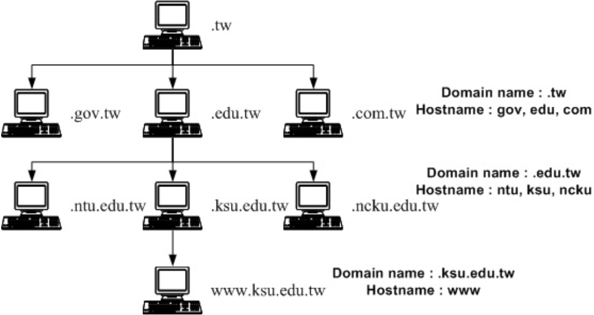
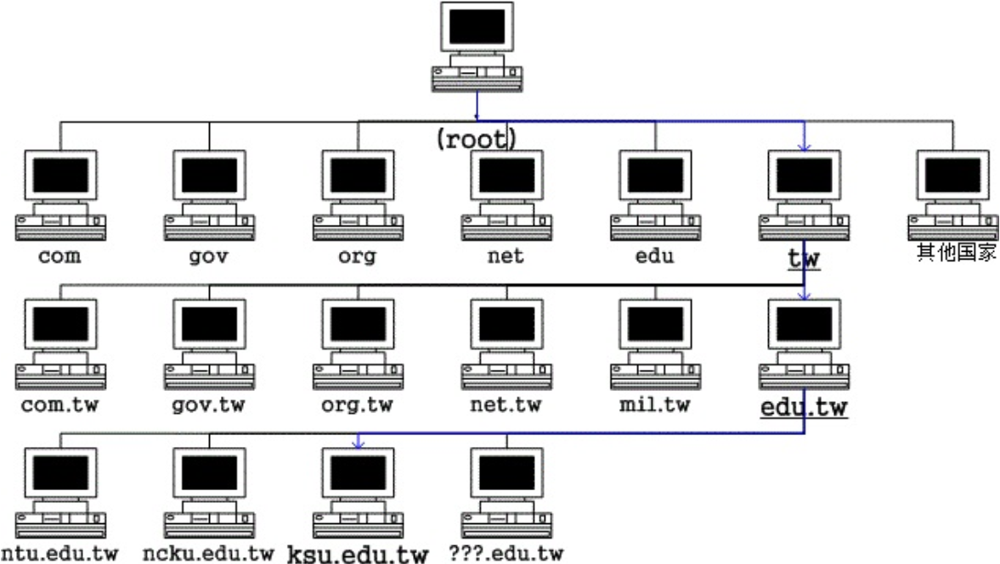

# DNS

[TOC]

在 Linux 里面，DNS 主机 IP 的设定就是在 /etc/resolv.conf 这个档案里面.

**Fully Qualified Domain Name (FQDN)** 就是『主机名与领域名 (hostname and domain name)』由这两者组成的完整主机名。

例如 www.google.com.tw, www.seednet.net, www.hinet.net 等等，那么我们怎么知道这些 www 名称的主机在不同的地方呢？就需要给他领域名啰！也就是 .google.com.tw, .seednet.net, .hinet.net 等等的不同，所以即使你的主机名相同，但是只要不是在同一个领域内，那么就可以被分辨出不同的位置。

在上面的例子当中，由上向下数的第二层里面，那个 .tw 是 domain name ，而 com, edu, gov 则是主机的名称，而在这个主机的名称之管理下，还有其他更小网域的主机，所以在第三层的时候，基本上，那个 edu.tw 就变成了 domain name 了！而昆山科大与成大的 ksu, ncku则成为了 hostname。

> **Tips**: 并不是以小数点 (.) 区分 domain name 与 hostname 喔！某些时刻 domain name 所管理的 hostname 会含有小数点。 举例来说，鸟哥所在的信息传播系并没有额外的 DNS 服务器架设，因此我们的主机名为 www.dic ，而 domain name 还是 ksu.edu.tw ，因此全名为www.dic.ksu.edu.tw ！

