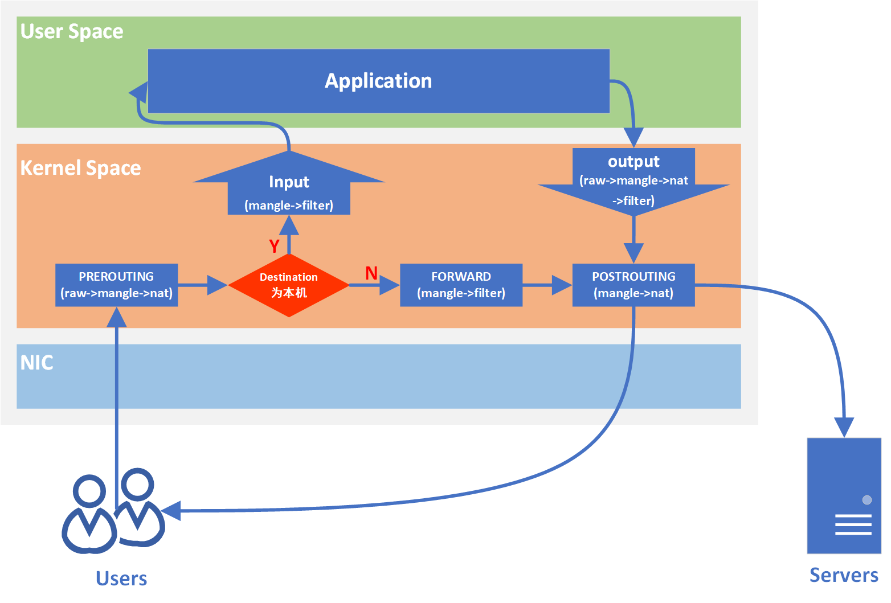

# iptables

[TOC]

## 防火墙策略[^quick]
1. 默认关闭， 只有指定的数据放行
2. 默认开启， 只有指定的过滤

## iptables 规则链
1. PREROUTING
2. INPUT
3. FORWORD
4. OUTPUT
5. POSTROUTING

## 流程图 [^overview]


```bash
$ sudo iptables -L
Chain INPUT (policy ACCEPT)
target     prot opt source               destination

Chain FORWARD (policy DROP)
target     prot opt source               destination
DOCKER-USER  all  --  anywhere             anywhere
DOCKER-ISOLATION-STAGE-1  all  --  anywhere             anywhere
ACCEPT     all  --  anywhere             anywhere             ctstate RELATED,ESTABLISHED
DOCKER     all  --  anywhere             anywhere
ACCEPT     all  --  anywhere             anywhere
ACCEPT     all  --  anywhere             anywhere

Chain OUTPUT (policy ACCEPT)
target     prot opt source               destination

Chain DOCKER (1 references)
target     prot opt source               destination

Chain DOCKER-ISOLATION-STAGE-1 (1 references)
target     prot opt source               destination
DOCKER-ISOLATION-STAGE-2  all  --  anywhere             anywhere
RETURN     all  --  anywhere             anywhere

Chain DOCKER-ISOLATION-STAGE-2 (1 references)
target     prot opt source               destination
DROP       all  --  anywhere             anywhere
RETURN     all  --  anywhere             anywhere

Chain DOCKER-USER (1 references)
target     prot opt source               destination
RETURN     all  --  anywhere             anywhere
```

```bash
iptables -P INPUT ACCEPT
iptables -P OUTPUT ACCEPT
iptables -P FORWARD ACCEPT


iptables -P INPUT DROP
iptables -P OUTPUT DROP
iptables -P FORWARD DROP

iptables -F
```
-P: Policy
-F: flush 清空规则

```bash
iptables -t filter -A INPUT -s 172.18.0.1/16 -d 10.xxx.xxx.xxx -p tcp --dport 22 -j ACCEPT
```

-t: 指定要查看的表名。不指定的话，默认查询filter表。
-A: append 追加
-s: source 来源
-d: destination 目标
-p: protocol 协议
--dport：目标端口
-j: 后接动作[^jump]
1. Accept：接受报文
2. Drop：丢弃报文
3. SNAT：把报文的源地址改掉 （需要指定改为什么IP）
4. DNAT：把报文的目的地址改掉

```bash
iptables -F
```


```bash
sysctl -w net.ipv4.ip_forward=1
iptables -I FORWARD -o virbr0 -d 192.168.112.98 -j ACCEPT
iptables -t nat -I PREROUTING -p tcp --dport 10001 -j DNAT --to 192.168.112.98:5900
iptables -t nat -I PREROUTING -p tcp --dport 10002 -j DNAT --to 192.168.112.98:3389

iptables -t nat -L -n | grep -E '10001|10002'
```

[^quick]: https://www.bilibili.com/video/BV1Ym4y1X7CK/
[^jump]: https://bbs.huaweicloud.com/blogs/105847
[^overview]: https://tinychen.com/20200414-iptables-principle-introduction/

