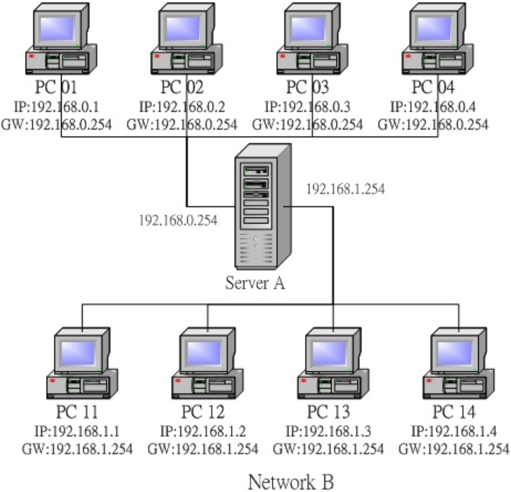
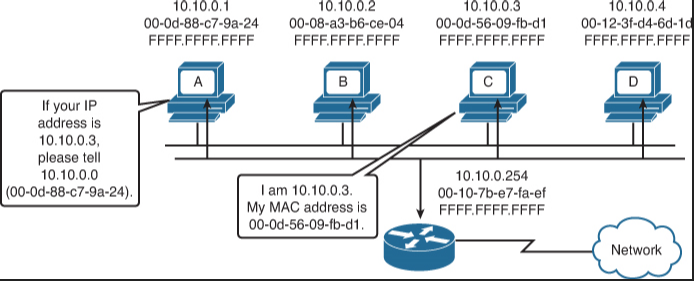

# route

[TOC]

## 简易路由示意图


PC01 要如何将数据传送到 PC02?

1. 查询 IP 封包的目标 IP 地址： 当 PC01 有 IP 封包需要传送时，主机会查阅 IP 封包表头的目标 IP 地址；
2. 查询是否位于本机所在的网域之路由设定： PC01 主机会分析自己的路由表，当发现目标 IP 与本机 IP 的 Net_ID 相同时(同一网域)，则 PC01 会直接透过区网功能，将数据直接传送给目的地主机。
3. 查询预设路由 (default gateway)： 但在本案例中， PC01 与 PC11 并非同一网域，因此PC01 会分析路由表当中是否有其他相符合的路由设定， 如果没有的话，就直接将该 IP封包送到预设路由器 (default gateway) 上头去，在本案例当中 default gateway 则是Server A 这一部。
4. 送出封包至 gateway 后，不理会封包流向： 当 IP 由 PC01 送给 Server A 之后， PC01就不理会接下来的工作。而 Server A 接收到这个封包后， 会依据上述的流程，也分析自己的路由信息，然后向后继续传输到正确的目的地主机上头

## route 命令
```sh
➜ route
Kernel IP routing table
Destination     Gateway         Genmask         Flags Metric Ref    Use Iface
default         shz82b-ldr01-v5 0.0.0.0         UG    100    0        0 enp0s31f6
10.67.112.0     0.0.0.0         255.255.254.0   U     100    0        0 enp0s31f6
172.18.0.0      0.0.0.0         255.255.0.0     U     0      0        0 docker0
192.168.122.0   0.0.0.0         255.255.255.0   U     0      0        0 virbr0
```

上面输出的数据共有八个字段，你需要注意的有几个地方：
- Destination ：其实就是 Network 的意思；
- Gateway ：就是该接口的 Gateway 那个 IP 啦！若为 0.0.0.0 表示不需要额外的 IP；
- Genmask ：就是 Netmask 啦！与 Destination 组合成为一部主机或网域；
- Flags ：共有多个旗标可以来表示该网域或主机代表的意义：
    + U：代表该路由可用(route is up)；
    + G：代表该网域需要经由 Gateway 来帮忙转递(use gateway)；
    + H：代表该行路由为一部主机，而非一整个网域(target is a host)；
- Iface ：就是 Interface (接口) 的意思。

> 万一我们要传送的封包目的地 IP 不在路由规则里面，那么就会将封包传送到『default』 所在的那个路由规则去。所以，**几乎每一部主机都会有一个 default gateway 来帮他们负责所有非网域内的封包转递**！

## ARP 与 RARP 协议
IP 与 MAC 势必有一个关连性存在吧？没错！那就是我们要谈到的 ARP (Address Resolution Protocol, 网络地址解析) 协议，以及 RARP (Revers ARP, 反向网络地址解析)



我们的主机会对整个区网发送出 ARP 封包，对方收到 ARP 封包后就会回传他的 MAC 给我们，我们的主机就会知道对方所在的网卡，那接下来就能够开始传递数据啰。 如果每次要传送都得要重新来一遍这个 ARP 协定那不是很烦？因此，当使用 ARP 协议取得目标 IP 与他网卡卡号后， 就会将该笔记录写入我们主机的 ARP table 中 (内存内的数据) 一般记录 20 分钟


```sh
➜ arp
Address                  HWtype  HWaddress           Flags Mask            Iface
shwdenpg031.ccr.corp.in  ether   1c:1b:0d:95:e6:6f   C                     enp0s31f6
shz82b-ldr01-v512-vrrp.  ether   00:00:5e:00:01:01   C                     enp0s31f6
10.67.112.212            ether   30:8d:99:bb:af:d9   C                     enp0s31f6
10.67.113.96             ether   1c:1b:0d:04:7c:06   C                     enp0s31f6
```


