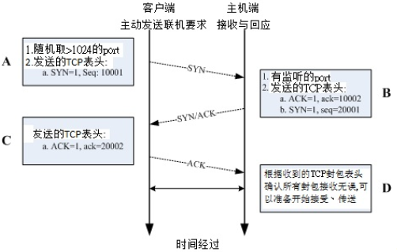

# TCP

[TOC]

## 三次握手

A: 封包发起 当客户端想要对服务器端联机时，就必须要送出一个要求联机的封包，此时客户端必须随机取用一个大于 1024 以上的端口来做为程序沟通的接口。然后在 TCP 的表头当中，必须要带有 SYN (synchronous)的主动联机(SYN=1)，并且记下发送出联机封包给服务器端的序号 (Sequence number = 10001) 。

B: 封包接收与确认封包传送 当服务器接到这个封包，并且确定要接收这个封包后，就会开始制作一个同时带有 SYN=1, ACK=1 的封包， 其中那个 acknowledge 的号码是要给client 端确认用的，所以该数字会比(A 步骤)里面的 Sequence 号码多一号 (ack = 10001+1 = 10002)， 那我们服务器也必须要确认客户端确实可以接收我们的封包才行，所以也会发送出一个 Sequence (seq=20001) 给客户端，并且开始等待客户端给我们服务器端的回应喔！

C: 回送确认封包 当客户端收到来自服务器端的 ACK 数字后 (10002) 就能够确认之前那个要求封包被正确的收受了， 接下来如果客户端也同意与服务器端建立联机时，就会再次的发送一个确认封包 (ACK=1) 给服务器，亦即是 acknowledge = 20001+1 = 20002 啰。

D: 取得最后确认 若一切都顺利，在服务器端收到带有 ACK=1 且 ack=20002 序号的封包后，就能够建立起这次的联机了。

