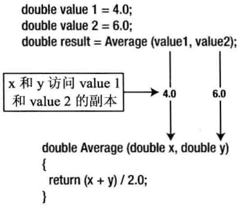

# C笔记
[TOC]


## 程序执行
```c
int main(void) {
    int a = 2;
    int b = 3;
    int c = a + b;
    return 0;
}
```


## 数据类型
```c
int main(void) {
    int i1 = 2;
    unsigned int ui1 = 3;

    char ch = 'a';

    float f1 = 1.2;
    float f2 = 0.8E-4;

    double d1 = 3.14;

    long a = -10001l;
    long b = 10002L;
    printf("%ld\n", (a + b));

    unsigned long = 10000l;

    // 16进制, 以0x开头
    // 十六进制FFFF 等于 十进制65535
    int i16 = 0xFFFF;

    // 8进制， 以0开头
    // 八进制077 等于 十进制63
    int i8 = 077;

    return 0;
}
```

| 类型名称  | 字节数 |      类型名称      | 字节数 |
| :-------- | :----- | :----------------- | :----- |
| char      | 1      |                    |        |
| short int | 2      | unsigned short int | 2      |
| int       | 4      | unsigned int       | 4      |
| long      | 8      | unsigned long      | 8      |
| long long | 8      | unsigned long long | 8      |
| float     | 4      |                    |        |
| double    | 8      |                    |        |

### printf函数控制输出字段宽度
输出的字符宽度是输出值所使用的总字符数(包括空格)

```c
int main(void) {
    long a = 10001l;
    double f = 3.1415926;
    printf("[%10ld]\n", a);
    printf("[%-10ld]\n", a);
    printf("[%10.4f]\n", f);

    // 右对齐
    printf("[%10ld]\n", a);

    // 左对齐
    printf("[%-10ld]\n", a);

    // 右对齐并保留4位小数
    printf("[%10.4f]\n", f);

    // 左对齐并保留5位小数
    printf("[%-10.5f]\n", f);

    return 0;
}
```

输出效果如下：
```
[     10001]
[10001     ]
[    3.1416]
[3.14159   ]
```

### 浮点数在内存中的存储
Intel PC中的浮点数如下表示


这是个单精度浮点数，在内存中占用4个字节。该值包含3个部分：
1. 符号位, 正值为0，负值为1
2. 8位的指数
3. 23位的尾数

### 字符类型
```c
    int main(void) {
    char letter_A = 'A';
    char letter_a = 'a';
    char digit_0 = '0';
    char exclamation = '!';
    printf("%c = %d\n", letter_A, letter_A);
    printf("%c = %d\n", letter_a, letter_a);
    printf("%c = %d\n", digit_0, digit_0);
    printf("%c = %d\n", exclamation, exclamation);

    char newline = '\n';
    char tab = '\t';
    char single_quote = '\'';
    printf("\\n = %d\n", newline);
    printf("\\t = %d\n", tab);
    printf("\' = %d\n", single_quote);

    char a = 'A';
    int i;
    for (i=a; i<a+26; i++) {
        printf("%c ", i);
    }

    return 0;
}
```

输出结果:
```
A = 65
a = 97
0 = 48
! = 33
\n = 10
\t = 9
' = 39
```

> 对于字符类型的值可以进行数值运算, 同时r仍把它当做y一个字符。

### 枚举类型
```c
int main(void) {
    enum Weekday {Monday, Tuesday, Wednesday, Thursday, Friday, Saturday, Sunday};
    enum Weekday today = Sunday;

    // today = 6
    printf("%d\n", today);

    enum FaceValue {two=2, three, four, five,
        six, seven,eight, nine, ten,
        jack, queen, king, ace};

    // two = 2
    printf("%d\n", two);

    // three = 3
    printf("%d\n", three);

    // ace = 14
    printf("%d\n", ace);

    return 0;
}
```

### 布尔类型
0为假， 非零为真
```c
#include <stdio.h>
#include <stdbool.h>

int main() {
    printf("%d\n", true);
    printf("%d\n", false);

    _Bool valid = 1;
    printf("%d\n", valid);

    return 0;
}
```

> _Bool 是新引进的

### sizeof
`sizeof`运算符可以确定给定的类型或者表达式占据多少字节。 `sizeof`在C语言中是一个关键字。

```c
int main(void) {
    size_t size = sizeof(int);
    printf("size = %ld\n", size);

    int a = 2;
    int b = 3;
    printf("size = %ld\n", sizeof(a+b));

    return 0;
}
```

> **size_t** 是unsigned int 类型，无符号，它的取值没有负数。用来表示 参数/数组元素个数，sizeof 返回值，或 str相关函数返回的 size 或 长度。sizeof 操作符的结果类型是size_t。

### 强制类型转换
```c
int main(void) {
    int a = 3;
    float b = (float)a;
    printf("b = %f\n", b);

    return 0;
}
```

### 常量
```c
#define PI 3.1415926f

int main(void) {
    float r = 2;
    printf("pi = %f\n", PI);
    printf("s = %f\n", PI * r * r);

    return 0;
}
```

```c
int main(void) {
    const float pi = 3.1415926;
    printf("s = %f\n", pi * r * r);

    return 0;
}
```

> 用 `const` 修饰的变量，不能被修改。

## if 判断语句
```c
int main(void) {
    int a = 5;
    if (a > 0) {
        printf("Positive number");
    } else if (a < 0) {
        printf("Negative number");
    } else {
        printf("Zero");
    }

    return 0;
}
```

```c
int main(void) {
    int age = 20;
    if ((age>18) && (age<60)) {
        printf("18 - 60");
    }

    if ((age<=8) || (age>=60)) {
        printf("You are a child or an old man");
    }

    if (!(age==20)) {
        printf("not 20");
    }

    return 0;
}
```

三目运算符
```c
int main(void) {
    int x, y;
    x = 5;
    y = x > 0 ? 1 : -1;

    return 0;
}
```

相当于：
```c
int main(void) {
    int x, y;
    x = 5;
    if (x > 0) {
        y = 1;
    } else {
        y = -1;
    }

    return 0;
}
```

## switch
```c
int main(void) {
    int grade = 78;
    int c = grade / 10;
    switch (c) {
        case 10:
            printf("Excellent\n");
            break;
        case 9:
            printf("Good\n");
            break;
        case 8:
            printf("Pass\n");
        case 7:
            printf("Pass\n");
        case 6:
            printf("Pass\n");
            break;
        default:
            printf("Fail\n");
    }

    return 0;
}
```

> 1. 这里的c要么是常数，要么是char类型
> 2. 如果当前case中没有break，还会到下一个case中

## 循环
while 循环
```c
int main(void) {
    int s = 0;
    int i = 1;
    while (i<=100) {
        s += i;
        i++;
    }
    printf("1 + 2 + 3 + ... + 100 = %d\n", s);

    return 0;
}
```

do ... while 循环
```c
int main(void) {
    int s = 0;
    int i = 1;
    do {
        s += i;
        i++;
    } while (i<=100);
    printf("1 + 2 + 3 + ... + 100 = %d\n", s);

    return 0;
}
```

for 循环
```c
int main(void) {
    int i;
    for(i=2; i<10; i++) {
        if(i % 2 == 0) {
            continue;
        }
        printf("%s\n", i);
        if(i % 6 == 0) {
            break;
        }
    }

    return 0;
}
```

```c
#include <stdio.h>
#include <stdlib.h>
#include <time.h>

int main(void) {
    time_t seed = time(NULL);
    srand(seed);
    // srand((unsigned)time(NULL));

    int i;
    for(i=0; i<10; i++) {
        int r = rand();
        printf("%d\n", r % 10);
        printf("%d\n", r);

        r = rand();
        printf("%d\n", r);
    }
    return 0;
}
```

## 数组
数组初始化
```c
int number[4] = {1, 2, 3, 4};
```


全部初始化
```c
int array_1[5] = {1, 2, 3, 4, 5};
```

初始化不必提供数组大小，编译器会推断出元素个数
```c
int array_2[] = {1, 2, 3, 4, 5};
```

设置其他默认值为0
```c
int array_3[5] = {1, 2};
```

计算数组大小
```c
int main(void) {
    int number[4] = {1, 2, 3, 4};
    int i;

    for (i=0; i<4; i++) {
        printf("%d\n", number[i]);
    }
    // 数组所占字节数
    printf("%zu\n", sizeof(number));

    // 确定数组大小
    int size = sizeof(number) / sizeof(int);
    printf("%d\n", size);

    return 0;
}
```

二维数组
```c
int main(void) {
    // 4行2列
    int number[4][2] = {{1, 2}, {3, 4}, {5, 6}, {7, 8}};
    int i, j;

    for (i=0; i<4; i++) {
        for (j=0; j<2; j++) {
            printf("%d\t", number[i][j]);
        }
        printf("\n");
    }
    printf("%zu\n", sizeof(number));

    int size_of_row = sizeof(number) / sizeof(number[0]);
    int size_of_colum = sizeof(number[0]) / sizeof(int);
    printf("row = %d, colum = %d\n", size_of_row, size_of_colum);

    return 0;
}
```

## 参数数组
```c
int main(int argc, char* argv[]) {
    printf("%d\n", argc);
    int i;
    for(i=0; i<argc; i++) {
        printf("%s\t", argv[i]);
    }
    printf("\n");

    for(i=0; argv[i]!=NULL; i++) {
        printf("%s\t", argv[i]);
    }
    printf("\n");

    return 0;
}
```

## 字符串
字符串常量是由一对双引号中的一串字符或者符号。

```c
printf("This is a string");
printf("This is on\ntwo lines");
printf("For \"you write \\\"");
```


> 空字符(`\0`)不要和 NULL混淆
> 空字符是字符串的终止符。
> NULL 是一个符号，表示不引用任何内容的地址。

C语言对变量存储字符串的语法没有特殊的规定，而且C就没有字符串变量，但是可以使用char类型的字符串数组来保存字符串。也没有处理字符串的特殊预算符。这不成问题，因为标准库提供了许多函数来处理字符串。

```c
#include <stdio.h>
#include <string.h>

int main(void) {
    char ch[5] = "1234";

    printf("%s\n", ch);
    printf("%ld\n", sizeof(ch));

    char ch2[ ] = "12345";
    printf("%s\n", ch2);

    // 长度是6
    printf("%ld\n", sizeof(ch2));

    char ch3[ ] = "12345\0 67890";
    // 输出:12345
    printf("%s\n", ch3);
    // 字符串数组长度:13
    printf("%ld\n", sizeof(ch3));
    // 字符串长度:5，字符串碰到第一个\0就结束
    printf("%ld\n", strlen(ch3));

    // 字符串常量
    const char message[] = "end";
    printf("%s\n", message);

    // 二维字符串数组
    char m[][70] = {
        "Hello world!",
        "Welcome to C world.",
        "Enjoy yourself!"
    };

    int i;
    for (i=0; i< sizeof(m)/sizeof(m[0]); i++) {
        printf("%s\n", m[i]);
    }

    return 0;
}
```

> 声明存储字符串的数组时，其内存大小至少要比所存储的字符数多1，因为编译器会自动在字符串常量的末尾添加`\0`

在C语言中，NULL和0的值都是一样的，但是为了目的和用途及容易识别的原因，NULL用于指针和对象，0用于数值
对于字符串的结尾，使用'\0'，它的值也是0，但是让人一看就知道这是字符串的结尾，不是指针，也不是普通的数值

### 字符串函数
```c
#include <stdio.h>
#include <string.h>
#include <strlib.h>

字符串拷贝
int main(void) {
    char src[] = "hello world!";
    char dest[50];
    strcpy(dest, src);
    printf("%s\n", dest);

    // 12 
    printf("%ld\n", strlen(src));

    // 12
    printf("%ld\n", strlen(dest));

    // 13
    printf("%ld\n", sizeof(src));

    // 50
    printf("%ld\n", sizeof(dest));

    return 0;
}
```
> 拷贝时 dest长度 大于等于 src的长度

字符串连接
```c
char src[] = "hello world!";
char cat[50] = "12345";
strcat(cat, src);
printf("%s\n", cat);
```

字符串比较
```c
char str1[] = "The quick brown fox";
char str2[] = "The quick black fox";
int flag = strcmp(str1, str2);
if (flag > 0) {
    printf(" > \n");
} else if (flag < 0) {
    printf(" < \n");
} else {
    printf(" = \n");
}
```


搜索字符串中的一个字符
```c
char str[] = "The quick brown fox";
char ch = 'q';
char *pGot_char = NULL;
pGot_char = strchr(str, ch);
if (NULL != pGot_char) {
    printf("find\n");
} else {
    printf("not found\n");
}
```


查找字符串子串
```c
char text[] = "Every dog has his day";
char word[] = "dog";
char *pFound = NULL;
pFound = strstr(text, word);
if (NULL != pFound) {
    printf("find\n");
} else {
    printf("not found\n");
}
```

字符串转成数字
```c
char value_str[] = "98.4";
double value = atof(value_str);
printf("%lf\n", value);
```

|  函数   |          返回值           |
| :------ | :----------------------- |
| atof()  | 字符串 --> double类型     |
| atoi()  | 字符串 --> int类型        |
| atol()  | 字符串 --> long 类型      |
| atoll() | 字符串 --> long long 类型 |


## 指针
### 声明指针
```c
int a = 5;
int b = 6;

// 声明指针
int *pa = &a;
int *pb = &b;
```


pa的初值是变量a的地址。 指针必须初始化

### 通过指针访问值
```c
int number = 99;
int *pnumber = NULL;
pnumber = &number;

// 得到变量number的地址
printf("address = %p\n", pnumber);
// 得到指针指向的值 99
printf("value = %d\n", *pnumber);

int result = *pnumber + 1;
printf("result = %d\n", result);
```

### 指向常量的指针
```c
int value = 2;
const int *p = &value;

// 编译器报错
*p = 5;
```
**被指向的对象是常量**  
当p指向的值声明为const，编译器会检查是否有语句试图修改p指向的值，如果有编译器会报错。

### 常量指针
```c
int value = 2;
int *const p = &value;

int a = 8;
// 编译器报错
p = &a;

*p = 10;
printf("a = %d\n", a);
```
**指针本身是常量**  
指针p存储的地址不能变, 否则编译器会报错。 但`*p`的值可以改变。


关于const可以这样记：**const后边**的内容为“常量”。
```c
const int p;      // p  为常量，初始化后不可更改
const int *p;     // *p 为常量，不能通过*p改变它指向的内容
int const *p;     // *p 为常量，同上. 也与数组名一样，不能执行p++
int* const p;     // p  为常量，初始化后不能再指向其它内容
```

但是下面这个是可以的 

`const` 只能避免直接修改，不能避免间接修改 
```c
const int a = 1;
int *p = (int*)&a;  // 强制转换在寄存器中进行，强转的返回值可以读取，但不能写
*p = 10;
printf("%d\n", a);
```

```c
const char *sports[] = {
    "golf",
    "hockey",
    "football",
    "cricket",
    "shooting"
};

*sports = "yyyyyy";
printf("%s\n", *sports);
*(sports + 1) = "xxxxxx";
printf("%s\n", *(sports+1));

int i;
for (i=0; i<5; i++) {
    printf("%s: %ld\n", *(sports+i), sizeof(*(sports+i)));
}
```

### 数组与指针
```c
int array[5] = {1, 2, 3, 4, 5};
int *p = array;

printf("array address = %p\n", array);
printf("p --> address = %p\n", p);
printf("p address = %p\n", &p);

printf("p0 = %d\n", *p);
p++;
printf("p1 = %d\n", *p);
printf("p --> address = %p\n", p);

p++;
printf("p2 = %d\n", *p);
printf("p --> address = %p\n", p);

*p += 100;
// 此时值为 103
printf("p2 = %d\n", *p);
```


当 `int *p = array` 指针p就知道了数组array的起始地址，以及int类型的偏移量`sizeof(int)`。  
此例子中int类型占4个字节，计算 `*p` 的值就是读取了array的起始地址+4个字节的偏移量。  
一开始p指向int数组的首地址。 `p++` p存储的值 (数组的首地址 + 4个字节) 即p指向下一个int 也就是array[1]的地址。

> 数组名array 是一个指针常量 (`int* const array`)，固定指向内存的某个地址。array++ 是不允许的。 函数名也是一个**指针常量**


```c
int array[5] = {1, 2, 3, 4, 5};
int *p = array;

int i;
int s = 0;
for (i=0; i<5; i++) {
    s += *(p + i);
    printf("%d\t", *(array + i));
}

// sizeof p 是 8
printf("sizeof p = %ld\n", sizeof(p));
// sizeof array 是 20
printf("sizeof array = %ld\n", sizeof(array));

// 15
printf("sum = %d\n", s);

// 此时值为 1
printf("*p = %d\n", *p);

p++;
// 此时值为 2
printf("*p = %d\n", *p);

```

上述中`*(array + i)` 数组名可以当做指针来使用, 但并不等同于指针。
1. sizeof(array) 与 sizeof(p) 取得的值是不一样的
2. `&array` 指向长度为5数组的指针

> 数组名 == 数组首地址  
> *(p+i) 意思是指针p往后偏移i个单位之后取得的值. 指针p并未移动。  
> p++ 意思是指针p往后偏移了1个单位。


```c
// 数组没有副本拷贝机制， 作为参数退化为指针
void find(int *array) {
    int *p = array;
    for (; p<array+5; p++) {
        printf("%d\n", *p);
    }
}

int main(void) {
    int array[5] = {1, 2, 3, 4, 5};
    find(array);
    return 0;
}
```
上面数组没有副本拷贝机制， 作为参数退化为指针。  
没有拷贝机制是数组有起始地址，类型，以及数组长度。  
但**作为参数传递的数组时候，只知道起始地址和类型，不知道数组长度**。  
所以说它传递的是指向数组起始地址的指针。


```c
char *p = "12345";  // "12345"是常量字符串 在代码区，存储代码区的地址
printf("%s\n", p);
// *p = 'A';        // 会报错
```

### 二维数组与指针
```c
char board[3][3] = {
    {'1', '2', '3'},
    {'4', '5', '6'},
    {'7', '8', '9'}
};

// board[0][0] = 1
printf("board[0][0] = %c\n", board[0][0]);

// *board[0] = 1
printf("*board[0] = %c\n", *board[0]);

// **board = 1
printf("**board = %c\n", **board);

int i,j;
for (i=0; i<(int)(sizeof(board)/sizeof(board[0])); i++) {
    for (j=0; j<(int)(sizeof(board[0])); j++) {
        printf("%c: %p\t", board[i][j], &board[i][j]);
        // printf("%c: %p\t", *(board[i] + j), &board[i][j]);
    }
    printf("\n");
}
```


在二维数组中，如果通过board获取第一个值，就需要间接运算符`**board`。  
只使用一个`*` 得到board[0]的地址。

```c
int main(void) {
    int arr[3][3] = {{1,2,3},{4,5,6},{7,8,9}};
    int **p = arr;
    return 0;
}
```
上面的代码会报错，这是因为两者数据类型是不相同的，所以不能赋值。  
**二维数组的数组名指向的是一维数组，也就是指向数组类型**，但是二级指针指向的是一级指针，也就是指针类型，所以两者不能互相赋值。

```c
int arr[3][4] = {
    {1, 2, 3, 4},
    {5, 6, 7, 8},
    {9, 10, 11, 12}
};

int *p = arr[0];
int i;
for (i=0; i<12; i++) {
    printf("%2d:%p\t", *p, p);
    p++;
    if ((i+1) % 4 == 0) {
        printf("\n");
    }
}

printf("\n");
printf("%p\n", *(arr+2) + 3);
printf("%p\n", arr[2] + 3);
printf("%p\n", &arr[2][3]);

printf("\n");
printf("%d\n",*(*(arr+2) + 3));
printf("%d\n", *(arr[2] + 3));
```

输出的结果如下：
```
1:0x7ffd44faab30        2:0x7ffd44faab34        3:0x7ffd44faab38        4:0x7ffd44faab3c
5:0x7ffd44faab40        6:0x7ffd44faab44        7:0x7ffd44faab48        8:0x7ffd44faab4c
9:0x7ffd44faab50       10:0x7ffd44faab54       11:0x7ffd44faab58       12:0x7ffd44faab5c

0x7ffd44faab5c
0x7ffd44faab5c
0x7ffd44faab5c

12
12
```


```c
int a[2][3] = {
{1, 2, 3},
{4, 5 ,6}
};
int (*p)[3] = &a[0];
printf("val: %d\n",(*p)[0]);
printf("val: %d\n",(*p)[1]);
printf("val: %d\n",(*p)[2]);

p++;
printf("val: %d\n",(*p)[0]);
printf("val: %d\n",(*p)[1]);
printf("val: %d\n",(*p)[2]);
```
上面的a中元素为含有3个int数据的数组，定义这样一个普通变量为： int p[3]，然后在变量名前面加上`*`即可，但是要注意运算符的优先级，因为`*`的优先级比[]低，所以要加括号，即int (*p)[3]。
这样再将p指向a的第一个元素的地址：p = &a[0]，然后就可以用p来访问数组a啦！


### 内存的使用
在程序执行期间分配内存是， 内存区域中的这个空间称为堆(heap)。   
还有另一个内存区域称为栈(stack)， 其中的空间分配给函数的参数和本地变量。  
在执行完该函数后，存储参数和本地变量的内存空间就会释放。  
堆中的内存则由程序员控制。

### 动态内存分配
通过malloc()函数申请内存
```c
#include <stdio.h>
#include <stdlib.h>
int main(void) {
    int SIZE = 10;
    int *head = (int*)malloc(SIZE * sizeof(int));

    int i;
    int *p = NULL;
    if (head) {
        p = head;
        for (i=0; i<SIZE; i++) {
            *p = (i+1);
            p++;
        }
    }

    p = head;
    for (i=0; i<SIZE; i++) {
        printf("%d  ", *p);
        p++;
    }
    printf("\n");

    free(head);
    head = NULL;

    return 0;
}
```

类型转换`(int*)`将malloc()函数返回的地址转换成int类型的指针。  
许多编译器会把malloc()函数自带转换为左边的指针类型，但显示的加上是无害的。  
在释放指针指向的堆内存时，必须确保它不被另一个地址覆盖。  


通过calloc()函数申请内存
```c
int SIZE = 5;
int *head = (int *)calloc(SIZE, sizeof(int));

int *p = head;
int i;
for (i=0; i<SIZE; i++) {
    printf("%d  ", *p);
    p++;
}
printf("\n");
free(head);
```

calloc()函数与malloc()函数相比有2个优点：
1. 它的内存分配改定大小的数组
2. 它初始化了所分配的内存，所有的位都是0

### 指针数组
```c
char *pStr[5] = { NULL };

char ch[][20] = {
    "line1: Hello",
    "line2: World",
    "line3: XXXX",
    "line4: YYYY",
    "line5: end!"
};

int i;
for (i=0; i<5; i++) {
    pStr[i] = (char *)malloc(15 * sizeof(char));
    strcpy(pStr[i], ch[i]);
}

for (i=0; i<5; i++) {
    printf("%s\n", pStr[i]);
    free(pStr[i]);
}
printf("\n");
```


```c
int* get() {
    int i;
    return i + j;
}

int main() {
    int a;
    &a;  // 这步操作在寄存器中

    // 以下都是非法的
    // &&a; &a 在寄存器中产生, 
    // &1; 1是寄存器的常量
    // &(a+1); 在寄存器中
    // &get(); get() 返回值在寄存器的cache中 或者备份内存中， 返回值不可以取地址
}
```

> 变量名不需要储存，变量名是给人看的，编译器编译的时候知道每个变量所储存的地址，直接使用地址来读写


## 函数
```c
double Average(double x, double y) {
    return (x + y)/2.0;
}

int main(void) {
    double value1 = 4.0;
    double value2 = 6.0;
    double result = Average(value1, value2);

    return 0;
}

```

给函数传递变量时，变量值不会直接传递给函数, 而是先制作变量值的副本, 存储在栈上, 再使这个副本可用于函数,而不是初始值。



### 回调函数
回调函数就是一个通过函数指针调用的函数。

```c
int max(int a, int b) {
    return a > b ? a : b;
}

int main(void) {
    int a = 1, b = 3, c = 2;
    int (*p)(int, int) = &max;  // & 可以不用写

    // 与直接调用函数等价，d = max(max(a, b), c)
    int d = p(p(a, b), c);
    printf("Max = %d\n", d);

    return 0;
}
```

回调函数作为参数
```c
void populate_array(int *array, int size, int (*getNumber)(void)) {
    int i;
    for (i=0; i<size; i++) {
        *(array + i) = getNumber();
    }
}

int getRandomNumber(void) {
    int r = rand() % 10;
    printf("r = %d\n", r);
    return r;
}

int main(void) {
    int array[5];
    int size = 5;
    populate_array(array, size, getRandomNumber);

    int i;
    for (i=0; i<size; i++) {
        printf("%d\t", *(array+i));
    }
    printf("\n");

    return 0;
}
```

## 结构体
```c
#include <stdio.h>
#include <string.h>

int main(void) {
    struct Books {
        char  title[50];
        char  author[50];
        char  subject[100];
        int   book_id;
    } book1;

    strcpy(book1.title, "C Programming");
    strcpy(book1.author, "Nuha Ali");
    strcpy(book1.subject, "C Programming Tutorial");
    book1.book_id = 6495407;

    struct Books book2;
    strcpy(book2.title, "Tom and jerry");
    strcpy(book2.author, "MGM");
    strcpy(book2.subject, "Cartoon");
    book2.book_id = 10001;

    printf("book1.title: %s\n", book1.title);
    printf("book2.book_id: %d\n", book2.book_id);
    return 0;
}
```

可以用typedef创建新类型
```c
int main(void) {
    typedef struct {
        char  title[50];
        char  author[50];
        char  subject[100];
        int   book_id;
    } Books;

    Books book1;
    strcpy(book1.title, "C Programming");
    strcpy(book1.author, "Nuha Ali");
    strcpy(book1.subject, "C Programming Tutorial");
    book1.book_id = 6495407;

    printf("book1.title: %s\n", book1.title);
    printf("book1.book_id: %d\n", book1.book_id);

    return 0;
}
```

### 指向结构的指针
```c
typedef struct {
    char  title[50];
    char  author[50];
    char  subject[100];
    int   book_id;
} Book;

void showBook(Book *book) {
    printf("title: %s\n", book->title);
    printf("author: %s\n", book->author);
    printf("subject: %s\n", book->subject);
    printf("book_id: %d\n", book->book_id);
}

int main(void) {
    Book *book1 = (Book*)malloc(sizeof(Book));
    strcpy(book1->title, "C Programming");
    strcpy(book1->author, "Nuha Ali");
    strcpy(book1->subject, "C Programming Tutorial");
    book1->book_id = 6495407;
    showBook(book1);

    Book book2;
    strcpy(book2.title, "Tom and jerry");
    strcpy(book2.author, "MGM");
    strcpy(book2.subject, "Cartoon");
    book2.book_id = 10001;
    showBook(&book2);

    return 0;
}
```

### 结构体内存对齐
结构体内存对齐：元素是按照定义顺序一个一个放到内存中去的，但并不是紧密排列的。从结构体存储的首地址开始，每个元素放置到内存中时，它都会认为内存是按照自己的大小来划分的，因此元素放置的位置一定会在自己宽度的整数倍上开始。

**1. 前面的地址必须是后面的地址正数倍,不是就补齐**  
**2. 整个Struct的地址必须是最大字节的整数倍**

```c
typedef struct {
    int a;
    long b;
    char c;
    char d;
} S1;

// 24
printf("sizeof(S1) = %ld\n", sizeof(S1));
```
上述中 
1. int a 占4个字节
2. long b 占8个字节，先补位int a中的4个字节，加上自己的8个字节，此时一共16个字节。
3. char c 占1个字节，先申请8个字节。 char c放入第一个位置。此时一共24个字节。
4. char d 占1个字节，上次申请的8个字节还有多余的空位，char d放入第二个位置。此时一共24个字节。


```c
typedef struct {
    int a;
    char c;
    char d;
    long b;
} S1;

// 16
printf("sizeof(S1) = %ld\n", sizeof(S1));
```
上述中 
1. int a 占4个字节
2. char c 占1个字节，先申请4个字节。 char c放入第一个位置。此时一共8个字节。
3. char d 占1个字节，上次申请的4个字节还有多余的空位，char d放入第二个位置。此时一共8个字节。
4. long b 占8个字节，先补位上面剩余的2个 (4+1+1),申请8个字节。此时一共16个字节


## 动态分配
```c
int *p1;
p1 = (int*)malloc(sizeof(int));
*p1 = 1;
printf("%d\n", *p1);

int *p2;
p2 = (int*)calloc(3, sizeof(int));
int i;
for(i=0; i<3; i++) {
    *p2 = i + 1;
    printf("%d\n", *p2);
    p2++;
}
free(p1);
free(p2);
```

> malloc 和 calloc 内存分配在堆上

## 宏定义
```c
#define R
int main() {
#ifdef R
    printf("Yes\n");
#else
    printf("No\n");
#endif

#define i 1
#if (i > 0)
    printf("+:%d\n", i);
#elif (i < 0)
    printf("-:%d\n", i);
#else
    printf("0:%d\n", i);
#endif

}
```


### 数组指针
```c
char *month[] = {
    "January",
    "February",
    "March",
    "April",
    "May",
    "June",
    "July",
    "August",
    "September",
    "October",
    "November",
    "December"
};

int i;
for(i=0; i<12; i++) {
    printf("%s ", month[i]);
}
```

## 链表
```c
#include <stdio.h>
#include <stdlib.h>
#include <string.h>

typedef struct Node {
    int data;
    struct Node *next;
} Node;

void show(Node *head) {
    Node *p = head;
    while (p) {
        printf("[%d]\t", p->data);
        p = p->next;
    }
    printf("\n");
}

Node *init(int size) {
    Node *head = NULL;
    Node *p = NULL;
    Node *pPre = NULL;

    int i;
    for (i=0; i<size; i++) {
        p = (Node *)malloc(sizeof(Node));
        p->data = (i+1);
        p->next = NULL;
        if (i == 0) {
            head = p;
        } else {
            pPre->next = p;
        }
        pPre = p;
    }

    return head;
}

int find(Node* head, int x) {
    int flag = -1;
    Node *p = head;
    while (p) {
        if (p->data == x) {
            flag = 0;
            break;
        }
        p = p->next;
    }

    if (flag == 0) {
        printf("find\n");
    } else {
        printf("not found\n");
    }
    return flag;
}

Node* removeX(Node* head, int x) {
    Node *p = head;
    Node *pPre = p;
    int flag = -1;
    int index = 0;
    while (p) {
        if (p->data == x) {
            pPre->next = p->next;
            if (index == 0) {
                head = p->next;
            }
            free(p);
            flag = 0;
            break;
        }
        pPre = p;
        p = p->next;
        index++;
    }

    if (flag == 0) {
        printf("find and deleted\n");
    } else {
        printf("not found\n");
    }

    return head;
}

int main(void) {
    Node *head = init(10);
    show(head);
    find(head, 3);
    find(head, 12);
    head = removeX(head, 1);
    head = removeX(head, 3);
    head = removeX(head, 15);
    show(head);

    free(head);
    return 0;
}
```

## Makefile
```shell
gcc main.c -L. -lstack -Istack -o main
```

> -L选项告诉编译器去哪里找需要的库文件， -L.表示在当前目录找。 
> -lstack告诉编译器要链接libstack库， 
> -I选项告诉编译器去哪里找头文件。注意，即使库文件就在当前目录，编译器默认也不会去找的，所以-L.选项不能少。
> 编译器默认会找的目录可以用gcc -print-search-dirs选项查看：


## 打包成（静态）库文件
```shell
ar crv libpersion.a Person.o
```

> 最好以lib开头，否则可能找不到。


## memcpy
```c
#include <stdio.h>
#include <string.h>

int main() {
    char buf[20] = "hello world\n";
    printf(buf);     // hello world
    memcpy(buf+1, buf, 13);
    printf(buf);     // hhello world
    return 0;
}
```

`void *memcpy(void *destin, void *source, unsigned n)` 在src里面拷贝n个字节到dest

## fork
```c
#include <stdio.h>
#include <sys/types.h>
#include <unistd.h>
#include <stdlib.h>

int main() {
    pid_t pid;
    char *message;
    int n;
    pid = fork();
    if(pid < 0) {
        perror("fork failed!");
        exit(1);
    }else if(pid == 0) {
        message = "This is the child\n";
        n = 6;
    }else {
        message = "This is the parent\n";
        n = 3;
    }

    for(; n>0; n--) {
        printf("%d:%s", n, message);
        sleep(1);
    }
}
```

> 这里的pid>0 是父进程， pid是子进程的pid。 
> pid==0 是子进程。
> pid<0, 不成功。


## 环境变量
```c
#include <stdio.h>
int main() {
    extern char **environ;
    int i;
    for(i=0; environ[i] !=NULL; i++) {
        printf("%s\n", environ[i]);
    }
    return 0;
}
```

输出
```
SHELL=/bin/bash
HISTSIZE=1000
SSH_CLIENT=10.239.173.39 62092 22
...
```

## 内存布局


### 代码区
代码区code，程序被操作系统加载到内存的时候，所有的可执行代码都加载到代码区，也叫代码段，这块内存是不可以在运行期间修改的。

代码区中所有的内容在程序加载到内存的时候就确定了，运行期间不可以修改，只可以执行。

### 静态区
静态区是程序加载到内存的时候就确定了，程序退出的时候从内存消失。所有的全局变量和静态变量在程序运行期间都占用内存。

所有的全局变量以及程序中的静态变量和常量（const）都存储到静态区

### 栈区
栈stack是一种先进后出的内存结构，所有的自动变量，函数的形参，函数的返回值都是由编译器自动放出栈中，当一个自动变量超出其作用域时，自动从栈中弹出。 **从高地址到低地址**

不同的系统栈的大小是不一样的，即使相同的系统，栈的大小也是不一样的，windows程序在编译的时候就可以指定栈的大小，linux栈的大小是可以通过环境变量设置的。

### 静态区、代码区、栈区
静态区和代码区的大小受到物理内存大小的限制

栈区的大小一般很小，单位一般是k，所以栈中不能有太多变量

### 堆区
堆heap和栈一样，也是一种在程序运行过程中可以随时修改的内存区域，但没有栈那样先进后出的顺序。 **从低地址到高地址**

堆是一个大容器，它的容量要远远大于栈，但是在C语言中，堆内存空间的申请和释放
需要手动通过代码来完成。

```c
// main.c 程序代码区

int a = 0;  // 全局初始化区 
char *p1;   // 全局未初始化区

void f1() {
    int b;                    // 栈
    char s[] = "abcd";        // 栈
    char *p2;                 // 栈
    char *p3 = "12345";       // "12345\0"在常量区, p3在栈
    static int c = 0;         // 全局(静态)初始化区
    p1 = (char *)malloc(10);  // 堆
    p2 = (char *)malloc(20);  // 堆
    strcpy(p1, "12345");      // "12345\0"在常量区, 编译器可能会把它与p3指向同一个地方

    printf("a = %p\n", &a);
    printf("p1 = %p\n", &p1);
    printf("p2 = %p\n", &p2);
    printf("p3 = %p\n", &p3);
    printf("c = %p\n", &c);
}
```


## Others
### `<stdio.h>`: 在系统目录下查找
`"a.c"`:  先在当前目录下找出，没有找到的话去系统目录查找。
```c
#include <stdio.h>
#include "a.c"

int main(void) {
    printf("Hello\n");
    system("ls");
#include "hello.txt"

    return 0;
}
```

### api.h
在这个示例中，我们将函数指针类型定义放在了 `api.h` 文件中，每个厂商的实现放在了单独的文件中，然后在 `main.c` 文件中使用了这些实现。这种组织方式更加清晰和模块化，使得不同部分的代码更容易独立开发和维护。

`api.h` 文件：
```c
// api.h

// 定义 API 的函数指针类型
typedef int (*APIFunction)(int);

// 选择实现的函数声明
APIFunction SelectImplementation(int vendor);
```

`vendor_a.c` 文件：
```c
// vendor_a.c

#include "api.h"

// 厂商 A 的实现
int VendorAImplementation(int value) {
    return value * 2;
}
```

`vendor_b.c` 文件：
```c
// vendor_b.c

#include "api.h"

// 厂商 B 的实现
int VendorBImplementation(int value) {
    return value * value;
}
```

`main.c` 文件：
```c
// main.c

#include <stdio.h>
#include "api.h"

int main() {
    int input = 3;
    int selectedVendor = 1; // 假设选择了厂商 A

    // 选择实现
    APIFunction apiFunction = SelectImplementation(selectedVendor);

    // 使用选择的实现
    if (apiFunction != NULL) {
        int result = apiFunction(input);
        printf("Result using selected vendor's implementation: %d\n", result);
    } else {
        printf("Selected vendor's implementation not found\n");
    }

    return 0;
}
```


