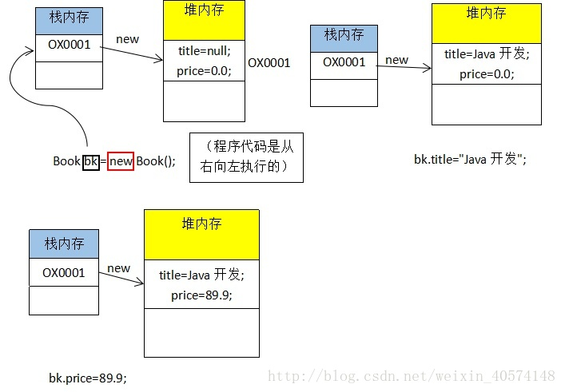
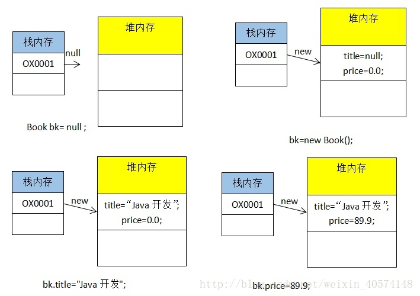

# Java笔记
[TOC]

参考 李兴华老师的[网易公开课](https://study.163.com/course/courseMain.htm?courseId=1455026) 以及 [runoob](http://www.runoob.com/java/java-tutorial.html)

## 注释
```java
// 这是当行注释

/*
多行注释
多行注释
*/

/**
文档注释
文档注释
*/
```


```java
public class HelloWorld {
    public static void main(String[] args) {
        System.out.println("Hello World!");
    }
}
```

## 基本数据类型
|  基本类型 |  二进制位数  |   包装类   |         最小值        |          最大值         |
| :------- | :--------- | :-------- | :------------------- | :--------------------- |
| byte     | 8          | Byte      | -128                 | 127                    |
| short    | 16         | Short     | -32768               | 32767                  |
| int      | 32         | Short     | -2147483648          | 2147483647             |
| long     | 64         | Long      | -9223372036854775808 | 9223372036854775807    |
| float    | 32         | Float     | 1.4E-45              | 3.4028235E38           |
| double   | 64         | Double    | 4.9E-324             | 1.7976931348623157E308 |
| char     | 16         | Character | 0                    | 65535                  |

字符编码
'A'(65) --> 'Z'(90)
'a'(97) --> 'z'(122)
'0'(48) --> '9'(57)

## 数组
```java
    int size = 5;
    // 定义数组
    double[] myList = new double[size];
    myList[0] = 5.6;
    myList[1] = 4.5;
    myList[2] = 3.3;
    myList[3] = 13.2;
    myList[4] = 4.0;
```

```java
    // 初始化
    double[] myList = {1.9, 2.9, 3.4, 3.5};
    double total = 0;
    for (int i = 0; i < myList.length; i++) {
        total += myList[i];
    }
```

二维数组
```java
String str[][] = new String[3][4];

```

##  运算符
+, -, *, /

### 算术运算符
表格中的实例假设整数变量A的值为10，变量B的值为20
| 操作符 | 描述 | 例子|
| :------- | :--------- | :-------- |
| `+` | 	加法 - 相加运算符两侧的值 | A + B 等于 30 |
| `-`	| 减法 - 左操作数减去右操作数 | A – B 等于 -10| 
| `*`	| 乘法 - 相乘操作符两侧的值	| A * B等于200 |
| `/`	| 除法 - 左操作数除以右操作数 | 	B / A等于2 |
| `％` | 取余 - 左操作数除以右操作数的余数	|  B%A等于0 |
| `++` | 自增: 操作数的值增加1 | 	B++ 或 ++B 等于 21|
| `--` | 自减: 操作数的值减少1 | 	B-- 或 --B 等于 19|


### 关系运算符
表格中的实例整数变量A的值为10，变量B的值为20：

|运算符 |	描述	| 例子|
| :------- | :--------- | :-------- |
| `==`| 检查如果两个操作数的值是否相等，如果相等则条件为真。| 	（A == B）为假(非真)。|
| `!=`| 检查如果两个操作数的值是否相等，如果值不相等则条件为真。| 	(A != B) 为真。|
| `>` | 检查左操作数的值是否大于右操作数的值，如果是那么条件为真。| 	（A> B）非真。|
| `<` | 检查左操作数的值是否小于右操作数的值，如果是那么条件为真。| 	（A <B）为真。|
| `>=`| 检查左操作数的值是否大于或等于右操作数的值，如果是那么条件为真。| 	（A> = B）为假。|
| `<=`| 检查左操作数的值是否小于或等于右操作数的值，如果是那么条件为真。| 	（A <= B）为真。|

### 三目运算符
```java
    int a = 1;
    int b = 2;
    int max = a > b ? a : b;
    System.out.println("max = " + max);
```

### 逻辑运算符
| 操作符	| 描述	|  例子|
| :------- | :--------- | :-------- |
| `&&`	| 逻辑与运算符。当且仅当两个操作数都为真，条件才为真。|	`(A && B)`为假。 |
| `||`  | 逻辑或操作符。如果任何两个操作数任何一个为真，条件为真。 | `(A || B)` 为真。|
| `！`  | 逻辑非运算符。用来反转操作数的逻辑状态。如果条件为true，则逻辑非运算符将得到false。| `!(A && B)`为真。|

## 分支结构
### if ... else ...
```java
    int a = 5;
    if(a > 5) {
        System.out.println("a > 5");
    } else if(a < 5) {
        System.out.println("a < 5");
    } else {
        System.out.println("a = 5");
    }
```

### switch ... case ...
```java
    int i = 5;
    switch(i){
        case 0:
        System.out.println("0");
        break;
        case 1:
        System.out.println("1");
        break;
        case 2:
        System.out.println("2");
        break;
        default:
        System.out.println("default");
        break;
    }
```

> 如果不加break的话， 当匹配后其余后项都会被执行。

## 循环结构
### while
```java
    int x = 10;
    while( x < 20 ) {
        System.out.print("value of x : " + x );
        x++;
        System.out.print("\n");
    }
```

### do ... while ...
```java
    int x = 10;
    do{
        System.out.print("value of x : " + x );
        x++;
        System.out.print("\n");
    }while( x < 20 );
```

### for
```java
    for(int x = 10; x < 20; x++) {
        System.out.println("value of x : " + x );
    }
```

### 增强型for
```java
    int [] numbers = {10, 20, 30, 40, 50};

    for(int x : numbers ){
        System.out.println( x );
    }
```

### break
```java
      int [] numbers = {10, 20, 30, 40, 50};
 
      for(int x : numbers ) {
        // x 等于 30 时跳出循环
        if( x == 30 ) {
           break;
        }
        System.out.print( x );
      }
```

### continue
```java
      int [] numbers = {10, 20, 30, 40, 50};
 
      for(int x : numbers ) {
        if( x == 30 ) {
            continue;
        }
        System.out.println( x );
      }
   }
```

## 类与对象
### 类
```java
class Book { 
    String title; 
    double price; 
    public void getInfo() { 
        System.out.println(“图书名称：”+title+”，价格：”+price); 
    } 
} 

public class TestDemo{ 
    public static void main(String args[]) { 
        Book bk=new Book(); //声明并实例化对象 
        bk.title=”Java开发”; 
        bk.price=89.9; 
        bk.getInfo(); 
    } 
}
```

> 堆内存：保存每一个对象的属性内容，需要关键字new才可以开辟 
> 栈内存：保存的是一块堆内存的地址。

一旦对内存空间开辟了，里面就一定会有所有类中定义的属性，属性内容都为其对应数据类型的默认值。 
当使用没有实例化对象时（没有bk=new Book();），程序在运行时出现了“NullPointerException（空指向异常）”。
此类异常只要是引用数据类型都有可能出现。





#### this, super
super关键字：我们可以通过super关键字来实现对父类成员的访问，用来引用当前对象的父类。
this关键字：指向自己的引用。
```java
class Animal {
    void eat() {
        System.out.println("animal : eat");
    }
}
 
class Dog extends Animal {
    void eat() {
        System.out.println("dog : eat");
    }
    void eatTest() {
    this.eat();   // this 调用自己的方法
    super.eat();  // super 调用父类方法
  }
}
```

> 修饰符(public/private/default/protected) final 返回值类型 方法名(){//方法体}


### 继承
#### extends 继承父类
```java
public class Animal { 
    private String name;  
    private int id; 
    public Animal(String myName, int myid) { 
        name = myName; 
        id = myid;
    }
    public void eat(){ 
        System.out.println(name+"正在吃");
    }
    public void sleep(){
        System.out.println(name+"正在睡");
    }
    public void introduction() { 
        System.out.println("大家好！我是"         + id + "号" + name + "."); 
    }
}

public class Penguin extends Animal { 
    public Penguin(String myName, int myid) { 
        super(myName, myid); 
    } 
}
```
> Java只能继承一个父类

#### 抽象类
```java
abstract class Employee
{
   private String name;
   private String address;
   private int number;
   
   public abstract double computePay();
}

public class Salary extends Employee
{
   private double salary; // Annual salary
  
   public double computePay()
   {
      System.out.println("Computing salary pay for " + getName());
      return salary/52;
   }
}
```
1. 抽象类不能被实例化(初学者很容易犯的错)，如果被实例化，就会报错，编译无法通过。只有抽象类的非抽象子类可以创建对象。
2. 抽象类中不一定包含抽象方法，但是有抽象方法的类必定是抽象类。
3. 抽象类中的抽象方法只是声明，不包含方法体，就是不给出方法的具体实现也就是方法的具体功能。
4. 构造方法，类方法（用static修饰的方法）不能声明为抽象方法。
5. 抽象类的子类必须给出抽象类中的抽象方法的具体实现，除非该子类也是抽象类。

#### implements 实现接口
```java
public interface A {
    public void eat();
    public void sleep();
}
 
public interface B {
    public void show();
}
 
public class C implements A,B {
}
```
> Java 可以实现多个接口

##### 接口与类相似点：
- 一个接口可以有多个方法。
- 接口文件保存在 .java 结尾的文件中，文件名使用接口名。
- 接口的字节码文件保存在 .class 结尾的文件中。
- 接口相应的字节码文件必须在与包名称相匹配的目录结构中。

##### 接口与类的区别：
- 接口不能用于实例化对象。
- 接口没有构造方法。
- 接口中所有的方法必须是抽象方法。
- 接口不能包含成员变量，除了 static 和 final 变量。
- 接口不是被类继承了，而是要被类实现。
- 接口支持多继承。

##### 接口特性
- 接口中每一个方法也是隐式抽象的,接口中的方法会被隐式的指定为 public abstract（只能是 public abstract，其他修饰符都会报错）。
- 接口中可以含有变量，但是接口中的变量会被隐式的指定为 public static final 变量（并且只能是 public，用 private 修饰会报编译错误）。
- 接口中的方法是不能在接口中实现的，只能由实现接口的类来实现接口中的方法。

#### 抽象类和接口的区别
1. 抽象类中的方法可以有方法体，就是能实现方法的具体功能，但是接口中的方法不行。
2. 抽象类中的成员变量可以是各种类型的，而接口中的成员变量只能是 public static final 类型的。
3. 接口中不能含有静态代码块以及静态方法(用 static 修饰的方法)，而抽象类是可以有静态代码块和静态方法。
4. 一个类只能继承一个抽象类，而一个类却可以实现多个接口。


## 重写(Override)与重载(Overload)
### 重写(Override) 
```java
class Animal{
   public void move(){
      System.out.println("动物可以移动");
   }
}
 
class Dog extends Animal{
   public void move(){
      System.out.println("狗可以跑和走");
   }
}
 
public class TestDog{
   public static void main(String args[]){
    Animal a = new Animal(); // Animal 对象
    Animal b = new Dog(); // Dog 对象

    a.move();// 执行 Animal 类的方法
    b.move();//执行 Dog 类的方法
   }
}
```

### 方法的重写规则
- 参数列表必须完全与被重写方法的相同；
- 返回类型必须完全与被重写方法的返回类型相同；
- 访问权限不能比父类中被重写的方法的访问权限更低。例如：如果父类的一个方法被声明为public，那么在子类中重写该方法就不能声明为protected。
- 父类的成员方法只能被它的子类重写。
- 声明为final的方法不能被重写。
- 声明为static的方法不能被重写，但是能够被再次声明。
- 子类和父类在同一个包中，那么子类可以重写父类所有方法，除了声明为private和final的方法。
- 子类和父类不在同一个包中，那么子类只能够重写父类的声明为public和protected的非final方法。
- 重写的方法能够抛出任何非强制异常，无论被重写的方法是否抛出异常。但是，重写的方法不能抛出新的强制性异常，或者比被重写方法声明的更广泛的强制性异常，反之则可以。
- 构造方法不能被重写。
- 如果不能继承一个方法，则不能重写这个方法。

### 方法重载 Overload
方法名相同，方法参数类型及个数不同
```java
    public int test(){
        System.out.println("test1");
        return 1;
    }
 
    public void test(int a){
        System.out.println("test2");
    }
 
    //以下两个参数类型顺序不同
    public String test(int a, String s){
        System.out.println("test3");
        return "returntest3";
    }
 
    public String test(String s, int a){
        System.out.println("test4");
        return "returntest4";
    }
```

### 包
```java
package net.java.util;
public class Something{
   ...
}
```

## Java 8 新特性
### Lambda 表达式
```java
interface IMessage {
    public void print();
}

public class T{
    public static void fun(IMessage msg) {
        msg.print();
    }

    public static void main(String[] args) {
        fun(new IMessage() {
            public void print() {
                System.out.println("Hello, World!");
            }
        });
    }
}
```

```java
public class T{
    public static void main(String[] args) {
        fun(() -> System.out.println("Hello, World!"));
    }
}
```

```java
interface IMessage {
    public void print(String msg);
}

public class 你好{
    public static void fun(IMessage msg) {
        msg.print("Hello World");
    }

    public static void main(String[] args) {
        fun((s1) -> {
            s1 = s1.toUpperCase();
            System.out.println(s1);
        });
    }
}
```

### 方法引用

```java
@FunctionalInterface
public interface Supplier<T> {
    T get();
}
 
class Car {
    //Supplier是jdk1.8的接口，这里和lamda一起使用了
    public static Car create(final Supplier<Car> supplier) {
        return supplier.get();
    }
 
    public static void collide(final Car car) {
        System.out.println("Collided " + car.toString());
    }
 
    public void repair() {
        System.out.println("Repaired " + this.toString());
    }
 
    public void follow(final Car another) {
        System.out.println("Following the " + another.toString());
    }
}

public class T {
    public static void main(String[] args) {
        // 构造器引用：它的语法是Class::new，或者更一般的Class< T >::new实例如下：
        final Car car = Car.create( Car::new );
        final List< Car > cars = Arrays.asList( car );

        // 静态方法引用：它的语法是Class::static_method，实例如下：
        cars.forEach( Car::collide );

        // 特定类的任意对象的方法引用：它的语法是Class::method实例如下：
        cars.forEach( Car::repair );

        // 特定对象的方法引用：它的语法是instance::method实例如下：
        final Car police = Car.create( Car::new );
        cars.forEach( police::follow );
    }
}
```

### 函数式接口
```java

```

## 反编译
### apktool
apktool 将android的apk文件反编译
https://ibotpeaches.github.io/Apktool/
```sh
apktool d test.apk
```

### dex2jar
https://github.com/pxb1988/dex2jar
dex2jar 将android的apk反编译出class文件

```sh
sh d2j-dex2jar.sh -f ~/path/to/apk_to_decompile.apk
```

### jd-gui
通过 *.class 文件 查看 *.java

http://java-decompiler.github.io/


