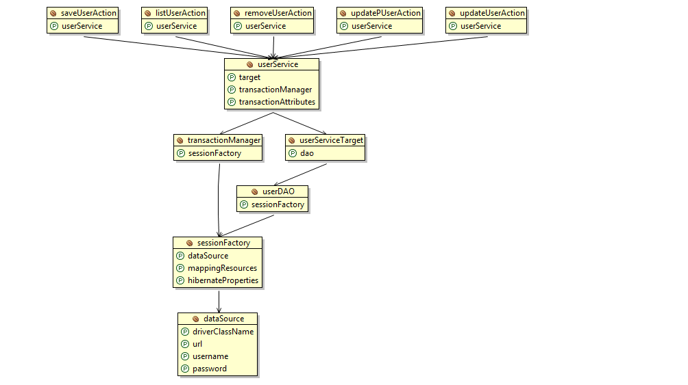

# Java SSH整合

[TOC]

## 建立User表
```sql
CREATE TABLE `user` (
  `id` int(11) NOT NULL,
  `firstName` varchar(20) DEFAULT NULL,
  `lastName` varchar(20) DEFAULT NULL,
  `age` int(11) DEFAULT NULL,
  PRIMARY KEY (`id`)
) 
```

## User pojo类
```java
package org.zbq.bean;

public class User {
    private int id;
    private String firstName;
    private String lastName;
    private int age;
    public int getId() {
        return id;
    }
    public void setId(int id) {
        this.id = id;
    }
    public String getFirstName() {
        return firstName;
    }
    public void setFirstName(String firstName) {
        this.firstName = firstName;
    }
    public String getLastName() {
        return lastName;
    }
    public void setLastName(String lastName) {
        this.lastName = lastName;
    }
    public int getAge() {
        return age;
    }
    public void setAge(int age) {
        this.age = age;
    }
    @Override
    public String toString() {
        return "ID: " + id + "FirstName: " + firstName;
    }
}
```

## User.hbm.xml
```xml
<?xml version='1.0' encoding='UTF-8'?>
<!DOCTYPE hibernate-mapping PUBLIC
          "-//Hibernate/Hibernate Mapping DTD 3.0//EN"
          "http://hibernate.sourceforge.net/hibernate-mapping-3.0.dtd">
<hibernate-mapping>
    <class name="org.zbq.bean.User" table="User">
        <id name="id" type="int">
            <generator class="increment"></generator>
        </id>
        
        <property name="firstName" column="firstName" type="string"></property>
        <property name="lastName" column="lastName" type="string"></property>
        <property name="age" column="age" type="int"></property>
        
    </class>
</hibernate-mapping>
```

## UserDAO.java
```java
package org.zbq.dao;

import java.util.List;

import org.zbq.bean.User;

public interface UserDAO {
    public void doCreateUser(User user);
    public List<User> findAllUsers();
    public void removeUser(User user);
    public void updateUser(User user);
    public User findUserById(int id);
}

```


## UserDAOImpl.java
```java
package org.zbq.dao.impl;

import java.util.List;

import org.springframework.orm.hibernate3.support.HibernateDaoSupport;
import org.zbq.bean.User;
import org.zbq.dao.UserDAO;

public class UserDAOImpl extends HibernateDaoSupport implements UserDAO {

    public void doCreateUser(User user) {
        this.getHibernateTemplate().save(user);
    }

    @SuppressWarnings("unchecked")
    public List<User> findAllUsers() {
        String hql = "from User u order by u.id asc";
        List<User> list = this.getHibernateTemplate().find(hql);
        return list;
    }

    public void removeUser(User user) {
        this.getHibernateTemplate().delete(user);
    }

    public void updateUser(User user) {
        this.getHibernateTemplate().update(user);
    }

    public User findUserById(int id) {
        User user = null;
        user = (User) this.getHibernateTemplate().get(User.class, id);
        return user;
    }
    
}
```

## UserService.java
```java
package org.zbq.service;  
  
import java.util.List;  
  
import org.zbq.bean.User;  
  
public interface UserService {  
    public void doCreateUser(User user);  
    public List<User> findAllUsers();  
    public void delete(User user);  
    public void update(User user);  
    public User findUserById(int id);  
}  
```


## UserServiceImpl.java
```java
package org.zbq.service.impl;

import java.util.List;

import org.zbq.bean.User;
import org.zbq.dao.UserDAO;
import org.zbq.service.UserService;

public class UserServiceImpl implements UserService {
    private UserDAO dao;
    
    public UserDAO getDao() {
        return dao;
    }

    public void setDao(UserDAO dao) {
        this.dao = dao;
    }

    public void doCreateUser(User user) {
        this.dao.doCreateUser(user);
    }

    public List<User> findAllUsers() {
        return this.dao.findAllUsers();
    }

    public void delete(User user) {
        this.dao.removeUser(user);
    }

    public void update(User user) {
        this.dao.updateUser(user);
    }

    public User findUserById(int id) {
        return this.dao.findUserById(id);
    }

}
```


## SaveUserAction.java
```java
package org.zbq.action.user;

import org.zbq.bean.User;
import org.zbq.service.UserService;

import com.opensymphony.xwork2.ActionSupport;

public class SaveUserAction extends ActionSupport {
    private User user;
    private UserService userService;
    
    public UserService getUserService() {
        return userService;
    }

    public void setUserService(UserService userService) {
        this.userService = userService;
    }

    public User getUser() {
        return user;
    }

    public void setUser(User user) {
        this.user = user;
    }

    @Override
    public String execute() throws Exception {
//      调用service相关的方法，完成实际的业务处理
        this.userService.doCreateUser(user);
        return SUCCESS ;
    }
}
```


## SaveUserAction.java
```java
package org.zbq.action.user;

import org.zbq.bean.User;
import org.zbq.service.UserService;

import com.opensymphony.xwork2.ActionSupport;

public class SaveUserAction extends ActionSupport {
    private User user;
    private UserService userService;
    
    public UserService getUserService() {
        return userService;
    }

    public void setUserService(UserService userService) {
        this.userService = userService;
    }

    public User getUser() {
        return user;
    }

    public void setUser(User user) {
        this.user = user;
    }

    @Override
    public String execute() throws Exception {
//      调用service相关的方法，完成实际的业务处理
        this.userService.doCreateUser(user);
        return SUCCESS ;
    }
}
```


## ListUserAction.java
```java
package org.zbq.action.user;

import java.util.Map;

import org.zbq.service.UserService;

import com.opensymphony.xwork2.ActionContext;
import com.opensymphony.xwork2.ActionSupport;

public class ListUserAction extends ActionSupport {
    private UserService userService;

    public UserService getUserService() {
        return userService;
    }

    public void setUserService(UserService userService) {
        this.userService = userService;
    }
    
    @SuppressWarnings("unchecked")
    @Override
    public String execute() throws Exception {
        
        Map request = (Map) ActionContext.getContext().get("request");
        
        request.put("list", this.userService.findAllUsers());
        return SUCCESS;
    }
}

```


## DeleteUserAction.java
```java
package org.zbq.action.user;

import org.zbq.bean.User;
import org.zbq.service.UserService;

import com.opensymphony.xwork2.ActionSupport;

public class DeleteUserAction extends ActionSupport {
    private User user;
    private UserService userService;
    
    public User getUser() {
        return user;
    }

    public void setUser(User user) {
        this.user = user;
    }

    public UserService getUserService() {
        return userService;
    }

    public void setUserService(UserService userService) {
        this.userService = userService;
    }

    @Override
    public String execute() throws Exception {
        this.userService.delete(user);
        return SUCCESS;
    }
}
```

## UpdatePUser.java
```java
package org.zbq.action.user;

import org.zbq.bean.User;
import org.zbq.service.UserService;

import com.opensymphony.xwork2.ActionSupport;

public class UpdatePUser extends ActionSupport {
    private User user;
    private UserService userService;
    
    public User getUser() {
        return user;
    }

    public void setUser(User user) {
        this.user = user;
    }

    public UserService getUserService() {
        return userService;
    }

    public void setUserService(UserService userService) {
        this.userService = userService;
    }

    @Override
    public String execute() throws Exception {
        this.user = this.userService.findUserById(user.getId());
        
        return SUCCESS;
    }
}
```


## UpdateUserAction.java
```java
package org.zbq.action.user;

import org.zbq.bean.User;
import org.zbq.service.UserService;

import com.opensymphony.xwork2.ActionSupport;

public class UpdateUserAction extends ActionSupport {
    private User user;
    private UserService userService;
    public User getUser() {
        return user;
    }
    public void setUser(User user) {
        this.user = user;
    }
    public UserService getUserService() {
        return userService;
    }
    public void setUserService(UserService userService) {
        this.userService = userService;
    }
    @Override
    public String execute() throws Exception {
        this.userService.update(this.user);
        return SUCCESS;
    }
}
```


## struts.xml
```xml
<?xml version="1.0" encoding="UTF-8"?>
<!DOCTYPE struts PUBLIC
    "-//Apache Software Foundation//DTD Struts Configuration 2.3//EN"
    "http://struts.apache.org/dtds/struts-2.3.dtd">

<struts>
    <package name="ssh2" extends="struts-default">
        <action name="saveUser" class="saveUserAction">
            <result name="success" type="redirect">listUser.action</result>
        </action>
        
        <action name="listUser" class="listUserAction">
            <result name="success">/list.jsp</result>
        </action>
        
        <action name="deleteUser" class="removeUserAction">
            <result name="success" type="redirect">listUser.action</result>
        </action>
        
        <action name="updatePUser" class="updatePUserAction">
            <result name="success">/update.jsp</result>
        </action>
        
        <action name="updateUser" class="updateUserAction">
            <result name="success" type="redirect">listUser.action</result>
        </action>
    </package>
</struts>
```

## web.xml
```xml
<?xml version="1.0" encoding="UTF-8"?>
<web-app version="2.5" 
    xmlns="http://java.sun.com/xml/ns/javaee" 
    xmlns:xsi="http://www.w3.org/2001/XMLSchema-instance" 
    xsi:schemaLocation="http://java.sun.com/xml/ns/javaee 
    http://java.sun.com/xml/ns/javaee/web-app_2_5.xsd">
  <welcome-file-list>
    <welcome-file>index.jsp</welcome-file>
  </welcome-file-list>
  
  <filter>
    <filter-name>struts2</filter-name>
    <filter-class>org.apache.struts2.dispatcher.ng.filter.StrutsPrepareAndExecuteFilter</filter-class>
  </filter>
  
  <filter-mapping>
    <filter-name>struts2</filter-name>
    <url-pattern>/*</url-pattern>
  </filter-mapping>
  
  <listener>
    <listener-class>org.springframework.web.context.ContextLoaderListener</listener-class>
  </listener>
  
</web-app>
```

## applictionContext.xml
```xml
<?xml version="1.0" encoding="UTF-8"?>
<beans
    xmlns="http://www.springframework.org/schema/beans"
    xmlns:xsi="http://www.w3.org/2001/XMLSchema-instance"
    xmlns:p="http://www.springframework.org/schema/p"
    xsi:schemaLocation="http://www.springframework.org/schema/beans http://www.springframework.org/schema/beans/spring-beans-3.0.xsd">
    
    <!-- 想到与Hibernate的hibernate.cfg.xml -->
    <bean id="dataSource" class="org.springframework.jdbc.datasource.DriverManagerDataSource">
        <property name="driverClassName">
            <value>org.gjt.mm.mysql.Driver</value>
        </property>
        
        <property name="url">
            <value>jdbc:mysql://127.0.0.1:3306/ssh</value>
        </property>
        
        <property name="username">
            <value></value>
        </property>
        
        <property name="password">
            <value></value>
        </property>
        
    </bean>

    <bean id="sessionFactory" class="org.springframework.orm.hibernate3.LocalSessionFactoryBean">
        <property name="dataSource">
            <ref local="dataSource"/>
        </property>
        
        <property name="mappingResources">
            <list>
                <value>org/zbq/bean/User.hbm.xml</value>                    
            </list>
        </property>
        
        <property name="hibernateProperties">
            <props>
                <prop key="hibernate.dialect">
                    org.hibernate.dialect.MySQLDialect
                </prop>
                
                <prop key="hibernate.show_sql">
                    true
                </prop>
            </props>
        </property>
        
    </bean>
    
    <bean id="transactionManager" class="org.springframework.orm.hibernate3.HibernateTransactionManager">
        <property name="sessionFactory">
            <ref local="sessionFactory"/>
        </property>
    </bean>
    
    <bean id="userDAO" class="org.zbq.dao.impl.UserDAOImpl" scope="singleton">
        <property name="sessionFactory">
            <ref local="sessionFactory"/>
        </property>
    </bean>
    
    <bean id="userServiceTarget" class="org.zbq.service.impl.UserServiceImpl" scope="singleton">
        <property name="dao" ref="userDAO" />
    </bean>
    
    <bean id="userService" class="org.springframework.transaction.interceptor.TransactionProxyFactoryBean">
        <property name="target">
            <ref local="userServiceTarget"/>
        </property>
        
        <property name="transactionManager">
            <ref local="transactionManager"/>
        </property>
        
        <property name="transactionAttributes">
            <props>
                <prop key="find*">PROPAGATION_REQUIRED,readOnly</prop>
                <prop key="*">PROPAGATION_REQUIRED</prop>
            </props>
        </property>
    </bean>
    
    <bean id="saveUserAction" class="org.zbq.action.user.SaveUserAction" scope="prototype">
        <property name="userService" ref="userService"></property>
    </bean>
    
    <bean id="listUserAction" class="org.zbq.action.user.ListUserAction" scope="prototype">
        <property name="userService" ref="userService"></property>
    </bean>
    
    <bean id="removeUserAction" class="org.zbq.action.user.DeleteUserAction" scope="prototype">
        <property name="userService" ref="userService"></property>      
    </bean>
    
    <bean id="updatePUserAction" class="org.zbq.action.user.UpdatePUser">
        <property name="userService" ref="userService"></property>
    </bean>
    
    <bean id="updateUserAction" class="org.zbq.action.user.UpdateUserAction" scope="prototype">
        <property name="userService" ref="userService"></property>
    </bean>
</beans>
```



## index.jsp
```html
<%@ page language="java" import="java.util.*" pageEncoding="UTF-8"%>
<%@ taglib prefix="s" uri="/struts-tags" %>

<!DOCTYPE HTML PUBLIC "-//W3C//DTD HTML 4.01 Transitional//EN">
<html>
  <head>
    
    <title>My JSP 'index.jsp' starting page</title>

  </head>
  
  <body>
    <h1><font color="red">Operation List</font></h1>
    <s:a href="save.jsp">Save User</s:a><br/>
    <s:a href="listUser.action">List Users</s:a>
    
    
  </body>
</html>
```


## list.jsp
```html
<%@ page language="java" import="java.util.*" pageEncoding="UTF-8"%>
<%@ taglib prefix="s" uri="/struts-tags"%>

<!DOCTYPE HTML PUBLIC "-//W3C//DTD HTML 4.01 Transitional//EN">
<html>
  <head>
    <base href="<%=basePath%>">
    
    <title>My JSP 'list.jsp' starting page</title>
    <script type="text/javascript">
        function del(){
            if(confirm("Are you sure?")){
                return true;
            }
            return false;
        }
    </script>
  </head>
  
  <body>
    <h1><font color="red">Users List</font></h1>
    <s:a href="/ssh2/index.jsp"><<--</s:a>
    <table border="1" width="80%" align="center">
        <tr>
            <th>序号</th>
            <th>姓</th>
            <th>名</th>
            <th>年龄</th>
            <th>删除</th>
            <th>更新</th>
        </tr>
        
        <s:iterator value="#request.list" id="us">
            <tr>
                <td>
                    <s:property value="#us.id"/>
                </td>
                <td>
                    <s:property value="#us.firstName"/>
                </td>
                <td>
                    <s:property value="#us.lastName"/>
                </td>
                <td>
                    <s:property value="#us.age"/>
                </td>
                <td align="center">
                    <s:a href="deleteUser.action?user.id=%{#us.id}" onclick="return del()">Delete</s:a>
                </td>
                <td align="center">
                    <s:a href="updatePUser.action?user.id=%{#us.id}">Update</s:a>       
                </td>
            </tr>
        </s:iterator>
    </table>
    
  </body>
</html>

```

## save.jsp
```html
<%@ page language="java" import="java.util.*" pageEncoding="UTF-8"%>
<%@ taglib prefix="s" uri="/struts-tags" %>

<!DOCTYPE HTML PUBLIC "-//W3C//DTD HTML 4.01 Transitional//EN">
<html>
  <head>
    
    <title>My JSP 'index.jsp' starting page</title>

  </head>
  
  <body>
    <h1><font color="red">Save User</font></h1>
        
    <s:form action="saveUser">
        <s:textfield name="user.firstName" label="First Name"></s:textfield>
        <s:textfield name="user.lastName" label="Last Name"></s:textfield>
        <s:textfield name="user.age" label="Age"></s:textfield>
        <s:submit></s:submit>
    </s:form>
    
  </body>
</html>

```


## update.jsp
```html
<%@ page language="java" import="java.util.*" pageEncoding="UTF-8"%>
<%@ taglib prefix="s" uri="/struts-tags"%>

<!DOCTYPE HTML PUBLIC "-//W3C//DTD HTML 4.01 Transitional//EN">
<html>
  <head>
    <base href="<%=basePath%>">
    
    <title>My JSP 'update.jsp' starting page</title>

  </head>
  
  <body>
    <h1><font color="red">Update User</font></h1>
    
    <s:form action="updateUser">
    <table>
        <tr>
            <td>
                <s:hidden name="user.id" value="%{user.id}"></s:hidden>
            </td>
        </tr>
    
        <tr>
            <td>
                <s:textfield name="user.firstName" value="%{user.firstName}" label="First Name"></s:textfield>
            </td>
        </tr>
        
        <tr>
            <td>
                <s:textfield name="user.lastName" value="%{user.lastName}" label="Last Name"></s:textfield>
            </td>
        </tr>
        
        <tr>
            <td>
                <s:textfield name="user.age" value="%{user.age}" label="Age"></s:textfield>
            </td>
        </tr>
        
        <tr>
            <td>
                <s:submit></s:submit>
            </td>
        </tr>
    </table>    
    </s:form>
    
  </body>
</html>

```


