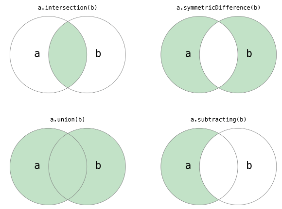

# Python 笔记

[TOC]

大部分来自于 https://github.com/jackfrued/Python-100-Days.git

<!--TOC-->

## 注释
```python
'''
这是多行注释1
这是多行注释2
这是多行注释3
'''

"""
这是多行注释1
这是多行注释2
这是多行注释3
"""

#这是单行注释
```


## 中文编码
> py文件中使用中文， 在文件第一行指定字符编码, 保存为utf-8格式。

```python
# -*- coding:utf-8 -*-
```


```python
# -*- coding:utf-8 -*-
chinese = '''
在python中使用中文
注意字符编码问题
字符编码有:utf-8, cp936, gb2312, iso-9959-1
'''
print chinese.decode('utf-8').encode('cp936')
```

在vim中保存为utf-8格式
```
:set fileencoding=utf-8
```


```python
#!/usr/bin/env python
# -*- coding: UTF-8 -*-

codec = 'utf-8'
# codec = 'gbk'

f = open('py2.txt', 'w')
s = u'你好'
f.write(s.encode(codec))
f.close()
f = open('py2.txt', 'r')
t = f.read()
print t.decode(codec)
```

## 元组
元组类似于C语言中的数组。 **下标从0开始** 

```python
s = (1, 1, 2, 3, 5)
print s[0]         # 打印第一个元素

print s.count(1)   # 打印元素个数  
print s.index(1)   # 第一个符合元素的下标
```


## 列表
列表类似于一个可变数组。 
```python
list1 = [1, 2, 3, 4, 5]
print list1[0]       # 打印第一个元素
list1.append(6)      # 在末尾添加一个元素
```

## 集合


```py
def main():
    set1 = {1, 2, 3, 3, 3, 2}
    print(set1)
    print('Length =', len(set1))
    set2 = set(range(1, 10))
    print(set2)
    set1.add(4)
    set1.add(5)
    set2.update([11, 12])
    print(set1)
    print(set2)
    set2.discard(5)
    # remove的元素如果不存在会引发KeyError
    if 4 in set2:
        set2.remove(4)
    print(set2)
    # 遍历集合容器
    for elem in set2:
        print(elem ** 2, end=' ')
    print()
    # 将元组转换成集合
    set3 = set((1, 2, 3, 3, 2, 1))
    print(set3.pop())
    print(set3)
    # 集合的交集、并集、差集、对称差运算
    print(set1 & set2)
    # print(set1.intersection(set2))
    print(set1 | set2)
    # print(set1.union(set2))
    print(set1 - set2)
    # print(set1.difference(set2))
    print(set1 ^ set2)
    # print(set1.symmetric_difference(set2))
    # 判断子集和超集
    print(set2 <= set1)
    # print(set2.issubset(set1))
    print(set3 <= set1)
    # print(set3.issubset(set1))
    print(set1 >= set2)
    # print(set1.issuperset(set2))
    print(set1 >= set3)
    # print(set1.issuperset(set3))


if __name__ == '__main__':
    main()
```

## 函数
```py
def foo():
    pass

def bar():
    pass

# __name__是Python中一个隐含的变量它代表了模块的名字
# 只有被Python解释器直接执行的模块的名字才是__main__
if __name__ == '__main__':
    print('call foo()')
    foo()
    print('call bar()')
    bar()
```

> 需要说明的是，如果我们导入的模块除了定义函数之外还中有可以执行代码，那么Python解释器在导入这个模块时就会执行这些代码，事实上我们可能并不希望如此，因此如果我们在模块中编写了执行代码，最好是将这些执行代码放入如下所示的条件中，这样的话除非直接运行该模块，if条件下的这些代码是不会执行的，因为只有直接执行的模块的名字才是“\_\_main\_\_”。


### 可变参数
```py
# 在参数名前面的*表示args是一个可变参数
# 即在调用add函数时可以传入0个或多个参数
def add(*args):
    total = 0
    for val in args:
        total += val
    return total

print(add())
print(add(1))
print(add(1, 2))
print(add(1, 2, 3))
print(add(1, 3, 5, 7, 9))
```

> `*args`的类型`type(args)` 在函数里面是一个元组 `<class 'tuple'>`。


在函数内部，是把 `names` 这个参数当作容器处理的 —— 否则也没办法用 `for ... in ...` 来处理。而在调用函数的时候，我们是可以将一个容器传递给函数的 Arbitrary Positional Arguments 的 —— 做法是，在调用函数的时候，在参数前面加上星号 `*`：
```py
def p(*names):
    for name in names:
        print(f'Hello {name}')

print('11111111111111')
p('Tom', 'Lucy', 'Jim')

print('22222222222222')
names = ['xiaomin', 'lilei', 'hanmeimei']
p(names)

print('33333333333333')
p(*names)
```

> **注意**：一个函数中，可以接收一系列值的位置参数只能有一个；并且若是还有其它位置参数存在，那就必须把这个可以接收一系列值的位置参数排在所有其它位置参数之后。

```py
def sayHi(gerrting, *names):
    for name in names:
        print(f'{gerrting} {name.capitalize()} !')

sayHi('Hello', 'jim', 'lucy', 'jerry')
```

### lambda 表达式
```py
def make_incrementor(n):
    return lambda x : x + n

f = make_incrementor(42)
f(1)
f(2)
```

上面的步骤如下：
1. 执行 `make_incrementor(42)` 之后， 返回 `lambda x : x + 42` 给变量`f`
2. `f(1)` 把 1 + 42 的计算结果返回


```py
def double_it(x):
    return x * 2

l = [1, 2, 3, 4, 5]
m = list(map(double_it, l))
m

m = list(map(lambda x: x*2, l))
m
```

```py
a_list = [1, 2, 3]
b_list = [4, 5, 6]

m = list(map(lambda x, y: x + y, a_list, b_list))
m
```

```py
pairs = [(1, 'd'), (2, 'b'), (3, 'c'), (4, 'a')]
pairs.sort(key=lambda p: p[1])
pairs
```

```py
from functools import reduce

def product(l):
    s = 1
    for i in l:
        s *= i
    return s

l = [1, 2, 3, 4]
print(product(l))

print(reduce(lambda x,y: x*y, l))
```

### 作用域
```py
a = 123

def f1():
    a = 456
    print(a)
    
if __name__ == '__main__':
    f1()         ## a = 456
    print(a)     ## a = 123
```

```py
a = 123

def f1():
    global a
    a = 456
    print(a)
    
if __name__ == '__main__':
    f1()         ## a = 456
    print(a)     ## a = 456
```

> 这里的 `golbal` 指明变量a来自全局变量


## 面向对象
```py
class Test:

    def __init__(self, foo):
        self.__foo = foo

    def __bar(self):
        print(self.__foo)
        print('__bar')

def main():
    test = Test('hello')
    # AttributeError: 'Test' object has no attribute '__bar'
    test.__bar()
    # AttributeError: 'Test' object has no attribute '__foo'
    print(test.__foo)

if __name__ == "__main__":
    main()
```

`__bar` 以2个`_`开头的都是私有属性或者私有函数。

```py
def main():
    test = Test('hello')
    test._Test__bar()
    print(test._Test__foo)
```

> 但是 还是可以访问的


通过属性的getter（访问器）和setter（修改器）方法进行对应的操作。如果要做到这点，就可以考虑使用@property包装器来包装getter和setter方法，使得对属性的访问既安全又方便

```py
class Person(object):

    def __init__(self, name, age):
        self._name = name
        self._age = age

    # 访问器 - getter方法
    @property
    def name(self):
        return self._name

    # 访问器 - getter方法
    @property
    def age(self):
        return self._age

    # 修改器 - setter方法
    @age.setter
    def age(self, age):
        self._age = age

    def play(self):
        if self._age <= 16:
            print('%s正在玩飞行棋.' % self._name)
        else:
            print('%s正在玩斗地主.' % self._name)


def main():
    person = Person('王大锤', 12)
    person.play()
    person.age = 22
    person.play()
    # person.name = '白元芳'  # AttributeError: can't set attribute

if __name__ == '__main__':
    main()
```

静态方法
```py
from math import sqrt

class Triangle(object):

    def __init__(self, a, b, c):
        self._a = a
        self._b = b
        self._c = c

    @staticmethod
    def is_valid(a, b, c):
        return a + b > c and b + c > a and a + c > b

    def perimeter(self):
        return self._a + self._b + self._c

    def area(self):
        half = self.perimeter() / 2
        return sqrt(half * (half - self._a) *
                    (half - self._b) * (half - self._c))
def main():
    a, b, c = 3, 4, 5
    # 静态方法和类方法都是通过给类发消息来调用的
    if Triangle.is_valid(a, b, c):
        t = Triangle(a, b, c)
        print(t.perimeter())
        # 也可以通过给类发消息来调用对象方法但是要传入接收消息的对象作为参数
        # print(Triangle.perimeter(t))
        print(t.area())
        # print(Triangle.area(t))
    else:
        print('无法构成三角形.')

if __name__ == '__main__':
    main()
```


继承
```py
class Person(object):
    """人"""

    def __init__(self, name, age):
        self._name = name
        self._age = age

    @property
    def name(self):
        return self._name

    @property
    def age(self):
        return self._age

    @age.setter
    def age(self, age):
        self._age = age

    def play(self):
        print('%s正在愉快的玩耍.' % self._name)

    def watch_av(self):
        if self._age >= 18:
            print('%s正在观看动作片.' % self._name)
        else:
            print('%s只能观看《熊出没》.' % self._name)

class Student(Person):
    """学生"""

    def __init__(self, name, age, grade):
        super().__init__(name, age)
        self._grade = grade

    @property
    def grade(self):
        return self._grade

    @grade.setter
    def grade(self, grade):
        self._grade = grade

    def study(self, course):
        print('%s的%s正在学习%s.' % (self._grade, self._name, course))


class Teacher(Person):
    """老师"""

    def __init__(self, name, age, title):
        super().__init__(name, age)
        self._title = title

    @property
    def title(self):
        return self._title

    @title.setter
    def title(self, title):
        self._title = title

    def teach(self, course):
        print('%s%s正在讲%s.' % (self._name, self._title, course))

def main():
    stu = Student('王大锤', 15, '初三')
    stu.study('数学')
    stu.watch_av()
    t = Teacher('骆昊', 38, '老叫兽')
    t.teach('Python程序设计')
    t.watch_av()

if __name__ == '__main__':
    main()
```

> `super().__init__(name, age)` 这个是在python3中才起效的。  
> 如果在python2中  `super(Student, self).__init__(name, age)` 或  
> `Person.__init__(self, name, age)`

## 多进程
```py
import os
import time
import random
from multiprocessing import Process

def dl(name):
    print('PID[%s]: downloading %s ...' %(os.getpid(), name))
    time_to_download = random.randint(5, 10)
    time.sleep(time_to_download)
    print('finish %s ... it takes %s sec' %(name, time_to_download))

def main():
    p1 = Process(target=dl, args=('a.txt',))
    p2 = Process(target=dl, args=('b.mp4',))
    p1.start()
    p2.start()
    p1.join()
    print('111111111111111111')
    p2.join()
    print('222222222222222222')
```

- target: 指定哪个函数
- args: 函数参数组成的元组
- start: 进程开始
- join: 等待进程结束

## 多线程
```py
import os
import time
import random
from threading import Thread

def dl(name):
    print('PID[%s]: downloading %s ...' %(os.getpid(), name))
    time_to_download = random.randint(5, 10)
    time.sleep(time_to_download)
    print('finish %s ... it takes %s sec' %(name, time_to_download))

def main():
    t1 = Thread(target=dl, args=('a.txt',))
    t2 = Thread(target=dl, args=('b.mp4',))
    t1.start()
    t2.start()
    t1.join()
    print('111111111111111111')
    t2.join()
    print('222222222222222222')
```


## 异常
```py
import traceback

def main():
    f = None
    try:
        f = open('致橡树.txt', 'r', encoding='utf-8')
        print(f.read())
    except FileNotFoundError:
        traceback.print_exc()
        print('无法打开指定的文件!')
    except LookupError:
        print('指定了未知的编码!')
    except UnicodeDecodeError:
        print('读取文件时解码错误!')
    except Exception as e:
        print('未知错误!', e)
        raise
    finally:
        if f:
            f.close()

if __name__ == '__main__':
    main()
```
捕获的异常会按顺序依次处理。如果异常已经处理就不会再进入后面的except语句.

`raise` 抛出异常

`traceback.print_exc()` 可以印出最后的异常情况。

变量`e`指向一个被抛出的 `OSError` 异常实例

想要捕获所有的异常，可以直接捕获 `Exception` 即可。这个将会捕获除了 `SystemExit` 、 `KeyboardInterrupt` 和 `GeneratorExit` 之外的所有异常。 如果你还想捕获这三个异常，将 `Exception` 改成 `BaseException` 即可。

```py
try:
    f = open(filename)
except (FileNotFoundError, PermissionError):
    pass
```
可以将多个异常放入一个元组中, 统一处理。


```py
try:
    f = open(filename)
except OSError as e:
    if e.errno == errno.ENOENT:
        logger.error('File not found')
    elif e.errno == errno.EACCES:
        logger.error('Permission denied')
    else:
        logger.error('Unexpected error: %d', e.errno)
```
`OSError` 是 `FileNotFoundError` 和 `PermissionError` 异常的基类。 `FileNotFoundError.__mro__`可以用来查看类的层级关系。

### 自定义异常
```py
class NetworkException(Exception):
    pass

class HostnameException(NetworkException):
    pass

class TimeoutException(Exception):
    def __init__(self, message):
        super().__init__(message)

try:
    msg = s.recv()
    ip = None
    if not ip:
        raise NetworkException('some comments')
except NetworkException as e:
    ...
except HostnameException as e:
    ...
except ProtocolError as e:
    ...
```

自定义异常要继承`Exception`类，或者继承已经继承了`Exception`的类。


## 闭包
```python
def plus(number):

    # 在函数内部再定义一个函数， 这个里面的函数就被认为是闭包
    def plus_in(number_in):
        print 'inner:' + str(number_in)
        return number + number_in

    # 这里返回的就是闭包的结果
    return plus_in

# 给plus函数赋值， 20给参数number
v1 = plus(20)

# 100 给参数number_in
print v1(100)
```

> 在调用plus时候就产生了一个闭包 plus_in, 并且该闭包持有自由变量 number, 当函数plus生命周期结束之后，number这个变量依然存在， 因为它被闭包引用了，所以不会被回收。

## 迭代器
`__next__(self)`: pop出当前的指向的值，再移动到下一个上面  
`__iter__(self)`: `return self` 约定俗成, 这个类就被识别为Iterator类型

```py
class Counter(object):
    def __init__(self, start, stop):
        self.current = start
        self.stop = stop

    def __next__(self):
        if self.current > self.stop:
            raise StopIteration
        else:
            c = self.current
            self.current += 1
        return c

    def __iter__(self):
        return self

c = Counter(1, 10)
next(c)
next(c)

for i in c:
    print(i)
```

## 生成器
`yield` 有点像关键字 `return`, 但不同的是它后面的语句是会被执行的。

程序在调用 `next()` 之后，执行到 `yield`生成的一个值返回， 再执行一个 `next()` 之后， 会从 `yield` 之后的语句执行

```py
def counter(start, stop):
    while start < stop:
        yield start
        start += 1

c = counter(1, 5)
next(c)
next(c)

for i in c:
    print(i)
```

## 装饰器
这是没有用python语法糖的装饰器
```py
def decorator(func):
    def run():
        print("start ...")
        func()
        print("end ...")
    return run

def process():
    print("Processing ...")

p = decorator(process)
p()
```

这是用python语法糖的装饰器
```py
def decorator(func):
    def run():
        print("start ...")
        func()
        print("end ...")
    return run

@decorator
def process():
    print("Processing ...")

process()
```

相当于
```py
@decorator
def process():
    ...
```

```py
def decorator(func):
    ...

process = decorator(process)
```


可以用多个装饰器， 执行顺序是**从下到上**， 或者说**由内而外**。
```py
def uppercase(func):
    def wapper(*args, **kwargs):
        print(f"uppercase ... {kwargs} ")
        t = func(*args, **kwargs)
        return t.upper()
    return wapper

def strong(func):
    def wapper(*args, **kwargs):
        print(f'strong...{args}')
        t = func(*args, **kwargs)
        return '<strong> %s </strong>' %(t)
    return wapper

@strong
@uppercase
def say(name='Tom', age=18):
    return "hello my name is %s I'm %s years old" %(name, age)

say('Jerry', age=18)
```


## 常用模块
### logging
#### 公用一个logging
lib/conf.py
```py
logging.basicConfig(filename='log.txt'
        level=logging.NOTSET,
        format='%(filename)s[%(lineno)d] - %(levelname)s: %(message)s')
logging.getLogger(__name__)
```

main.py
```py
logger = logging.getLogger('lib.conf')
logger.info('info')
```

dev.py
```py
logger = logging.getLogger('lib.conf')
logger.debug('info')
```

### unittest
```py
import unittest
class MyTest(unittest.TestCase):
    @classmethod
    def setUpClass(self):
        print("run once")

    def setUp(self):
        print("xxxxxxxxx Start xxxxxxxxxxx")

    def tearDown(self):
        print("xxxxxxxxx  End  xxxxxxxxxxx")

    def test_abc(self):
        print('Run')

def main():
    unittest.main()

if __name__ == '__main__':
    main()
```

### socket
服务器端
```py
import socket
def server():
    # family=AF_INET - IPv4地址
    # family=AF_INET6 - IPv6地址
    # type=SOCK_STREAM - TCP套接字
    # type=SOCK_DGRAM - UDP套接字
    # type=SOCK_RAW - 原始套接字
    server = socket.socket(family=socket.AF_INET, type=socket.SOCK_STREAM)

    # 绑定服务器，由IP和端口两部分构成的元组
    server.bind(('127.0.0.1', 8888))

    # 开启监听 - 监听客户端连接到服务器
    # 参数512 操作系统可以挂起的最大连接数量
    server.listen(512)

    index = 0
    while True:
        index += 1
        client, addr = server.accept()
        print(addr, 'is connecting')
        client.send('welcome %s' %(index))
        client.close()

        if index > 5:
            break
```

客户端
```py
import socket
def client():
    client = socket.socket()
    client.connect(('127.0.0.1', 8888))
    print(client.recv(1024))
    client.close()
```

### email
```py
from smtplib import SMTP
from email.header import Header
from email.mime.text import MIMEText

def main():
    # 请自行修改下面的邮件发送者和接收者
    sender = 'xxx@163.com'
    receivers = ['zhu.binqiang@163.com']
    message = MIMEText('用Python发送邮件的示例代码.', 'plain', 'utf-8')
    
    # message['From'] = Header(sender, 'utf-8')
    # message['To'] = Header('Zhu, Bin QiangX', 'utf-8')
    
    message['Subject'] = Header('示例代码实验邮件', 'utf-8')
    
    smtper = SMTP('smtp.163.com')
    # 请自行修改下面的登录口令
    #smtper.login(sender, 'secretpass')
    smtper.sendmail(sender, receivers, message.as_string())
    print('邮件发送完成!')

if __name__ == '__main__':
    main()
```


发送带附件
```py
from smtplib import SMTP
from email.header import Header
from email.mime.text import MIMEText
from email.mime.image import MIMEImage
from email.mime.multipart import MIMEMultipart

def main():
    # 请自行修改下面的邮件发送者和接收者
    sender = 'xxx@163.com'
    receivers = ['zhu.binqiang@163.com']
    message = MIMEMultipart()
    
    txt_content = MIMEText('用Python发送邮件的示例代码.', 'plain', 'utf-8')
    message['Subject'] = Header('示例代码实验邮件', 'utf-8')
    message.attach(txt_content)
    
    with open('t.py') as f:
        txt = MIMEText(f.read(), 'base64', 'utf-8')
        txt['Content-Type'] = 'text/plain'
        txt['Content-Disposition'] = 'attachment; filename=hello.txt'
        message.attach(txt)

    with open('media_equipment.xls', 'rb') as f:
        xls = MIMEText(f.read(), 'base64', 'utf-8')
        xls['Content-Type'] = 'application/vnd.ms-excel'
        xls['Content-Disposition'] = 'attachment; filename=equipment.xls'
        message.attach(xls)

    with open('memory.png', 'rb') as f:
        png = MIMEImage(f.read())
        png['Content-Disposition'] = 'attachment; filename=memory.png'
        message.attach(png)

    smtper = SMTP('smtp.163.com')
    # 请自行修改下面的登录口令
    #smtper.login(sender, 'secretpass')
    smtper.sendmail(sender, receivers, message.as_string())
    print('邮件发送完成!')

if __name__ == '__main__':
    main()
```

