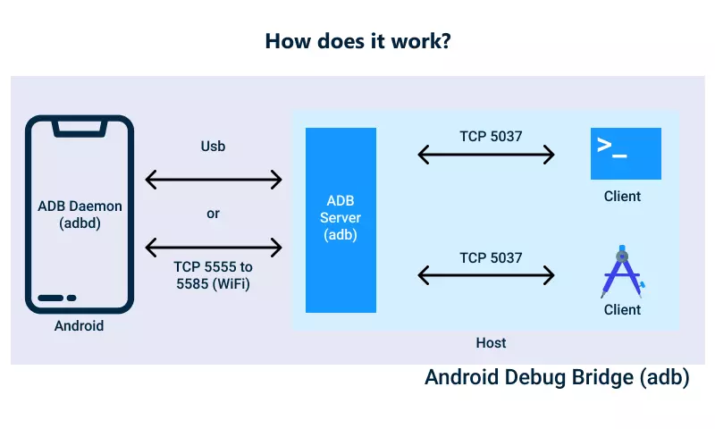

# adb 调试

[TOC]

## 安装
从官网 https://developer.android.com/studio/releases/platform-tools.html 下载。 并加入到PATH路径里。

## adb 的工作原理
refer to: https://developer.android.com/studio/command-line/adb?hl=zh-cn

**客户端**：用于发送命令。客户端在开发计算机上运行。您可以通过发出 adb 命令来从命令行终端调用客户端。
**守护进程 (adbd)**：在设备上运行命令。守护进程在每个设备上作为后台进程运行。
**服务器**：管理客户端和守护进程之间的通信。服务器在开发机器上作为后台进程运行。

当您启动某个 adb 客户端时，客户端会先检查是否有 adb 服务器进程正在运行。如果没有，它将启动服务器进程。服务器在启动后会与本地 TCP 端口 5037 绑定，并监听 adb 客户端发出的命令 - 所有 adb 客户端均通过端口 5037 与 adb 服务器通信。

然后，服务器会与所有正在运行的设备建立连接。它通过扫描 5555 到 5585 之间（该范围供前 16 个模拟器使用）的奇数号端口查找模拟器。服务器一旦发现 adb 守护进程 (adbd)，便会与相应的端口建立连接。请注意，每个模拟器都使用一对按顺序排列的端口 - 用于控制台连接的偶数号端口和用于 adb 连接的奇数号端口。例如：

模拟器 1，控制台：5554
模拟器 1，adb：5555
模拟器 2，控制台：5556
模拟器 2，adb：5557
依此类推

如上所示，在端口 5555 处与 adb 连接的模拟器与控制台监听端口为 5554 的模拟器是同一个。

服务器与所有设备均建立连接后，您便可以使用 adb 命令访问这些设备。由于服务器管理与设备的连接，并处理来自多个 adb 客户端的命令，因此您可以从任意客户端（或从某个脚本）控制任意设备。




```
+------------------+                  +-------------------------+
|  ADB 客户端      |                  |   Android 模拟器 1       |
|  (开发者电脑)    |                  |                         |
|                  |  +-----------+   |                         |
|  adb shell       |->| ADB 服务器 |---|     adbd (5555)        |
|                  |  | (5037)    |   |                         |
|  telnet localhost|  +-----------+   |     控制台 (5554)       |
|  5554            |                  |                         |
|                  |                  +-------------------------+
|                  |
|                  |                  +-------------------------+
|                  |                  |   Android 模拟器 2       |
|                  |                  |                         |
|                  |                  |     adbd (5557)        |
|                  |                  |                         |
|                  |                  |     控制台 (5556)       |
|                  |                  |                         |
|                  |                  +-------------------------+
|                  |
|                  |                  +-------------------------+
|                  |                  |   物理设备 1             |
|                  |                  |                         |
|                  |                  |     adbd (随机端口1)     |
|                  |                  |                         |
|                  |                  +-------------------------+
|                  |
|                  |                  +-------------------------+
|                  |                  |   物理设备 2             |
|                  |                  |                         |
|                  |                  |     adbd (随机端口2)     |
|                  |                  |                         |
|                  |                  +-------------------------+
+------------------+
```

## 列出设备
```sh
adb devices
```

多台设备时 `-s ID` 去连接
```
$ adb devices
List of devices attached
5771989f9905    device
WGY0217913000398        device

$ adb -s WGY0217913000398 shell
```

```sh
adb push local remote
adb pull remote local
adb install XXX.apk
```

##  列出已安装的apk包
```sh
adb shell pm list packages
```

## 取出安装在手机中的apk安装包
```sh
$ adb shell pm list packages | grep flat
package:com.tiledmedia.tiledmediaplayer.flat
package:com.tiledmedia.tiledmediaplayer.flat_cn

$ adb shell pm path com.tiledmedia.tiledmediaplayer.flat
package:/data/app/com.tiledmedia.tiledmediaplayer.flat-h6sslP8kcGsS5GCyx0hAFg==/base.apk

$ adb pull /data/app/com.tiledmedia.tiledmediaplayer.flat-h6sslP8kcGsS5GCyx0hAFg==/base.apk com.tiledmedia.tiledmediaplayer.flat.apk
```

## am 命令
```sh
am start com.android.calculator2/com.android.calculator2.Calculator
```

AndroidManifest.xml 文件中找出 package/class_full_name
**package="com.android.calculator2"**
**class_full_name=com.android.calculator2.Calculator**

```xml
<?xml version="1.0" encoding="utf-8" standalone="no"?>
<manifest xmlns:android="http://schemas.android.com/apk/res/android" package="com.android.calculator2">
    <application android:allowBackup="false" android:supportsRtl="true">
        <activity  android:launchMode="singleTask" android:name=".Calculator">
            <intent-filter>
                <action android:name="android.intent.action.MAIN"/>
                <category android:name="android.intent.category.LAUNCHER"/>
                <category android:name="android.intent.category.APP_CALCULATOR"/>
            </intent-filter>
        </activity>
        <activity android:name=".Licenses" android:parentActivityName=".Calculator"/>
    </application>
</manifest>
```

## input 命令
### 触摸
点击 坐标(30, 50)
```sh
input tap 30 50
```

### 滑动
滑动 从坐标(50, 50) 到(100, 100)
```sh
input swipe 50 50 100 100
```

### 按键
Home键
```sh
input keyevent 3
input keyevent KEYCODE_HOME
input keyevent --longpress HOME
```

KEYCODE_BACK=4
KEYCODE_CALL=5
KEYCODE_SEARCH=84
KEYCODE_VOLUME_UP=24
KEYCODE_VOLUME_DOWN=25
KEYCODE_0=7
KEYCODE_A=29


参考: [Android Keycode详解](https://blog.csdn.net/huiguixian/article/details/8550170)

### 输入文字
```sh
input text xxx
```


## 模拟器控制台
定义： 模拟器控制台是一个专用的命令行接口，用于与 Android 模拟器进行低级别的控制和调试。

用途：

允许开发者模拟各种设备状态和行为，如来电、短信、网络状态、电池状态等。
通过控制台，可以控制和调试模拟器的状态。
连接方式：
- 使用 Telnet 连接到控制台端口（通常是 5554）。

示例操作：
```bash
telnet localhost 5554
```

连接到模拟器控制台后，可以执行控制台命令：
```bash
gsm call 1234567890  # 模拟来电
sms send 123456 "Hello, Emulator!"  # 发送短信
network status 3  # 设置网络状态
battery status discharging  # 设置电池状态
```

区别总结
|     特性     |               adb shell                |                        模拟器控制台                        |
| ------------ | -------------------------------------- | ---------------------------------------------------------- |
| **主要用途** | 执行 Unix/Linux 风格的命令             | 控制和调试模拟器状态和行为                                 |
| **连接方式** | 使用 ADB 工具连接                      | 使用 Telnet 连接                                           |
| **示例命令** | `ls`, `ps`, `top`, `cat /proc/cpuinfo` | `gsm call`, `sms send`, `network status`, `battery status` |
| **适用范围** | 所有 Android 设备（物理设备和模拟器）  | 仅适用于 Android 模拟器                                    |

总结
`adb shell`：提供一个到 Android 设备或模拟器的命令行接口，可执行 Unix/Linux 命令，用于常规的系统操作和调试。
模拟器控制台：提供一个专用的命令行接口，用于控制和调试模拟器的状态和行为，通过 Telnet 连接。
因此，通过 `adb shell`` 并不能进入模拟器控制台，它们是两个不同的接口，提供了不同的功能。


