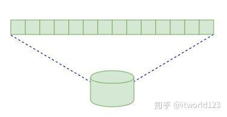
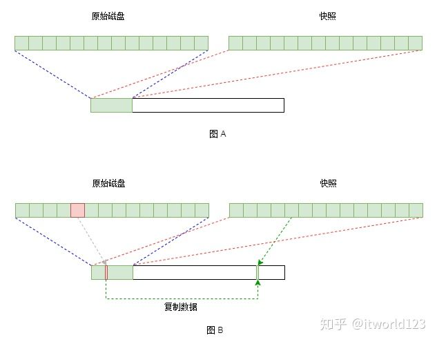
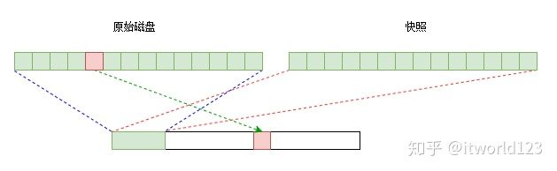

# 快照
[TOC]

转载于 [知乎](https://zhuanlan.zhihu.com/p/64595897) 作者: [itworld123](https://www.zhihu.com/people/zhang-shu-zhu-69/activities)

## 什么是快照
快照是存储系统中的一种数据保护技术，主要是实现数据的**逻辑保护**。所谓逻辑保护，就是当数据出现误删除或者病毒等原因导致数据破坏的情况。通过快照技术，可以将数据恢复到某一个时间点的数据。

从名字上可以猜出来，快照就好像给数据拍了一个照片，就好像我们日常生活中给人拍照片类似。以生活中拍照片为例，比如给你家娃娃拍了他2岁的照片，等他到5岁的时候，样子变化很大。这个时候你想看看他2岁的时候长什么样，那你就可以拿出他2岁的照片看看。

对于存储中的快照技术也是类似，在某个时间点，你给某个磁盘（或者存储中的LUN）打一个快照，相当于让存储系统给这个磁盘拍了一个照片。当之后的使用过程中发生了意外，比如病毒把数据搞坏了等等。这个时候你就可以通过快照知道原来的数据是什么样的，这样数据就可以找回来了。

## 快照的实现原理
”不错，不错，那快照的实现原理是什么呢？“，王大拿觉得有点小看小赵同学了，于是接着问。

快照可以在文件系统或者块设备层面实现，我们以块存储为例。块存储从普通用户的角度来看就是磁盘。从用户的角度**磁盘其实就是一个线性空间，可以理解为一个很大的数组**，比如512G或者4TB等。但磁盘的读写最小单位是一个扇区，也就是512字节。这样可以不用关心，这个跟我们后面讲的快照的原理也没有太大关系。

有了磁盘的这个概念，那么快照就比计较容易理解了。对于存储系统而言，磁盘实际上是从存储池划分的一块空间而已（这一点与我们普通PC的事物磁盘有所不同），如图2所示，假设原始磁盘在存储池中有如图的一块空间，而磁盘在存储系统中其实就是一个数据结构而已，只不过这个数据结构描述了磁盘在存储池中的空间范围。

磁盘是一个数据结构，快照实际上也是一个数据结构。对磁盘做快照，其实就是在存储系统中创建一个数据结构，让其描述的数据范围指向原始磁盘指向的存储池的范围即可。这样快照的数据就和磁盘的数据一模一样，具体可以参考图2 A进行理解。 但是原始磁盘的数据是会变化的，也就是会被重新写新数据的。这个时候怎么保证快照的数据还是打快照那个时间点的数据呢？**问题的关键就在磁盘对数据的描述和管理**。在存储系统中，将磁盘划分为固定大小的块（比如4KB），然后通过某种机制（比如位图）对这些磁盘块进行管理和标记。当有应用对磁盘写新的数据的时候，磁盘管理软件就会将原始数据拷贝到新的地方，然后让快照的指向改为这个新地址，而磁盘原来的地方就可以将数据写入。这样对于磁盘而言，数据发生了变化；而对于快照而言，快照的数据还是打快照那个时间点的数据。 “嗯，懂得很多嘛，小赵”，王大拿似乎很满意赵二狗同学的答案。“问题是这种方式需要在底层复制数据，会影响原始磁盘的性能”。

## 快照的2种实现
是的，目前快照有2中实现方式，一种是我上面介绍的方式，称为COW，全称为**Copy-On-Write**。也就是在原始磁盘写数据的时候会将原始数据拷贝到新的地方。当然，并不是每次写数据都会拷贝，而是第一次写数据的时候才会拷贝。这里有一个位图记录着已经拷贝过的数据，如果已经拷贝过，则下次再写数据的时候将不会再拷贝了。 另外一种实现方式成为ROW，全称为**Redirect-On-Write**，也就是写时重定向。这种实现方式的基本原理是当原始磁盘写数据的时候并不在原始位置写入数据，而是分配一个新的位置。这种情况下就需要维护磁盘逻辑地址与实际数据位置的对应关系。如图3是ROW的原理示意图。

