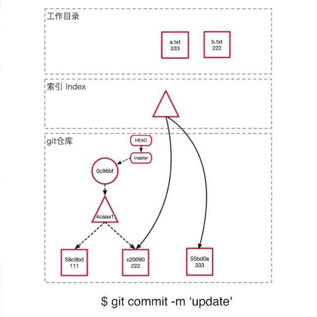
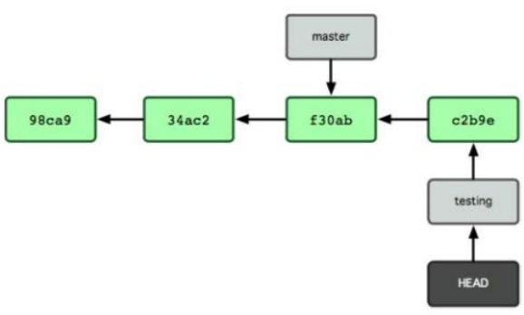

# Git 笔记

[TOC]

# 配置
## 全局变量
```bash
git config –-global user.name “Your Name”
git config –-global user.email “you@example.com”
git config --global color.ui true
git config --global core.autocrlf true
```

## 当前repo 变量
```bash
git config receive.denyCurrentBranch ignore
git config branch.master.remote origin
git config branch.master.merge refs/heads/master
```

## 添加与提交




# 分支
```bash
git branch experimental
git checkout experimental
```

# 日志

输出非常详细的日志内容
```bash
git log -p     
git log -p -2    # 显示最近2次更新
```

## git show
显式更详细的 commit 信息
```bash
git show 5b888402aadd3cd41b3fe8c84a8658da07893b20
```

显示分支信息
```bash
git show master
git show experimental
```

每一次 commit 都会有”parent commit”，可以使用^表示 parent
```bash
git show HEAD^   # 查看 HEAD 的父母的信息
git show HEAD^^  # 查看 HEAD 的父母的父母的信息
git show HEAD~4  # 查看 HEAD 上溯 4 代的信息
```


你可以给复杂名称起个别名：
```bash
git tag V3 5b888      # 以后可以用 V3 来代替复杂的名称(5b888…)
git show V3
git branch stable V3  # 建立一个基于 V3 的分支
```

git grep 帮助我们搜索：
```bash
git grep “print” V3  # 在 V3 中搜索所有的包含 print 的行
git grep “print”     # 在所有的历史记录中搜索包含 print 的行
```

定位具体的历史记录
```bash
git log V3..V7    # 显示 V3 之后直至 V7 的所有历史记录
git log V3..      # 显示所有 V3 之后的历史记录。注意<since>..<until>中任何一个被省略都将被默认设置为 HEAD。
            #所以如果使用..<until>的话，git log 在大部分情况下会输出空的。
git log –since=”2 weeks ago”   # 显示 2 周前到现在的所有历史记录。具体语法可查询
git-ref-parse 命令的帮助文件。
git log stable..experimental   # 显示在 experimental 分支但不在 stable 分支的历史记录
git log experimental..stable   # 将显示在 stable 分支但不在 experimental 分支的历史记录
```

## log 格式

```bash
git log --pretty=oneline
git log --pretty=short
git log --pretty=full
git log --pretty=fuller
```

定制格式
```bash
git log --pretty=format:"%h - %an, %ar:%s"
```

> 用oneline 或format时结合 --graph， 可以看到分支的简单图表

```bash
git log --pretty=oneline --graph
```

常用格式占位符

| 选项   | 说明                               |
| :----- | :-----                             |
| %H     | 提交对象(commit)的完整哈希值       |
| %h     | 提交对象的简短哈希值               |
| %T     | 树对象(tree)的完整哈希值           |
| %t     | 树对象的简短哈希值                 |
| %P     | 父对象(parent)的完整哈希值         |
| %p     | 父对象简短哈希值                   |
| %an    | 作者(author)的名字                 |
| %ae    | 作者的电子邮件                     |
| %ad    | 作者修订日期(可以用 -date= 选项)   |
| %ar    | 作者修订日期，按多久以前的方式显示 |
| %cn    | 提交者(committer)的名字            |
| %ce    | 提交者的电子邮件                   |
| %cd    | 提交日期                           |
| %cr    | 提交日期，按多久以前的方式显示     |
| %s     | 提交说明                           |


```sh
git log

git log --oneline

git log --graph --pretty=format:'%Cred%h%Creset -%C(yellow)%d%Creset %s %Cgreen(%cr) %C(bold blue)<%an>%Creset' --abbrev-commit --date=relative
```

### 按时间查询
```sh
git log --after='2020/07/31'
git log --after="2020/07/31" --before="2020/08/08"
```

### 按作者查询
```sh
git log --author="XXX"
```

### log 关键字 查询
```sh
git log --grep="ISSUE-43560"
git log -i --grep="issue-43560"
git log -i --grep="issue-43560\|issue-89786"
git log -i --grep="fix " main.sh
```

### 内容关键字查询
```sh
git log -i -S "function login()" 
```

### 查询merge的
```sh
git log --merges
```

### 不同branch查询
```sh
git log master..dev
```

# 索引文件
```bash
git ls-files –-stage      # 用于查看 index file 的
git cat-file -t a5596
git cat-file blob a5596
```


# 回撤
```bash
git reset --hard HEAD // –hard 表示将 working tree 和 index file 都撤销到以前状态
git reset --soft HEAD // –soft 表示只撤销 commit，而保留 working tree 和 index file 的信息
git reset –-mixed HEAD // –mixed 会撤销 commit 和 index file，只保留 working tree 的信息

 git reset – aFile  // 从index中撤回来  
```

```bash
# 恢复暂存区的指定文件到工作区
$ git checkout [file]

# 恢复某个commit的指定文件到暂存区和工作区
$ git checkout [commit] [file]

# 恢复暂存区的所有文件到工作区
$ git checkout .

# 重置暂存区的指定文件，与上一次commit保持一致，但工作区不变
$ git reset [file]

# 重置暂存区与工作区，与上一次commit保持一致
$ git reset --hard

# 重置当前分支的指针为指定commit，同时重置暂存区，但工作区不变
$ git reset [commit]

# 重置当前分支的HEAD为指定commit，同时重置暂存区和工作区，与指定commit一致
$ git reset --hard [commit]

# 重置当前HEAD为指定commit，但保持暂存区和工作区不变
$ git reset --keep [commit]

# 新建一个commit，用来撤销指定commit
# 后者的所有变化都将被前者抵消，并且应用到当前分支
$ git revert [commit]

# 暂时将未提交的变化移除，稍后再移入
$ git stash
$ git stash pop
```


从远程的 master 分支下载 objects 和 refs 到本地的bobworks 分支中
```bash
git fetch /home/bob/myrepo master:bobworks
```

git pull 是 git fetch 和 git merge 命令的一个组合


# 忽略文件
建立一个 .gitignore 文件
```bash
# 此为注释，  将被Git忽略

*.a      # 忽略所有 .a 结尾的文件
!lib.a   # 但lib.a除外
/Temp    # 仅仅忽略根目录下的Temp文件， 但不包括subdir/Temp
build/   # 忽略 build/ 目录下所有文件
doc/*txt # 忽略 doc/notes.txt 但不包括doc/server/arch.txt
```

# 标签

## 有注释(annotated)的标签
```bash
git tag -a v0.2 -m "my version 0.1"
git tag
```

## 轻量级(lightweight)的标签
```bash
git tag v0.1 6928fee3561b
```

# 推送远程
```bash
git remote show origin
```


# 分支
当使用git commit新建一个提交对象前，Git会先计算每一个子目录的校验和，然后保存到树对象(tree)对象。之后Git创建的提交对象，除了包含相关提交信息之外，还包含着指向这个树对象的指针，如此它就可以在将来需要的时候，重现此次快照的内容了。

第一次提交


*多次提交后，commit对象包含指向上一次commit对象的指针*


Git中的分支其实本质上仅仅是个指向commit对象的可变指针。Git会使用master作为分支的默认名字。在若干次提交之后，已经有一个指向最后一次提交对象的master分支，它在每次提交的时候都会自动向前移动。


在当前commit对象上新建一个分支指针


Git保存着一个名为HEAD的特别指针，它是一个指向正在工作中的本地分支的一个指针。


当运行``` git checkout testing ``` 时， HEAD就指向testing这个分支


在testing分支中提交一次，HEAD也会随着一起向前移动


HEAD在一次```git chekcout master ```之后移动到master上


对master进行提交之后，项目就形成了分叉。


# 生成补丁
```
git format-patch -M origin/master
```


# 打补丁

## git diff 或是 diff 命令生成的补丁

```
git apply xxx.patch
```

检查补丁是否顺利应用到当前分支中，如果没有任何输出，表示顺利采纳该补丁。
```
git apply --check xxx.patch
```

## 使用git format-patch

它会带有提交者的信息，并生成一个新的commit。
```
git am xxx.patch
```


# 打包发布
## tar 包
```
git archive master --prefix='project/' | gzip > 001.tar.gz
```

## zip包
```
git archive master --prefix='project/' --format=zip > 001.zip
```


# 重写历史

```
git commit --amend
```


# 子模块

添加子模块
```
git submodule add git://github.com/zhubinqiang/myTMS.git
```

clone 一个带有子模块的项目
```
git clone git://github.com/zhubinqiang/myTMS.git
cd myTMS/
cd third_party/
git submodule init
git submodule update
```


