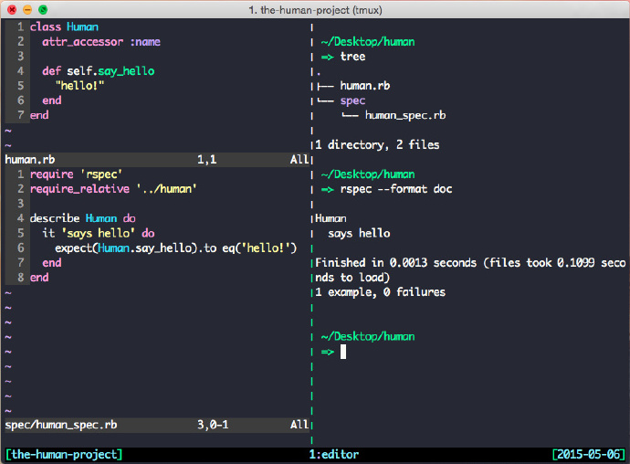
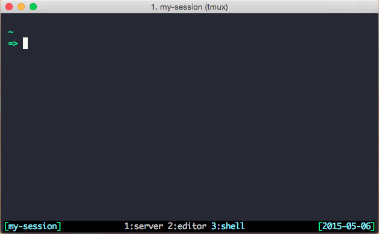
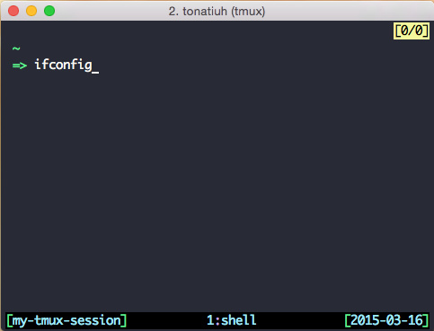
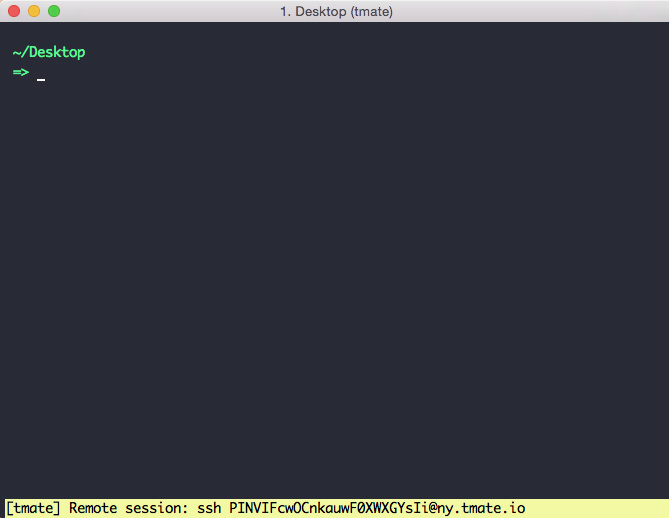
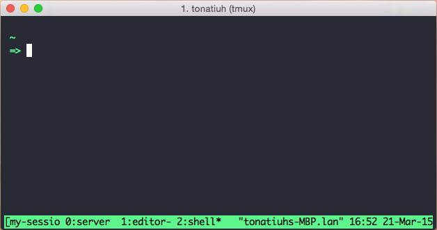
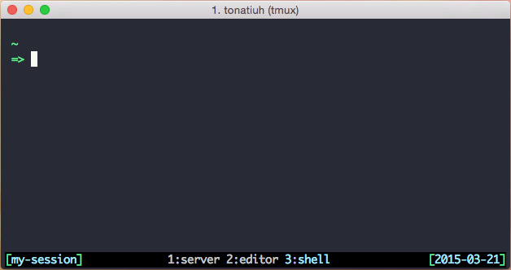

# tmux 使用

[TOC]

## 简介

有些开发者经常要使用终端控制台工作，导致最终打开了过多的标签页。如果你也是他们当中的一员，或者你正在实践结对编程，那么我推荐你读一读这篇文章。从上个月开始，我开始大量使用 Tmux 并且发现 Tmux 非常实用，所以我想应该写一篇文章，与诸位分享一些有关使用 Tmux 的建议和专业方案。本文将先介绍 Tmux 是什么，然后讲解如何使用 Tmux，才能使其同 Vim 结合起来，打造出更高效、更优雅的终端工具。

本文将会包含以下内容：

Tmux 的基础
Tmux 中最棒的功能
窗口（Window）
窗格（Pane）
会话（Session）
快速在文本间移动光标或复制文本
非常轻巧的结对编程功能
调整 Tmux 以增强其同 Vim 的集成度
调整背景的配色方案
调整光标的形状
调整粘贴时的文本缩进
其他能够提升 Tmux 体验的工具或技巧
用 Tmuxinator 自动创建会话
改变 Tmux 状态栏的颜色
请注意，在撰写本文的过程中，我安装了以下这一组软件，并在测试时使用了这些版本：

Tmux 1.9a
Vim 7.4
iTerm 2.1
Mac OS (Mavericks and Yosemite)
让我们开始吧！

## 基础知识

### 什么是Tmux？

Tmux 是一个工具，用于在一个终端窗口中运行多个终端会话。不仅如此，你还可以通过 Tmux 使终端会话运行于后台或是按需接入、断开会话，这个功能非常实用。稍后，我们将会看到如何充分地利用这个功能。

如图所示，这就一个是 Tmux 的会话：


从图中我们可以看出：
- 左侧：Vim
- 右侧：系统 Shell
- 左下方：Tmux 会话的名字（“pomodoro-app”）
- 下方的中部：当前会话中的 Tmux 窗口（“app log”、“editor”和 “shell”）
- 右下方：当前的日期


### 如何安装 Tmux？

#### 在 Mac OS 中安装：

1. 安装 Homebrew
```bash
ruby -e "$(curl -fsSL https://raw.githubusercontent.com/Homebrew/install/master/install)"
```
有关安装 homebrew 的详细的信息可以参考[这里](https://raw.githubusercontent.com/Homebrew/install/master/install)。

2. 安装 Tmux
```bash
brew install tmux
```

#### 在 Ubuntu 中安装：
在终端输入如下命令：
```bash
sudo apt-get install tmux
```


### Tmux 的快捷键前缀（Prefix）

为了使自身的快捷键和其他软件的快捷键互不干扰，Tmux 提供了一个快捷键前缀。当想要使用快捷键时，需要先按下快捷键前缀，然后再按下快捷键。Tmux 所使用的快捷键前缀默认是组合键 Ctrl-b（同时按下 Ctrl 键和 b 键）。例如，假如你想通过快捷键列出当前 Tmux 中的会话（对应的快捷键是 s），那么你只需要做以下几步：

* 按下组合键 Ctrl-b (Tmux 快捷键前缀)
* 放开组合键 Ctrl-b
* 按下 s 键

这里有一些小建议：

首先我建议对调 Ctrl 键和 Caps-Lock 键的功能。

通过按下 Caps-Lock 键来代替 Ctrl 键将会非常实用。因为在编码过程中，你需要频繁地按下 Ctrl 键，而由于 Caps-Lock 与手指在键盘的起始位置处于同一直线，所以按下 Caps-Lock 键会更加容易、便捷。

其次，我建议将 Tmux 的快捷键前缀变为 Ctrl - a。用 Caps-Lock 键替代了 Ctrl 键之后，由于 Caps-Lock 键与 a 键离得更近，所以按下 Ctrl - a 就将会比按下 Ctrl - b 更容易、更便捷。

若要将快捷键前缀变更为 Ctrl-a ，请将以下配置加入到 Tmux 的配置文件 ~/.tmux.conf 中：

```
unbind Ctrl+B
set -g prefix C-a
```

### 快捷键
|命令|说明|
|:----|:----|
|tmux |开启tmux
|tmux ls |显示已有tmux列表（Ctrl+B s）
|tmux attach-session -t |数字 #选择tmux
|Ctrl+B c |创建一个新的窗口    
|Ctrl+B n |切换到下一个窗口
|Ctrl+B p |切换到上一个窗口
|Ctrl+B l |最后一个窗口,和上一个窗口的概念不一样哟,谁试谁知道
|Ctrl+B w |通过上下键选择当前窗口中打开的会话
|Ctrl+B 数字 |直接跳到你按的数字所在的窗口
|Ctrl+B & |退出当前窗口
|Ctrl+B d |临时断开会话 断开以后,还可以连上的哟:)
|Ctrl+B " |分割出来一个窗口 （横向）
|Ctrl+B % |分割出来一个窗口 （纵向）
|Ctrl+B o |在小窗口中切换    
|Ctrl+B (方向键)|.
|Ctrl+B ! |关闭所有小窗口
|Ctrl+B x |关闭当前光标处的小窗口
|Ctrl+B t |钟表
|Ctrl+B |pageup/pagedo


### Tmux 的配置文件

每当开启一个新的会话时，Tmux 都会先读取 ~/.tmux.conf 这个文件。该文件中存放的就是对 Tmux 的配置。

小提示：如果你希望新的配置项能够立即生效，那么你可以将下面这一行配置加入到文件 ~/.tmux.conf 中。

```
# bind a reload key
bind R source-file ~/.tmux.conf ; display-message "Config reloaded.."
```

这样配置了之后，每当向 ~/.tmux.conf 文件中添加了新的配置，只需要按下 Ctrl-b r 就可以重新加载配置并使新的配置生效，从而免去了开启一个新的会话。

###　Tmux 中最棒的功能

提示：下面这截图也许与你使用 Tmux 时看到的界面略有不同。这是因为我修改了 Tmux 的状态栏配置，如果你也想修改成和截图中一样的效果，那么可以参照“美化 Tmux 的状态栏”这一节中的步骤。

#### 窗格

我认为沿竖直方向分割屏幕是个不错的主意，这样我就可以在一边使用 Vim，而在另一边查看代码运行结果，如果需要的话，有时我还会再打开一个控制台。下面我就要讲解如何利用 Tmux 实现这一切。



从图中可以看出：

* 左侧：Vim（左上方是一个 Ruby 的类文件，左下方是针对这类编写的测试文件）
* 右侧：一个 Bash 的会话

要创建一个竖直放置的窗格很容易，待开启了一个 Tmux 会话之后，只需再按下 Ctrl-b % ，一个竖直窗格就出现了。另外，若要把屏幕沿水平方向分割，则只需要按下 Ctrl-b "。在 Tmux 的窗格间移动光标也很简单，只需要先按下 Tmux 的快捷键前缀，然后再按下对应的方向键就可以让光标进入到目标窗格了。

#### 窗口

在Tmux中，窗口是个窗格容器，你可以将多个窗格放置在窗口中，并根据你的实际需要在窗口中排列多个窗格，也是完全取决于你的需要。例如，我经常是这样做，先开启一个叫作“server”的窗口用于运行应用程序的服务器（在这个窗口中可以看到服务器的日志），然后开启另一个叫作“editor”的窗口用于编写代码。在这个窗口中有两个窗格，一个用于 Vim，一个用于运行测试代码。最后再开启一个叫作“shell”的窗口用于通过 Bash shell 运行命令。Tmux 的窗口功能非常实用，因为在一个窗口中可以创建出多个窗格，这样在一个窗口中就能同时查看所有窗格内容，通过这种方法可以高效地利用有限的屏幕空间。

在 Tmux 的会话中，现有的窗口将会列在屏幕下方。下图所示的就是在默认情况下 Tmux 列出现有窗口的方式。这里一共有三个窗口，分别是“server”、“editor”和“shell”。



若要创建一个窗口，只需要按下Ctrl-b c；若要切换窗口，只需要先按下Ctrl-b，然后再按下想切换的窗口所对应的数字，该数字会紧挨着窗口的名字显示。

#### 会话

一个 Tmux 会话中可以包含多个窗口。会话功能非常简单易用，例如可以为一个特定的项目创建一个专用的 Tmux 会话。若要创建一个新的会话，只需要在终端运行如下的命令：

```
tmux new -s <name-of-my-session>
```
假设我还需要开发另一个项目，于是我就会为此再新建一个会话。虽然进入了新的会话，但是原来的会话并没有消失。所以我可以在稍后回到之前的会话继续工作。若要创建一个新的会话，只需要按下 Ctrl-b : ，然后输入如下的命令：

```
new -s <name-of-my-new-session>
```

除非显式地关闭会话，否则 Tmux 的会话在重启计算机之前都不会消失。只要还没有重启计算机，你都可以自由地从一个项目的会话跳转到另一个。

#### 在 Tmux 的会话间切换

若要获取现有会话的列表，可以按下Ctrl-b s。下图所示的就是会话的列表：


列表中的每个会话都有一个 ID，该 ID 是从 0 开始的。按下对应的 ID 就可以进入会话。如果你已经创建了一个或多个会话，但是还没有运行 Tmux，那么可以输入如下命令以接入已开启的会话。

```
tmux attach
```

####在文本间快速移动光标，复制文本

在 iTerm2 中，要想快速地复制内容就不得不键盘和鼠标一起用，这一点我一直很不喜欢。我想一定会有不需要使用鼠标且更快捷的复制方法。幸运的是，Tmux就提供了只用键盘就可以完成复制的功能，这源于 Tmux 是从命令行启动的，而在命令行界面是无法使用鼠标的。

在文本间移动光标

在 Tmux 中可以使用与 Vim 极为相似的方式在文本间移动光标。正如你熟知的那样，用 k 键可以将光标移动到上一行，用 w 键可以向后移动一个单词等等。而且还可以通过把 Tmux 设为 vi 模式，使其与 Vim 的操作更加接近。为此，需要将以下配置加入到文件 ~/.tmux.conf 中。

```
# Use vim keybindings in copy mode
setw -g mode-keys vi
```

#### 将复制下来的文本发送到系统的剪贴板中

在默认情况下，当从 Tmux 中复制文本时，复制下来的文本只能粘贴到同一个 Tmux 会话中。若要使复制下来的文本可以粘贴到任何位置，就需要让 Tmux 将文本复制到系统的剪贴板。为此，我们需要这样做：

安装 retach-to-user-namespace。用 brew 安装的话将会非常简单，只需要运行下面这条命令：

```
$ brew install reattach-to-user-namespace
```

在配置文件 ~/.tmux.conf 中加入以下内容：
```
# invoke reattach-to-user-namespace every time a new window/pane opens
set-option -g default-command "reattach-to-user-namespace -l bash"
```

#### Select and copy text
既然已经设置成了 vi 模式，也安装了 rettach-to-user-namespace，下面就让我们来看看如何从 Tmux 的会话中复制文本吧。假设要复制的是 IP 地址，于是我们先运行了 ifconfig 命令。接下来就请跟随以下的步骤：

首先按下 Ctrl-b [ 进入复制模式，然后可以看到一小段高亮的文本出现在了屏幕的右上角 (“[0/0]”)（如下图所示）。



接下来就可以像在 Vim 中一样用 j、k、l 和 h 等键在文本间移动光标了。

把光标移动到想复制的文本上后再按下空格键就可以开始选择文本了（这和在 Vim 中复制文本的步骤一模一样）。

选择完要复制的文本后再按下回车键。

这样 IP 地址就复制下来并可以粘贴到任何地方了。

#### 让复制文本的操作更像 Vim

你还可以设置 Tmux 使用 v 键选择文本，用 y 键复制文本。为此只需要将下面的配置项加入到配置文件 ~/.tmux.conf 中。

```
# start selecting text typing 'v' key (once you are in copy mode)
bind-key -t vi-copy v begin-selection
# copy selected text to the system's clipboard
bind-key -t vi-copy y copy-pipe "reattach-to-user-namespace pbcopy"
```

#### 高效的结对编程

你可以将 Tmux 会话的地址分享给他人，这样他们就可以通过 SSH 接入这个会话了。由于会话是建立在 SSH 之上的，所以不会产生额外的开销。通过使用高速的互联网，对于那些连接到远程会话上的用户而言，他们会觉得这个会话就是运行在本地的。

#### 在Tmux 中使用 Tmate

Tmate 是一个 Tmux 的管理工具，使用它不但能够轻松地创建 Tmux 会话而且还能够通过互联网把该会话共享给其他人。若要使用 Tmate 共享 Tmux 会话，请按照以下步骤操作：

* 安装 Homebrew
```
$ ruby -e "$(curl -fsSL https://raw.githubusercontent.com/Homebrew/install/master/install)"
```

* 安装 Tmate
```
$ brew update             &&brew tap nviennot/tmate &&
brew install mate
```

* 使用 Tmate 开启一个新的会话
```
$ tmate
```

* 从 Tmux 的会话中复制由 Tmate 产生的 SSH URL。如下图所示，请注意屏幕下方的信息“[tmate] Remote session: ssh …”：


* 利用刚刚复制下来的 URL 就可以邀请其他人通过 SSH 访问你的会话了。

了解了如何利用 Tmux 的结对编程功能之后，还可以再利用您所喜爱的运营商提供的语音服务进一步加强会话交互性。

调整 Tmux 以增强其同 Vim 的集成度

### 调整背景的配色方案

当我第一次通过 Tmux 打开 Vim 时，我发现 Vim 的颜色没有正确显示。正如下图所示，只有有字符的地方才有背景色。


这个问题是因为通过 Tmux 运行 Vim 需要配置一个特殊的终端参数（term parameter）。请将下面这行配置添加以你的 ~/.vim 文件中。

```
if exists('$TMUX')
  set term=screen-256color
endif
```
在更新了配置文件 ~/.vimrc 以后，颜色应该就可以正确显示了。


### 调整光标的形状

在默认情况下，当通过 Tmux 运行 Vim 时，无论当前 Vim 是处于插入模式、可视模式还是其他模式，光标的形状都是一样的。这样就很难判断当前的 Vim 模式是什么。若要避免这个问题，就需要让 Tmux 通知 iTerm 更新光标的形状。为此，需要将以下配置加入到文件 ~/.vimrc 中。

```
if exists('$ITERM_PROFILE')
  if exists('$TMUX') 
    let &amp;t_SI = "<Esc>[3 q"
    let &amp;t_EI = "<Esc>[0 q"
  else
    let &amp;t_SI = "<Esc>]50;CursorShape=1x7"
    let &amp;t_EI = "<Esc>]50;CursorShape=0x7"
  endif
end
```
在这里我要感谢 Andy Fowler，是他最先分享了调整光标的形状[这个技巧](https://gist.github.com/andyfowler/1195581)。

### 调整粘贴时的文本缩进

在 Vim 中粘贴文本时可能会遇到这样的问题，有时文本的缩进会发生变化，特别是在粘贴大量的文本时，这个问题会更加明显。虽然可以通过在粘贴前执行 :set nopaste 来解决这个问题，但是这里还有一种更好的解决方法。就是把下面这段配置加入到配置文件 ~/.vimrc 中，这样 Vim 就会自动地阻止粘贴文本时的自动缩进。

```
" for tmux to automatically set paste and nopaste mode at the time pasting (as
" happens in VIM UI)
 
function! WrapForTmux(s)
  if !exists('$TMUX')
    return a:s
  endif
 
  let tmux_start = "<Esc>Ptmux;"
  let tmux_end = "<Esc>"
 
  return tmux_start . substitute(a:s, "<Esc>", "<Esc><Esc>", 'g') . tmux_end
endfunction
 
let &amp;t_SI .= WrapForTmux("<Esc>[?2004h")
let &amp;t_EI .= WrapForTmux("<Esc>[?2004l")
 
function! XTermPasteBegin()
  set pastetoggle=<Esc>[201~
  set paste
  return ""
endfunction
 
inoremap <special> <expr> <Esc>[200~ XTermPasteBegin()
```

在这里我要感谢 Marcin Kulik，是他最先分享了[这个技巧](https://coderwall.com/p/if9mda/automatically-set-paste-mode-in-vim-when-pasting-in-insert-mode)。

### 其他能够提升 Tmux 体验的工具或技巧

#### Tmuxinator （为项目自动创建会话）

假设你正在开发应用程序 A。在开发过程中，经常要创建 Tmux 会话，会话中包含“server”、“editor”（用于编写代码）和“shell”（用于运行系统命令）这 3 个窗口。不仅如此，在一天之中的某个特定的时间你还需要临时进入到应用程序 B 的开发工作中。于是你又不得不创建另一个会话，虽然有略微的不同（比如目录和某些命令），但是会话中还是要包含应用程序 A 中的那 3 个窗口。但是有了 Tmuxinator，你就可以为每个Tmux 会话声明一个配置，然后用 1 条命令就能创建出这个会话了。这功能太棒了，不是吗。

Tmuxinator 是一个 Ruby 的 gem 包，可用于创建 Tmux 的会话。它的工作方式是先在配置文件中定义会话中的细节，然后用 1 条命令创建出这些会话。下面就让我们看看如何安装 Tmuxinator 以及如何添加配置来为指定项目开启一个会话。可以通过运行如下命令安装 Tmuxinator 的 gem 包。

```
$ gem install tmuxinator
```
安装好了 Tmuxinator 以后，就可以在系统 Shell 中运行 tmuxinator 或 mux 命令了。下面就让我们为上述的应用程序（有 3 个窗口，分别是“servers”, “editor” 和 “shell”）来创建一个配置文件吧。下面这条命令的作用是为这个项目创建并打开一个配置文件。

```
$ tmuxinator new project_a
```
按下回车键后，就会自动打开文件 ~/.tmuxinator/project_a.yml。为了实现项目 A 所需的配置，你需要把 project_a.yml 的内容更新为：

```
name: project_a
root: <the-folder-of-project-A>
 
windows:
  - server: <command-to-start-application-server>
 
  - editor:
    layout: even-horizontal
    panes:
      - vim
      - <command-to-launch-tests-guard>
 
  - shell: ''
```
一旦将上面的配置添加到了项目 A 的 Yaml 文件中，只需要运行下面这条命令就可以启动 Tmux 的会话了。

```
$ tmuxinator start project_a
```
当然如果愿意的话，你也可以使用 Tmuxinator 命令的别名：

```
$ mux start project_a
```
大功告成了。现在，每当想进入项目 A 的编码工作时，就只需要运行 Tmuxinator 命令。

可以到[这里](https://github.com/tmuxinator/tmuxinator)查看Tmuxinator的官方文档。

#### 美化 Tmux 的状态栏

默认情况下，Tmux的状态栏看起来是下图这个样子（图中绿底部分）：



我们可以根据需要改变状态栏的外观。对我来说，我喜欢下图这种清爽的外观。



为了达到上图的效果，我将如下的配置加入到了配置文件 ~/.tmux.conf 中。

```
# 状态栏
  
# 颜色
  set -g status-bg black
  set -g status-fg white
 
  
# 对齐方式
  set-option -g status-justify centre
 
# 左下角
  set-option -g status-left '#[bg=black,fg=green][#[fg=cyan]#S#[fg=green]]'
  set-option -g status-left-length 20
 
# 窗口列表
  setw -g automatic-rename on
  set-window-option -g window-status-format '#[dim]#I:#[default]#W#[fg=grey,dim]'
  set-window-option -g window-status-current-format '#[fg=cyan,bold]#I#[fg=blue]:#[fg=cyan]#W#[fg=dim]'

# 右下角
  set -g status-right '#[fg=green][#[fg=cyan]%Y-%m-%d#[fg=green]]'
```

### 总结

在这篇文章中我们先介绍了 Tmux 的基本功能，然后介绍了 Tmux 中最棒的几个功能。这之后介绍了一些配置以及几个能够提升 Tmux 体验的工具。至此，诸位对 Tmux 的印象如何呢？你们是否也发现了什么其他有用的功能或配置？如果有的话欢迎留言告诉我们。

感谢您阅读本文！