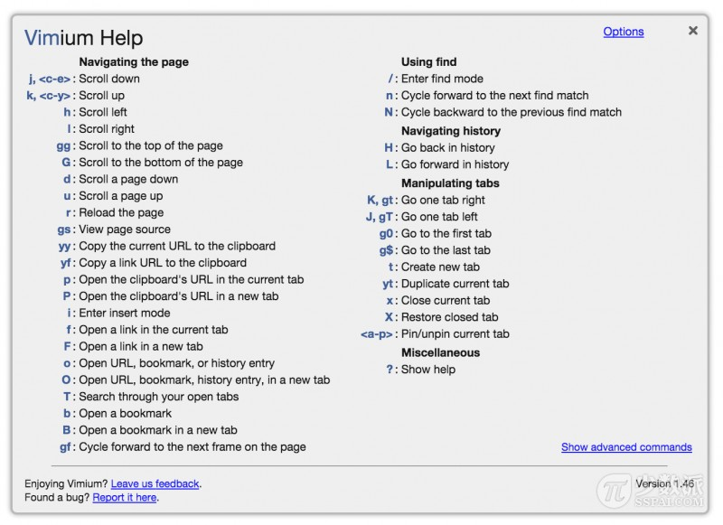
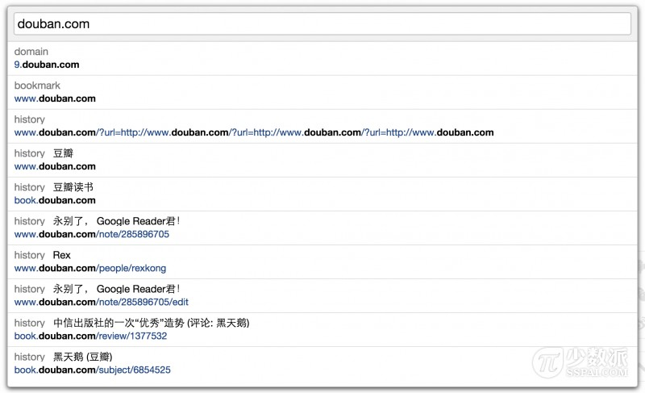
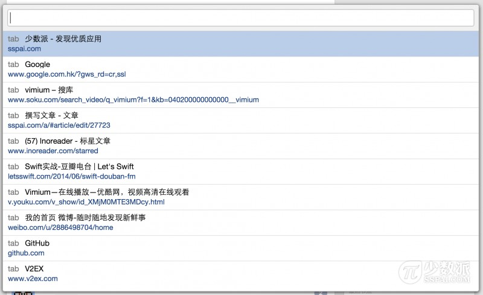

# Vimium 是做什么的
Vimium 这个名字其实是 Vim 和 Chromium 的合体。很多人可能不知道 Vim，这么说吧，你是不是经常在电影里看到那些顶尖的黑客，他们在屏幕上来去自如，最关键的是，他们竟然都不用鼠标？没错，狭义地说，Vim 其实是 Linux 等平台上的一款文本编辑器，它可以让你彻底脱离鼠标，通过一系列快捷键，来操作任何一件事情。

而 Vimium 则继承了 Vim 中的常用键位，让你在使用 Chrome 的过程中，无论是浏览网页、切换标签或是其它任何操作，全都可以只通过键盘完成。想像一下，你再也不需要移动鼠标去打开一个链接，手指不用离开键盘，一切都是这么流畅。

# Vimium 使用简单吗
听了前面这么一段介绍，你可能还在云里雾里，感觉这不是一个好上手的东西。好，换一种方式来说，Vimium 实际上可以理解成是一系列快捷键配置，你可以通过这些快捷键来完成对应的操作。比如，Chrome 其实自带的快捷键就有：「Control + T」可以新建标签页，「Control + N」可以新建窗口等等。而 Vimium 比这简单得多，却又强大得多。

这里是一张 Vimium 的快捷键列表


# Vimium 的几个招式

## 页面滚动
|快捷键|说明|
|:---|:-------|
|j | 向下滚动一点
|k | 向上滚动一点
|gg| 到页面最底部
|G | 到页面最底部
|d | 向下翻一屏
|u | 向上翻一屏

## 打开新页面
1. 复制一段链接：
经常在网页上看到一段链接文字，但却是不可点的。原来你需要先复制，然后新建标签页，再粘贴，敲回车后才能打开。现在呢？你只需要把要打开的链接复制一下，直接按「p」或「P」就可以打开了，小写的 p 是在当前标签页打开，大写的 P 则新建标签页打开。 

2. 从收藏夹、历史记录打开：
是不是之前看过什么网页，现在又想看了，还需要再打开历史记录找？或者想打开收藏夹里的某个链接？现在，直接按下「o」，输入对应的关键字后，会一起搜索你的历史记录和收藏夹，如果你输的是一个网址，回车还能直接打开。


3. 只用敲三下，打开当前页面上任意一个链接
如果说，任意一个页面上，哪所有再多链接，你也不用鼠标，最多只需要敲三个键，你就可以迅速打开任意一个链接，你信不信？Vimium 就可以办到。

你只需要按一下「f」，然后当前页面上所有可点击的元素，都会生成一个对应的快捷键分派给这些链接。比如我现在想点击导航栏上的「专题」，只需要再输入「GJ」，OK！完成了，你只敲了三个键，就打开了「专题」页面。


4. 显示当前所有的标签页，并快速切换
有时候在查找信息、翻阅资料时，经常会一口气打开几十个网站，东西一多，Chrome 会自动将每个标签页的宽度缩小，几乎就看不到它们的标题了。用了 Vimium，你可以按一下大写的「T」，就可以显示当前打开的所有标签页，并支持快捷搜索和跳转。



```flow
st=>start: Start|past:>http://www.google.com[blank]
e=>end: End|future:>http://www.google.com
op1=>operation: My Operation|past
op2=>operation: Stuff|current
sub1=>subroutine: My Subroutine|invalid
cond=>condition: Yes
or No?|approved:>http://www.google.com
c2=>condition: Good idea|rejected
io=>inputoutput: catch something...|future

st->op1(right)->cond
cond(yes, right)->c2
cond(no)->sub1(left)->op1
c2(yes)->io->e
c2(no)->op2->e
```

