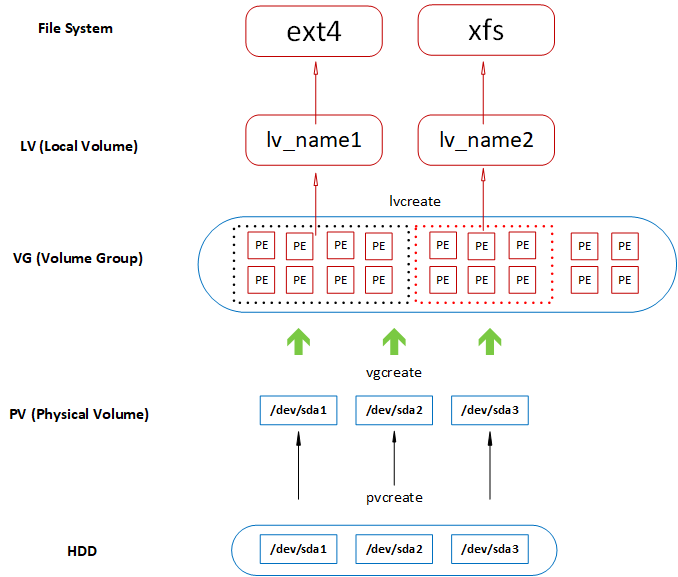
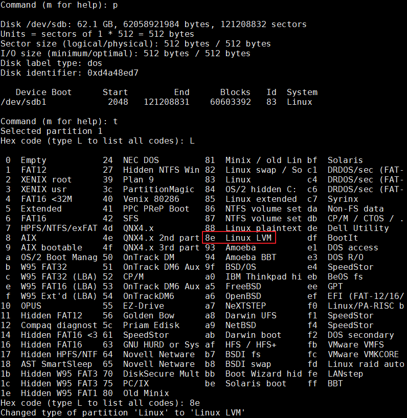

# LVM

[TOC]

## 概要图


**上图中PE就是Physical Extent。类似于 ext3 里面block的概念**。

上图中在HDD层需要把/dev/sda1 这些在分区时系统ID改为8e 也就是Linux LVM类型。  


## 相关命令
|   任务    |    PV    |        VG         |     LV     |      FS       |
| :-------- | :------- | :---------------- | :--------- | :------------ |
| scan      | pvscan   | vgscan            | lvscan     | lsblk,blkid   |
| create    | pvcreate | vgcreate          | lvcreate   | mkfs.ext4     |
| display   | pvcreate | vgcreate          | lvcreate   | df, mount     |
| extend    | vgextend | vgextend/lvresize | xfs_growfs | resize2fs     |
| reduce    | vgreduce | lvreduce/lvresize | None       | resize2fs     |
| remove    | pvremove | vgremove          | lvremove   | umount,格式化 |
| resize    | lvresize | xfs_growfs        | resize2fs  |               |
| attribute | pvchange | vgchange          | lvchange   | /etc/fstab    |


## 创建 PV
```sh
sudo pvcreate /dev/sdb1
sudo pvdisplay
```

## 删除 PV
```sh
sudo pvremove /dev/sdb1
```

## 创建 VG
```sh
sudo vgcreate volume-group1 /dev/sdb1 /dev/sdb2
sudo vgdisplay
```

## 删除 VG
```sh
sudo vgremove volume-group1
```

## 扩展 VG
```sh
sudo vgextend volume-group1 /dev/sdb3
```

## 创建 LV
```sh
sudo lvcreate -L 100M -n lv1 volume-group1
sudo lvdisplay
```

为其格式化为ext4格式
```sh
sudo mkfs.ext4 /dev/volume-group1/lv1
mkdir lv1-mount
sudo mount /dev/volume-group1/lv1 lv1-mount
```

## 修改 LV 的大小
```sh
sudo lvresize -L 200M /dev/volume-group1/lv1
```

## 检查磁盘错误
```sh
sudo e2fsck /dev/volume-group1/lv1
sudo e2fsck -f /dev/volume-group1/lv1
```

## 更新文件系统
```sh
sudo resize2fs /dev/volume-group1/lv1
sudo lvdisplay
```

## 挂载 LVM
```sh
sudo lvdisplay

--- Logical volume ---
LV Path                /dev/centos_lh/home
LV Name                home
VG Name                centos_lh
LV UUID                1qiRhY-AVX4-Wueh-mUp5-mER0-ISCM-E0wwlp
LV Write Access        read/write
LV Creation host, time lh.lm, 2016-08-30 10:58:18 +0800
LV Status              available
# open                 1
LV Size                873.21 GiB
Current LE             223541
Segments               1
Allocation             inherit
Read ahead sectors     auto
- currently set to     256
Block device           253:2
```

```sh
## 设为活动
sudo vgchange -ay /dev/centos_lh/home
sudo mount /dev/centos_lh/home /mnt
```

## 重命名同名的VG
```sh
$ sudo pvs
  PV         VG     Fmt  Attr PSize    PFree
  /dev/sda2  centos lvm2 a--  <465.27g    0
  /dev/sdb2  centos lvm2 a--  <931.02g    0

$ sudo vgs -v
    Archiving volume group "centos" metadata (seqno 4).
    Archiving volume group "centos" metadata (seqno 4).
    Creating volume group backup "/etc/lvm/backup/centos" (seqno 4).
    Cache: Duplicate VG name centos: Prefer existing 7fo5pW-bjKx-2wzi-kJez-2nOj-WuuD-Mxk3vy vs new PzOElX-4jRk-JCL4-8dJx-t7c0-7xOl-oeyjwM
    Archiving volume group "centos" metadata (seqno 4).
    Archiving volume group "centos" metadata (seqno 4).
    Creating volume group backup "/etc/lvm/backup/centos" (seqno 4).
  VG     Attr   Ext   #PV #LV #SN VSize    VFree VG UUID                                VProfile
  centos wz--n- 4.00m   1   3   0 <465.27g    0  7fo5pW-bjKx-2wzi-kJez-2nOj-WuuD-Mxk3vy
  centos wz--n- 4.00m   1   3   0 <931.02g    0  PzOElX-4jRk-JCL4-8dJx-t7c0-7xOl-oeyjwM

$ sudo vgrename PzOElX-4jRk-JCL4-8dJx-t7c0-7xOl-oeyjwM centos1t
  Processing VG centos because of matching UUID PzOElX-4jRk-JCL4-8dJx-t7c0-7xOl-oeyjwM
  Volume group "PzOElX-4jRk-JCL4-8dJx-t7c0-7xOl-oeyjwM" successfully renamed to "centos1t"

$ sudo pvs
  PV         VG       Fmt  Attr PSize    PFree
  /dev/sda2  centos   lvm2 a--  <465.27g    0
  /dev/sdb2  centos1t lvm2 a--  <931.02g    0

$ sudo lvscan
  ACTIVE            '/dev/centos/home' [<407.63 GiB] inherit
  ACTIVE            '/dev/centos/swap' [7.64 GiB] inherit
  ACTIVE            '/dev/centos/root' [50.00 GiB] inherit
  inactive          '/dev/centos1t/home' [<873.38 GiB] inherit
  inactive          '/dev/centos1t/swap' [7.64 GiB] inherit
  inactive          '/dev/centos1t/root' [50.00 GiB] inherit

$ sudo vgchange -ay /dev/centos1t
  3 logical volume(s) in volume group "centos1t" now active

$ sudo lvscan
  ACTIVE            '/dev/centos/home' [<407.63 GiB] inherit
  ACTIVE            '/dev/centos/swap' [7.64 GiB] inherit
  ACTIVE            '/dev/centos/root' [50.00 GiB] inherit
  ACTIVE            '/dev/centos1t/home' [<873.38 GiB] inherit
  ACTIVE            '/dev/centos1t/swap' [7.64 GiB] inherit
  ACTIVE            '/dev/centos1t/root' [50.00 GiB] inherit

$ sudo mount /dev/centos1t/home /mnt/
```