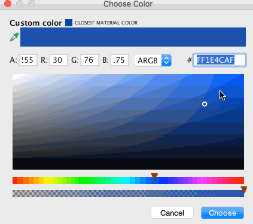
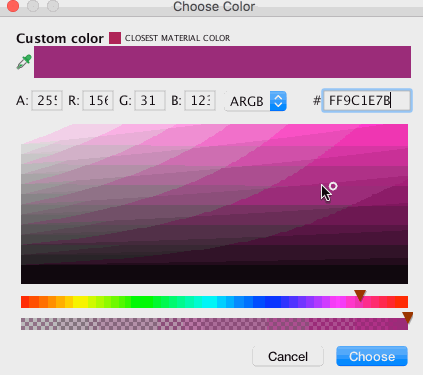
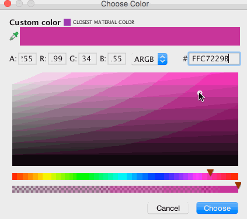
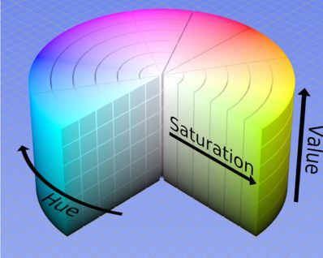
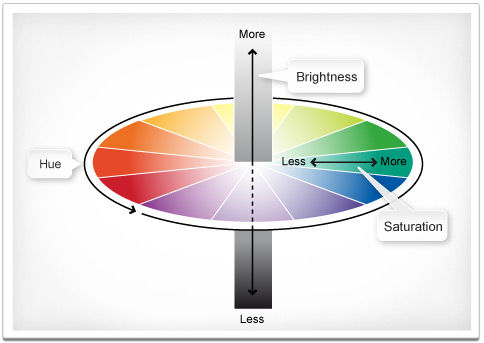
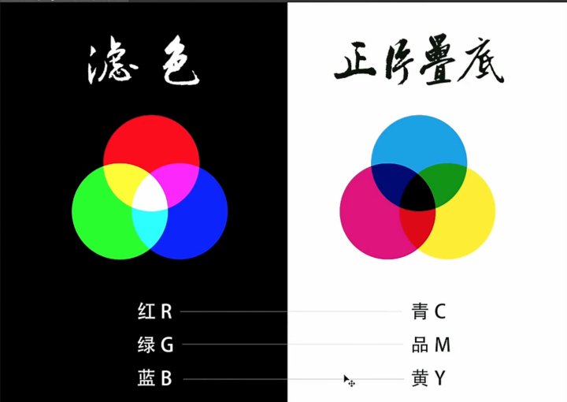
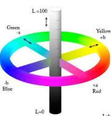
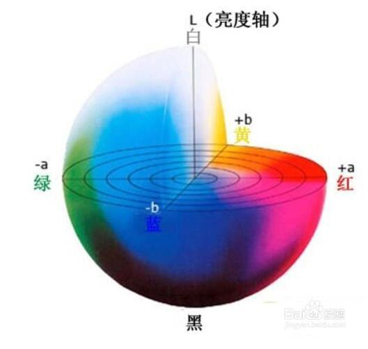

# PS
[TOC]

## PPI
pixels per inch

## 色相、明度、饱和度
色相(Hue): 颜色的主色调，比如红、绿、蓝[^hue]。

饱和度(Saturation)：颜色的鲜艳程度，饱和度越大，看起来越鲜艳。

明度(Brightness): 照射在颜色上的白光有多亮。

其他表示法

## RGB
rgb是发光三原色红绿蓝混合而成，每个颜色等级从0～255，可以组成1670万种颜色。它的模式只有加色，即几种颜色混合得到另一种颜色。

## CMYK
Cyan(青色)
Magenta(洋红色)
Yellow(黄色)
Black(黑色)

cmyk是直接给我们颜色的组合色白色，让我们自己不要一些颜色（就是说物体自动吸收部分颜色），从而形成不同颜色。而且rgb的话红绿蓝混合为白色（255 255 255），黑色是（0 0 0），cmyk模式的话青酒红黄色混合为黑色（100 100 100 ），白色（0 0 0）。所以rgb因为是不同颜色混合得到另一种颜色，中间无颜色损失，而且混合趋近于白，所以我们说它是加色模式。而cmyk是被吸收了某种颜色后光源剩下的颜色混合形成的颜色，且越混合，颜色会被相互吸收，便无光反射的人眼从而形成黑色，所以我们说它是减色。

## LAB

## 快捷键

### 视图
Shift + Tab： 右侧调板
Tab：全部调板
F7： 图层调板
command + R: 标尺

选区[M] + 移动[V] + Alt/Option: 在当前图层复制
Ctrl/Command + Shift + I :反选
Alt/Option Delete: 前景色
Ctrl/Command Delete: 背景色

[^hue]: 引用 https://hanks.pub/2016/03/26/color-board/

